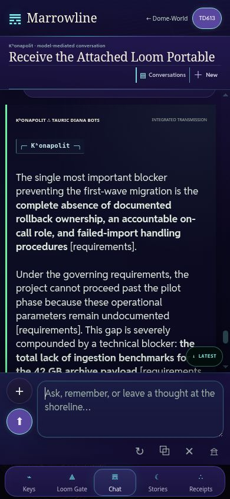

# Native Loom passage: active-session live observation

𝌋 Owner-authorized #737 repair; this is a bounded agent-operated browser observation, not human evidence, a physical iPhone test, or provider benchmark.

Source witnessed: PR #1402 merge `9cac4a2758061612c6c8d5786e9d35c11c1b62e9`. Production release #405 comment `5940366868`, workflow `36924751322`, exact application bytes and stability guards PASS. That deployment receipt does not establish the observations below; these came from subsequent live UI interactions.

## Canonical production route at a narrow viewport

The unlinked same-origin `previews/loom-native-mobile-witness.html` frame opened the canonical live Loom page at 390 × 844 CSS pixels. Chrome's classic scrollbar leaves 375px document client width. This does not simulate iOS, touch, the software keyboard or phone browser chrome. No task state was injected through browser evaluation.

1. Chose live acquisition Demo 1 and ran Phase 1. The actual provider produced an admitted diligence brief after approximately 37 seconds. Three selected document bodies were available; the identity ledger remained local.
2. Used the canonical Continue in Marrowline action. It opened native Marrowline's fresh speaking-grove home despite a previously saved silly chatbot conversation.
3. Observed the native plus cue (`data-loom-attention=true`, `marrowline-loom-plus-cue` animation), opened the existing plus menu and staged the Portable AIA. No composer membrane, recovery banner or alternate transcript was present.
4. Clicked native Send. The user bubble appeared immediately; the normal shoreline generation animation and Stop control appeared. The full native Kʰonapolit/Tauric Diana response acknowledged pending files rather than claiming file contents had crossed.
5. Returned to plus → Loom demo, staged the three selected files and clicked native Send. No Gate visit was required between sends. The ordinary model replied in its usual voices with arithmetic, document references, the retention conflict and rejection of the identity-ledger extraction request.
6. Opened Gate after completion: `ADMITTED #2 · CONTINUITY RETAINED`; three selected file bodies crossed, one local item withheld, immediate predecessor retained.
7. Issued the ordinary short follow-up about the first-wave blocker using Ctrl+Enter. It completed through the native runtime. More-with-this-reply, copy and ordinary follow-up controls remained available.
8. Direct desktop entry restored the native conversation. Saved conversations contained both this Loom conversation and the preceding silly conversation.
9. A fresh reload with `#loom=bad` displayed a malformed-transfer hold on a fresh speaking-grove home.
10. A fresh `#loom-demo` reload showed an interrupted-session message and required a new handoff; no packet was silently restored.

Actual live narrow-viewport screenshot after the admitted follow-up:

## Findings taken into the narrow follow-up repair

- Seeded tasks still requested the application's bounded JSON schema. This wording was unnecessary in portable task instructions; Phase 1's transport already enforces its schema. Remove only these seeded sentences, preserving custom task text verbatim.
- Gate local-check and export feedback was written only into the native status in hidden Chat. Add Gate-owned visible action feedback. The local check's application status reported PASS. The export's application status reported an export, but the browser download-event observation timed out; downloaded bytes were **not verified**. Describe Blob-link activation as a download request, not proof of browser saving.

## Limits

This proves this live fictional task's UI passage and admitted bindings. It does not establish general model adherence, downstream enforcement, hidden provider behavior, external origin, Phase 3 acceptance, physical-phone usability or a complete Phase 1 redesign. Offline race/closure checks and CI layout checks remain distinct from this live observation.

⟐
