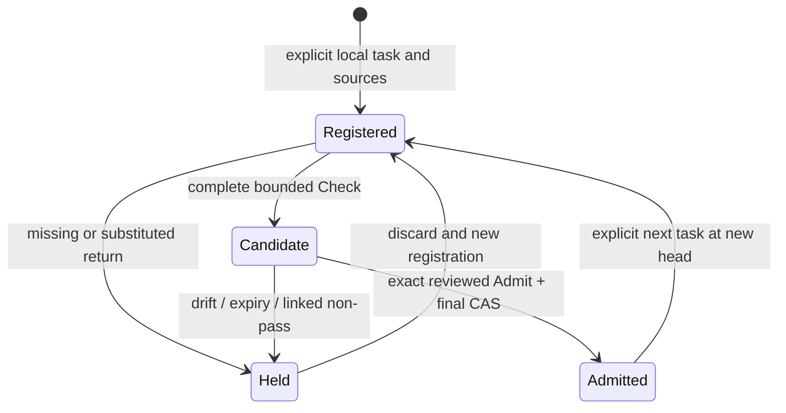

# Portable Loom re-entry: the custody crossing

This tranche admits returned **content records** into an authenticated local process relation. It does not authenticate foreign execution. The operation is v0.2; legacy v0.1 preparation/receipt semantics remain separately typed. Production acceptance, restored custody and exogenous enforcement evidence remain held.

| Research question | Implemented answer | Executable or observed evidence |
| --- | --- | --- |
| 1. What makes a candidate? | A live locally branded seed with recomputed root/ledger, immutable inherited policy, unexpired pre-egress task/source registrations, complete ordered exact bound returns, answer commitments, operator policy-review declarations and all linked Challenge history. | `portable-loom-reentry.js::createPortableLoomReentryCustodian/stage/check`; hostile, Aperture and Atlas suites. |
| 2. What evidence class? | Pasted bytes are local supplied capture; tasks/sources were locally registered; hashes/comparisons are recomputed integrity; receiver source use/missingness/policy statements and operator review are declarations. Foreign origin/execution/internal state remain unresolved. | [Field law](RELATION_MAP.md), [evidence table](EVIDENCE_AND_HOLDS.md); candidate retains classifications and alternatives. |
| 3. What holds? | Import/reload authority absent, weakened/extended seed policy, missing registration/review/capture, incomplete/out-of-order batch, root/policy/task/source/answer/anchor substitution, expired/reversed clock, stale capability/head, linked pending/exposure/HOLD Challenge records, and any directly attached Challenge evidence that was not already retained for the active excursion. Missing answer computation stays unbound. | Hostile and four role suites; actual inline/focused browser HOLDs. |
| 4. What advances ancestry? | `admit(candidate, {expected_head_ref, reviewed_candidate_ref, gesture:'ADMIT_RETURNED_WORK', accept_unresolved:true})` requires the issued immutable object and current revision/state/excursion. All descendants are built before one synchronous final guard/install. No prefix commits on failure. | Aperture race tests and Atlas atomic-batch tests; browser Check preserves head, explicit Admit changes it. |
| 5. What prevents substitution/replay/inheritance? | Unique excursion/intent commitments, exact per-turn task/source/answer bindings, full ordered range, issued-object capability, consumed root registry, revision/head CAS, frozen root policy and fresh source selection. Work-unit parents differ from content parents and fixed foreign anchor. | Hostile controls include copied/replayed/duplicate candidates, wrong session/future/stale anchors, semantic substitutions and presentation-preserving transformations. Global forks remain unresolved. |
| 6. What cannot be proven? | Foreign execution, internal obedience, exhaustive source use, hidden retention/training/memory/retransmission, universal secrecy/non-reconstructability, human comprehension, exteriority and Golden Egg realization. | [Aperture findings](APERTURE_FINDINGS.md); claim ceilings embedded in candidates, units and carriers. Host acquisition needs an independently qualified discriminating witness; another f(A) is insufficient. |
| 7. What does the operator encounter? | Check is visibly separate from Admit. Exact-candidate acknowledgment follows adjacent parent/head/rule consequence and unresolved claims. Successful admission shows new head/count. Rest preserves deadline; discard preserves admitted history. New-root replacement has its own adjacent warning, private Save and acknowledgment. | Pedagogue's original VETO and repaired desktop/390px receipts; root and Atlas rendered witnesses. These measure exposure/behavior, not comprehension. |
| 8. Can it continue? | The next registered excursion anchors at the latest admitted descendant under the same root/rules; sources start empty. A separate public carrier includes the latest answer and explicitly chosen latest-turn sources, without registering admission-ready work. | Atlas continuation/reanchor tests; browser three-task root route and two-task Atlas route. |
| 9. Can Challenge inspect a descendant? | Native current retained v0.2 unit is accepted; shadow/noncurrent units are rejected. Episodes keep literal, standalone and joined results distinct. Challenge never advances the head. Scope excludes future-turn coverage. An attached recheck is admissibility-relevant only when the exact evidence was already retained against the active excursion; an unregistered or anchor-only attachment cannot become a clean shortcut. | Native descendant tests, Challenge-history scope controls, hostile attached-evidence anti-erasure control, production joined-only assay and candidate desktop/390px clean/literal/reconstruction/joining/HOLD routes. |
| 10. Can another session recover? | PR #1406 retains code, role findings, original defects, hostile fixtures, browser harnesses/receipts/screenshots, source/hash coordinates and this handoff. Private exported user records remain review-only; no restoration custody is invented. | [Handoff](../PORTABLE_LOOM_REENTRY_HANDOFF.md), [case dossier](CASE_DOSSIER.json), [production recheck](PRODUCTION_BOUNDARY_RECHECK.json). |

## State and relation law



The last edge is a new bounded excursion. It neither erases the retained old episode nor exonerates it. A Challenge association is a local route relation, not proof that every task was assayed. Its registered-intent snapshot cannot grow after capture. Same session/root does not imply same work, content, evidence, route or foreign state. Withholding count, absent sources and unknown host use remain different projections.

## Reproduction

Node 22+ and the repository's jsdom dependency run the pure/DOM contracts:

```bash
node --test tests/loom-ai-workspace-dom.test.mjs tests/portable-loom-session-challenge.test.mjs tests/portable-loom-reentry-*.test.mjs tests/portable-loom-challenge-dollhouse-boundaries.test.mjs tests/pedagogue-reentry-staging.test.mjs
```

Rendered witnesses use Playwright Chromium, their own static loopback server and synthetic captures. Every non-local/non-GET request is blocked. Pin and install a supported Playwright version outside the repository, then run:

```bash
TD613_REENTRY_ARTIFACT_DIR=/absolute/new/root-witness node tests/portable-loom-reentry.browser.mjs
TD613_PEDAGOGUE_ARTIFACT_DIR=/absolute/new/pedagogue-witness node tests/portable-loom-reentry-pedagogue.browser.mjs
TD613_ATLAS_ARTIFACT_DIR=/absolute/new/atlas-witness node tests/portable-loom-reentry-atlas-browser.mjs
node scripts/run-portable-loom-reentry-dossier.mjs
```

Receipts report observed SHA256 bytes and the source coordinate; historical working-tree receipts must not be silently relabeled final exact-source evidence. Approximately 390px is a simulated viewport, not a physical-device witness. CI includes returned-work hostile contracts and the rendered desktop/390px root route. Merge and deployment authority remain zero; #405 law is unchanged.


## 2026-10-02 Chat-mode adversarial revalidation

The ten answers above were rechecked after the attached-Challenge anti-erasure repair at exact application source `a9f89a980adeba30046acea2b13187a6b4d271cc`, tree `0c328a6ea42b45beef432909920647533b8cf849`. GitHub Actions run [37038296667](https://github.com/tauric-diana-613/TD613-TCP/actions/runs/37038296667) completed success. The returned-work custody contracts reported **150/150**, and the CI-produced `td613.loom.reentry-browser-witness/v0.2` receipt reports PASS at **1280×900** and **390×844**, `application_matches_commit: true`, synthetic captures, and 0 live provider calls. This is CI-executed browser evidence, not a fresh independent browser witness by the Chat reviewer.

The repair adds one exact HOLD rule to questions 3 and 9: an attached Challenge must already match a retained episode for the active excursion. Unregistered or anchor-only direct attachments cannot create an admission candidate. The prior 7f7008f/dbf1a763 evidence remains historical after the application-byte change. Merge/deployment authority remains zero and #405 is unchanged.
