# TD613 · Six-Sequence and Dollhouse Orchestrator Canonical Index

Reconciled 2026-10-08 from remote refs, full Git objects, actual file bytes and retained execution logs. This is an archival address index. No receiver model, research assay or historical test was executed for this reconciliation.

The numbered program is the existing TD613 Sequence 1 → Sequence 6 lineage. It is not a newly invented six-stage test battery. Contract-location HOLD is resolved; that does not authorize subsequent execution.

Reconciliation branch: `research/six-sequence-contract-reconciliation-20261008`. Base: [8d57bdfcd69cff9c5760cd001549197f3180c00a](https://github.com/tauric-diana-613/TD613-TCP/commit/8d57bdfcd69cff9c5760cd001549197f3180c00a). The immutable publication head is the commit containing this index; it cannot be embedded in its own bytes without circularity.

Git objects outrank prose recollection. Remote commits outrank short SHAs from chat. File bytes outrank descriptions. Execution receipts differ from later reconstruction; research branches differ from main. Latest commit is not automatically the canonical contract.

## A. Dollhouse Orchestrator

Current explicit contract: [DOLLHOUSE_ORCHESTRATOR_CONTRACT.md](https://github.com/tauric-diana-613/TD613-TCP/blob/6c9687dba075a6edd6a478c7f86f9b2d0f018af7/docs/research/DOLLHOUSE_ORCHESTRATOR_CONTRACT.md) and [CONTRACT.json](https://github.com/tauric-diana-613/TD613-TCP/blob/6c9687dba075a6edd6a478c7f86f9b2d0f018af7/research/dollhouse-orchestrator-contract/CONTRACT.json) at [6c9687dba075a6edd6a478c7f86f9b2d0f018af7](https://github.com/tauric-diana-613/TD613-TCP/commit/6c9687dba075a6edd6a478c7f86f9b2d0f018af7). This dated formalization follows the recovered historical contract. Its exact interfaces and source-defined capability limits govern current review; it carries no retrospective execution credit.

Historical Episode contract: [docs/research/2026-10-04-dollhouse-orchestration-episode-1428-x.md](https://github.com/tauric-diana-613/TD613-TCP/blob/b08a7cbf851d326fa5d79aea45d38d93c7bd63c9/docs/research/2026-10-04-dollhouse-orchestration-episode-1428-x.md) at [b08a7cbf851d326fa5d79aea45d38d93c7bd63c9](https://github.com/tauric-diana-613/TD613-TCP/commit/b08a7cbf851d326fa5d79aea45d38d93c7bd63c9) on `amari/loom-mobile-dollhouse-closure-1430`. Sections VII, XI, XIII and XIX define the decision gate, whole-route veto, closure audit and self-audit; sections VI and VIII–X retain disagreements and bounded comparisons.

This is a composite decision and adjudication contract with executable deterministic components. It is not evidence of a general autonomous multi-provider scheduler. The canonical role question below is an editorial synthesis of those sections, not a fabricated quotation:

> Which role findings are admissible at their declared evidence coordinates, which disagreements must survive, and what bounded recommendation can be made without whole-route regression or exceeding human authority?

| Contract coordinate | Recovered law / implementation |
|---|---|
| Inputs | Frozen evidence/source packet; distinct role findings; declared service-journey state; evidence classes; scope and human closure requirements. |
| Roles | Pedagogue: explanation and consequence. Aperture: evidence/admissibility. Atlas: continuity and structure. FADT: finite erasure/action-support evaluation under its contract. Temporal Custodian: chronological non-retroactivity and whole-route regression veto. |
| Installed versus established | Episode registry has four registered jurisdictions: Pedagogue and Aperture are INSTALLED; Atlas and FADT are BOUNDED_RESEARCH_CANDIDATE. Temporal Custodian is the fifth jurisdiction, with its separate bounded candidate ref. Orchestrator is not the fifth doll. |
| Disagreement retention | Preserve original findings, coordinates and evidence references. Keep synthesis distinct; do not resolve missing evidence by consensus or overwrite an unresolved role finding. |
| Synthesis | Decision gate balances role imperatives against evidence, operational stability, bounded scope and human closure. Auditor finding does not automatically require mutation. |
| Temporal Custodian | LOCAL_PASS_PLUS_GLOBAL_ROUTE_REGRESSION -> HELD. Later evidence cannot rewrite an earlier observable epistemic state. |
| Human operator | Human authorizes consequential scope and final closure; synthesis is recommendation, not execution authority. |
| Actions | No standing autonomous execution, product-change, external-call, merge, deployment or release authority is conveyed by synthesis. |
| HOLD | Missing/conflicting evidence; unobserved workspace; whole-route regression; failed closure predicates. Preserve separate custody/signature/provider/physical/comprehension unknowns. |
| Claim ceiling | Frozen packet and bounded decision procedure; structural non-redundancy in one coordinate does not establish orchestration superiority. |

Canonical supporting addresses:

- [DOLLHOUSE.md](https://github.com/tauric-diana-613/TD613-TCP/blob/b08a7cbf851d326fa5d79aea45d38d93c7bd63c9/DOLLHOUSE.md)
- [PEDAGOGUE.md](https://github.com/tauric-diana-613/TD613-TCP/blob/b08a7cbf851d326fa5d79aea45d38d93c7bd63c9/PEDAGOGUE.md)
- [APERTURE.md](https://github.com/tauric-diana-613/TD613-TCP/blob/b08a7cbf851d326fa5d79aea45d38d93c7bd63c9/APERTURE.md)
- [ATLAS.md](https://github.com/tauric-diana-613/TD613-TCP/blob/b08a7cbf851d326fa5d79aea45d38d93c7bd63c9/ATLAS.md)
- [FADT.md](https://github.com/tauric-diana-613/TD613-TCP/blob/b08a7cbf851d326fa5d79aea45d38d93c7bd63c9/FADT.md)
- [app/engine/dollhouse-agent-registry.js](https://github.com/tauric-diana-613/TD613-TCP/blob/b08a7cbf851d326fa5d79aea45d38d93c7bd63c9/app/engine/dollhouse-agent-registry.js)
- [app/engine/dollhouse-claim-ceilings.js](https://github.com/tauric-diana-613/TD613-TCP/blob/b08a7cbf851d326fa5d79aea45d38d93c7bd63c9/app/engine/dollhouse-claim-ceilings.js)
- [app/engine/dollhouse-case-dossier.js](https://github.com/tauric-diana-613/TD613-TCP/blob/b08a7cbf851d326fa5d79aea45d38d93c7bd63c9/app/engine/dollhouse-case-dossier.js)
- [app/engine/dollhouse-closure-auditor.js](https://github.com/tauric-diana-613/TD613-TCP/blob/b08a7cbf851d326fa5d79aea45d38d93c7bd63c9/app/engine/dollhouse-closure-auditor.js)
- [tests/dollhouse-orchestration-invariants.test.mjs](https://github.com/tauric-diana-613/TD613-TCP/blob/b08a7cbf851d326fa5d79aea45d38d93c7bd63c9/tests/dollhouse-orchestration-invariants.test.mjs)
- [tests/fixtures/dollhouse/disagreement-ledger-1428.json](https://github.com/tauric-diana-613/TD613-TCP/blob/b08a7cbf851d326fa5d79aea45d38d93c7bd63c9/tests/fixtures/dollhouse/disagreement-ledger-1428.json)
- [app/dome-world/dollhouse-disagreement-inspector.html](https://github.com/tauric-diana-613/TD613-TCP/blob/b08a7cbf851d326fa5d79aea45d38d93c7bd63c9/app/dome-world/dollhouse-disagreement-inspector.html)
- [scripts/run-dollhouse-ablation-experiment.mjs](https://github.com/tauric-diana-613/TD613-TCP/blob/b08a7cbf851d326fa5d79aea45d38d93c7bd63c9/scripts/run-dollhouse-ablation-experiment.mjs)
- [tests/fixtures/dollhouse/blind-divergence/ablation-experiment.json](https://github.com/tauric-diana-613/TD613-TCP/blob/b08a7cbf851d326fa5d79aea45d38d93c7bd63c9/tests/fixtures/dollhouse/blind-divergence/ablation-experiment.json)
- [tests/fixtures/dollhouse/blind-divergence/](https://github.com/tauric-diana-613/TD613-TCP/tree/b08a7cbf851d326fa5d79aea45d38d93c7bd63c9/tests/fixtures/dollhouse/blind-divergence)
- [docs/receipts/1428-closure-assay/closure-assay-report.json](https://github.com/tauric-diana-613/TD613-TCP/blob/b08a7cbf851d326fa5d79aea45d38d93c7bd63c9/docs/receipts/1428-closure-assay/closure-assay-report.json)

Temporal Custodian: [TEMPORAL_CUSTODIAN.md](https://github.com/tauric-diana-613/TD613-TCP/blob/88f128c75cd8efd58db9a77249f293e69d08762e/TEMPORAL_CUSTODIAN.md) at [88f128c75cd8efd58db9a77249f293e69d08762e](https://github.com/tauric-diana-613/TD613-TCP/commit/88f128c75cd8efd58db9a77249f293e69d08762e) on `candidate/temporal-custodian-first-class-20261005`. Its pure adapter and ledger schema are cataloged in the JSON. Its established jurisdiction is not silently conflated with installation in the four-role registry.

The ablation script reads fixed role-audit fixtures and runs a deterministic role-presence decision function. The five retained conditions are full roster and four role removals. This is executable bounded routing/adjudication, not a recovered LLM orchestration scheduler.

The later comparison contract is [docs/sequence-6/SURVIVOR_MAP_AND_ARCHITECTURE_FREEZE.md](https://github.com/tauric-diana-613/TD613-TCP/blob/4871e0c53749985facbf62749e1161d13a420e0e/docs/sequence-6/SURVIVOR_MAP_AND_ARCHITECTURE_FREEZE.md) §VII. It defines **A Monolith, B Dumb Concat, C Typed Roles, D Governed Clerk, E Conventional Code**. A–D remain proposed comparative designs; deterministic code exists as engineering baseline E, with comparative superiority unassayed. Vendor rosters are proposals. Episode 1428-X “Model A” means setup acknowledgment plus the first substantive continuation; comparison “Model A” means monolith. Preserve those separate namespaces.

Orchestrator lineage: original [58aa9e87eed14359b1ea32c5b5e33bd12be3b508](https://github.com/tauric-diana-613/TD613-TCP/commit/58aa9e87eed14359b1ea32c5b5e33bd12be3b508) → corrective HELD [c57e348dfddd6e9191d20233432662763b531611](https://github.com/tauric-diana-613/TD613-TCP/commit/c57e348dfddd6e9191d20233432662763b531611) → harness correction [1a2424b66e59625552888675b7615daf2c15e9dd](https://github.com/tauric-diana-613/TD613-TCP/commit/1a2424b66e59625552888675b7615daf2c15e9dd) → bounded ceiling [7e9fb139ce8a3c0e7ea4c2ffa161838223251bc6](https://github.com/tauric-diana-613/TD613-TCP/commit/7e9fb139ce8a3c0e7ea4c2ffa161838223251bc6) → R4 witness [b93d65bd7e7497c23ca71bf566878911178030c1](https://github.com/tauric-diana-613/TD613-TCP/commit/b93d65bd7e7497c23ca71bf566878911178030c1) → layered contract [b08a7cbf851d326fa5d79aea45d38d93c7bd63c9](https://github.com/tauric-diana-613/TD613-TCP/commit/b08a7cbf851d326fa5d79aea45d38d93c7bd63c9) → merged coordinate [5b4b34278c6100d3c21ced35984c046da157e097](https://github.com/tauric-diana-613/TD613-TCP/commit/5b4b34278c6100d3c21ced35984c046da157e097). Candidate X is the successor re-entry mechanism, not a rewrite of the earlier episode.

The retained dossier admits transport/receipt-ancestry/return-review layers for its named R4 episode. It retains local custody HELD, signatures UNVERIFIED and physical/human UNMEASURED. Reading that historical report is not a new production witness.

ORCHESTRATOR != OPERATOR · ORCHESTRATION != EPISTEMIC_SUPERIORITY · SYNTHESIS != EXECUTION_AUTHORITY

## B. Six top-level sequences

The wide table is an exact coordinate map. Byte hashes, Git trees/parents and functional artifact classifications are in the companion JSON. A raw-output filename or an execution ledger does not by itself authenticate its claimed receiver.

| Sequence | Canonical name | Question / purpose | Branch/ref | Canonical head SHA | Parent / predecessor | Primary contract | Execution evidence | Audit / correction | Final result | Claim ceiling | Closure status | Successor |
|---|---|---|---|---|---|---|---|---|---|---|---|---|
| 1 | R3 / Candidate X execution lineage | Verify byte-exact transfer and reconstruction of the explicit re-entry membrane, then run the retained R1/R2 regression family. | `witness/r3-execution-candidate-x-582a1f04-20261005` | [9b4a9e5561add51870d4f6cb5d106b3f7a6790e2](https://github.com/tauric-diana-613/TD613-TCP/commit/9b4a9e5561add51870d4f6cb5d106b3f7a6790e2) | Git parent: [582a1f04fd11e502fc7b3083ef6fa079dd0d23c8](https://github.com/tauric-diana-613/TD613-TCP/commit/582a1f04fd11e502fc7b3083ef6fa079dd0d23c8). Program: Episode 1428-X → Candidate X | [artifacts/r3-candidate-x-e2/03-BEHAVIOR_CONTRACT.md](https://github.com/tauric-diana-613/TD613-TCP/blob/582a1f04fd11e502fc7b3083ef6fa079dd0d23c8/artifacts/r3-candidate-x-e2/03-BEHAVIOR_CONTRACT.md); [artifacts/r3-candidate-x-e2/04-KNOWN_HOLDS.md](https://github.com/tauric-diana-613/TD613-TCP/blob/582a1f04fd11e502fc7b3083ef6fa079dd0d23c8/artifacts/r3-candidate-x-e2/04-KNOWN_HOLDS.md); [.github/workflows/r3-candidate-x-execution-witness.yml](https://github.com/tauric-diana-613/TD613-TCP/blob/9b4a9e5561add51870d4f6cb5d106b3f7a6790e2/.github/workflows/r3-candidate-x-execution-witness.yml) | s1-transfer-packet; [artifacts/r3-candidate-x-e2/12-SHA256SUMS.txt](https://github.com/tauric-diana-613/TD613-TCP/blob/582a1f04fd11e502fc7b3083ef6fa079dd0d23c8/artifacts/r3-candidate-x-e2/12-SHA256SUMS.txt); ci-sequence-1 | [artifacts/r3-candidate-x-e2/04-KNOWN_HOLDS.md](https://github.com/tauric-diana-613/TD613-TCP/blob/582a1f04fd11e502fc7b3083ef6fa079dd0d23c8/artifacts/r3-candidate-x-e2/04-KNOWN_HOLDS.md) | ADMISSIBLE_FOR_TRANSFER within local/structural scope. Retained remote CI: 15 checksum checks and 13/13 regression tests passed. | Byte carriage, reconstruction and tested machine behavior. No independent empirical origin, model cognition, provider privacy or Golden Egg proof. | BOUNDED_TRANSFER_EXECUTION_ADJUDICATED | 2 |
| 2 | Exteriority Observatory · Laboratory Monster | Build an observability instrument for evidence ladders, temporal non-retroactivity, authority support, classification replay and missing-witness boundaries. | `research/exteriority-observatory-v1-20261005` | [95dea19cc40a85bc4728916fcf2c6dbd227bc831](https://github.com/tauric-diana-613/TD613-TCP/commit/95dea19cc40a85bc4728916fcf2c6dbd227bc831) | Git parent: [5b4b34278c6100d3c21ced35984c046da157e097](https://github.com/tauric-diana-613/TD613-TCP/commit/5b4b34278c6100d3c21ced35984c046da157e097). Program: 1 | [EXTERIORITY_OBSERVATORY.md](https://github.com/tauric-diana-613/TD613-TCP/blob/95dea19cc40a85bc4728916fcf2c6dbd227bc831/EXTERIORITY_OBSERVATORY.md) | s2-record; [research/exteriority-observatory/dollhouse-role-passes.md](https://github.com/tauric-diana-613/TD613-TCP/blob/95dea19cc40a85bc4728916fcf2c6dbd227bc831/research/exteriority-observatory/dollhouse-role-passes.md) | [research/exteriority-observatory/claim-ceiling-ledger.json](https://github.com/tauric-diana-613/TD613-TCP/blob/95dea19cc40a85bc4728916fcf2c6dbd227bc831/research/exteriority-observatory/claim-ceiling-ledger.json); [research/exteriority-observatory/dollhouse-disagreements.json](https://github.com/tauric-diana-613/TD613-TCP/blob/95dea19cc40a85bc4728916fcf2c6dbd227bc831/research/exteriority-observatory/dollhouse-disagreements.json); [research/exteriority-observatory/temporal-ledger.json](https://github.com/tauric-diana-613/TD613-TCP/blob/95dea19cc40a85bc4728916fcf2c6dbd227bc831/research/exteriority-observatory/temporal-ledger.json) | Bounded Observatory implementation and recorded self-audits; retrospective R3 reference; higher exogenous, physical and human claims remain unmeasured. | Observability and declared evidence classification, not external origin or latent reconstruction. Historical 18-test PASS is reported in the retained contract; not rerun here. | BOUNDED_IMPLEMENTATION_RECORDED_WITH_OPEN_HIGHER_CEILINGS | 3 |
| 3 | Product Demo Cathedral · 39-carrier presentation tournament | Compose the Candidate X re-entry route with product presentation, browser-local search and state-driven Flow-Core choreography. | `design/loom-first-crossing-cathedral-20261005` | [6c21813c0f4a9fad31ef147d2b42c29b05ab8473](https://github.com/tauric-diana-613/TD613-TCP/commit/6c21813c0f4a9fad31ef147d2b42c29b05ab8473) | Git parent: [539c93021b6376f36ab2b3a7b65c8ae978dc766e](https://github.com/tauric-diana-613/TD613-TCP/commit/539c93021b6376f36ab2b3a7b65c8ae978dc766e). Program: 2 | [LAB_FEEDBACK_FROM_PRODUCT.md](https://github.com/tauric-diana-613/TD613-TCP/blob/6c21813c0f4a9fad31ef147d2b42c29b05ab8473/LAB_FEEDBACK_FROM_PRODUCT.md); [app/dome-world/marrowline-flowcore-cathedral.js](https://github.com/tauric-diana-613/TD613-TCP/blob/6c21813c0f4a9fad31ef147d2b42c29b05ab8473/app/dome-world/marrowline-flowcore-cathedral.js); [tests/marrowline-loom-cathedral-composition.test.mjs](https://github.com/tauric-diana-613/TD613-TCP/blob/6c21813c0f4a9fad31ef147d2b42c29b05ab8473/tests/marrowline-loom-cathedral-composition.test.mjs) | [LAB_FEEDBACK_FROM_PRODUCT.md](https://github.com/tauric-diana-613/TD613-TCP/blob/6c21813c0f4a9fad31ef147d2b42c29b05ab8473/LAB_FEEDBACK_FROM_PRODUCT.md); [tests/marrowline-loom-cathedral-composition.test.mjs](https://github.com/tauric-diana-613/TD613-TCP/blob/6c21813c0f4a9fad31ef147d2b42c29b05ab8473/tests/marrowline-loom-cathedral-composition.test.mjs) | No separate correction located | Committed product/design tranche: 39 carriers, 6 near / 13 mid / 20 far, one clock, route-state semantics, reduced-motion and responsive contract. | Source implementation and test contract. Feedback about comprehension is not a preserved scored human-comprehension assay. | IMPLEMENTATION_AND_FEEDBACK_RETAINED; SEPARATE_FORMAL_TOURNAMENT_CLOSURE_UNLOCATED | 4 |
| 4 | Relation Survival Assay v1 | Test survival of twelve declared governance relations under vocabulary removal, foreign-field projection, label permutation and decoy ablation. | `research/relation-survival-assay-v1-20261005` | [04d81163eda1af8be1f5957cd8dbeb593edbacb9](https://github.com/tauric-diana-613/TD613-TCP/commit/04d81163eda1af8be1f5957cd8dbeb593edbacb9) | Git parent: [2a9c915f38f05e7e30401f23cbfebc94b2e62b64](https://github.com/tauric-diana-613/TD613-TCP/commit/2a9c915f38f05e7e30401f23cbfebc94b2e62b64). Program: 3 (program order; Git descends from Sequence 2) | [research/relation-survival-assay/00-PREREGISTRATION.md](https://github.com/tauric-diana-613/TD613-TCP/blob/04d81163eda1af8be1f5957cd8dbeb593edbacb9/research/relation-survival-assay/00-PREREGISTRATION.md) | s4-record; [research/relation-survival-assay/19-MACHINE_READABLE_FINAL_RESULT.json](https://github.com/tauric-diana-613/TD613-TCP/blob/04d81163eda1af8be1f5957cd8dbeb593edbacb9/research/relation-survival-assay/19-MACHINE_READABLE_FINAL_RESULT.json); [research/relation-survival-assay/09-RECEIVER_ISOLATION_LEDGER.json](https://github.com/tauric-diana-613/TD613-TCP/blob/04d81163eda1af8be1f5957cd8dbeb593edbacb9/research/relation-survival-assay/09-RECEIVER_ISOLATION_LEDGER.json) | [research/relation-survival-assay/16-CLAIM_CEILING_LEDGER.json](https://github.com/tauric-diana-613/TD613-TCP/blob/04d81163eda1af8be1f5957cd8dbeb593edbacb9/research/relation-survival-assay/16-CLAIM_CEILING_LEDGER.json) | Retained result reports 12/12 Vocabulary-Blind, 12/12 Foreign Field, 12/12 Label Permutation and 5/5 Decoy Ablation. | RELATION_TRANSPORT != INDEPENDENT_DISCOVERY; VOCABULARY_REMOVAL != PROMPT_INFLUENCE_REMOVAL; SAME_HOST_CONTEXT_ISOLATION != EXOGENOUS_WITNESS. | BOUNDED_REPORTED_ASSAY_COMPLETE; INHERITED_WITH_SCOPE_QUALIFICATION | 4.1 → 4.5 → 5 |
| 5 | Differential Replication · failed receiver execution | Attempt controlled replication of matched-onboarding treatment differences after correcting Sequence 4.5 methodology. | `witness/sequence-5-postexecution-egress-20261005` | [a9b5b777a595484f6ff7b6f0d09e234a0d423711](https://github.com/tauric-diana-613/TD613-TCP/commit/a9b5b777a595484f6ff7b6f0d09e234a0d423711) | Git parent: [1bdbbf7966a563e29836d0d971aba6c39ea0d4ff](https://github.com/tauric-diana-613/TD613-TCP/commit/1bdbbf7966a563e29836d0d971aba6c39ea0d4ff). Program: 4.5 | [research/sequence-5-differential-replication/02-PREREGISTRATION.md](https://github.com/tauric-diana-613/TD613-TCP/blob/a9b5b777a595484f6ff7b6f0d09e234a0d423711/research/sequence-5-differential-replication/02-PREREGISTRATION.md) | s5-record; [research/sequence-5-differential-replication/18-MACHINE_READABLE_FINAL_RESULT.json](https://github.com/tauric-diana-613/TD613-TCP/blob/a9b5b777a595484f6ff7b6f0d09e234a0d423711/research/sequence-5-differential-replication/18-MACHINE_READABLE_FINAL_RESULT.json) | [research/sequence-5-differential-replication/00-HISTORICAL_4_5_CORRECTION_LEDGER.md](https://github.com/tauric-diana-613/TD613-TCP/blob/6e3015df659eb06084f14ce43144fd160bee3cda/research/sequence-5-differential-replication/00-HISTORICAL_4_5_CORRECTION_LEDGER.md); [research/sequence-5-differential-replication/19-FORENSIC_RECEIVER_PROVENANCE_AUDIT.json](https://github.com/tauric-diana-613/TD613-TCP/blob/6e3015df659eb06084f14ce43144fd160bee3cda/research/sequence-5-differential-replication/19-FORENSIC_RECEIVER_PROVENANCE_AUDIT.json); [scripts/execute_receivers_seq5.mjs](https://github.com/tauric-diana-613/TD613-TCP/blob/6e3015df659eb06084f14ce43144fd160bee3cda/scripts/execute_receivers_seq5.mjs) | SYNTHETIC_RECEIVER_OUTPUTS_FROM_START; SEQUENCE_5_RECEIVER_EVIDENCE = FAILED. All statistical treatment contrasts invalidated; differential and methodology effects HELD. | Failed execution witness and corrective audit must be kept together. ORIGINAL_SEQUENCE_5_REMOTE_CHRONOLOGY = NOT_ESTABLISHED. | FAILED_EXECUTION_PRESERVED_AND_CORRECTIVELY_ADJUDICATED | 5R → 5.5 |
| 6 | Surviving Relations / Product Realization | Render the surviving relation set beautifully after Sequence 5.5 closure, while separating product mechanisms, research, speculation, aesthetics, receipts and lineage. | `staging/sequence-6-integration-20261006` | [257848567fdc95c5dabee20b43d8bb17da1deb43](https://github.com/tauric-diana-613/TD613-TCP/commit/257848567fdc95c5dabee20b43d8bb17da1deb43) | Git parent: [2775ad20515c83c83f8df6689207e6f63342770b](https://github.com/tauric-diana-613/TD613-TCP/commit/2775ad20515c83c83f8df6689207e6f63342770b). Program: 5.5 | [research/sequence-6-surviving-relations/00-SEQUENCE_6_ACTIVATION_AND_INGESTION.json](https://github.com/tauric-diana-613/TD613-TCP/blob/257848567fdc95c5dabee20b43d8bb17da1deb43/research/sequence-6-surviving-relations/00-SEQUENCE_6_ACTIVATION_AND_INGESTION.json); [research/sequence-6-surviving-relations/01-SURVIVOR_MAP_AND_RELATIONAL_BASIS.json](https://github.com/tauric-diana-613/TD613-TCP/blob/257848567fdc95c5dabee20b43d8bb17da1deb43/research/sequence-6-surviving-relations/01-SURVIVOR_MAP_AND_RELATIONAL_BASIS.json); [research/sequence-6-surviving-relations/02-SURVIVOR_MAP_AND_ARCHITECTURE_SPECIFICATION.md](https://github.com/tauric-diana-613/TD613-TCP/blob/257848567fdc95c5dabee20b43d8bb17da1deb43/research/sequence-6-surviving-relations/02-SURVIVOR_MAP_AND_ARCHITECTURE_SPECIFICATION.md); [docs/sequence-6/SURVIVOR_MAP_AND_ARCHITECTURE_FREEZE.md](https://github.com/tauric-diana-613/TD613-TCP/blob/4871e0c53749985facbf62749e1161d13a420e0e/docs/sequence-6/SURVIVOR_MAP_AND_ARCHITECTURE_FREEZE.md) | s6-record; [tests/governed-event-chain.test.mjs](https://github.com/tauric-diana-613/TD613-TCP/blob/257848567fdc95c5dabee20b43d8bb17da1deb43/tests/governed-event-chain.test.mjs); [tests/sequence-6-native-cutover.test.mjs](https://github.com/tauric-diana-613/TD613-TCP/blob/257848567fdc95c5dabee20b43d8bb17da1deb43/tests/sequence-6-native-cutover.test.mjs); [scripts/loom-native-cutover-browser-witness.mjs](https://github.com/tauric-diana-613/TD613-TCP/blob/257848567fdc95c5dabee20b43d8bb17da1deb43/scripts/loom-native-cutover-browser-witness.mjs); ci-sequence-6 | [research/sequence-6-surviving-relations/07-TRANCHE_3A_ACTUAL_PRODUCT_CUTOVER.md](https://github.com/tauric-diana-613/TD613-TCP/blob/257848567fdc95c5dabee20b43d8bb17da1deb43/research/sequence-6-surviving-relations/07-TRANCHE_3A_ACTUAL_PRODUCT_CUTOVER.md); [research/sequence-6-surviving-relations/witnesses/browser/browser-witness-manifest.json](https://github.com/tauric-diana-613/TD613-TCP/blob/257848567fdc95c5dabee20b43d8bb17da1deb43/research/sequence-6-surviving-relations/witnesses/browser/browser-witness-manifest.json) | REST 1 architecture frozen. Custody repairs and Tranche 3B native route located. Retained exact-head CI reports PASS_NATIVE_CUTOVER_DETERMINISTIC_RECEIVER. | Native browser UI with deterministic simulated receiver is BROWSER_WITNESS plus SIMULATED_RECEIVER_TEST, not ACTUAL_RECEIVER_TEST, physical-device, measured comprehension or independent external witness. | BOUNDED_NATIVE_CUTOVER_WITNESSED; REST_2_RECOMMENDATION_RETAINED; SEPARATE_GLOBAL_FINAL_COUNTERSIGNATURE_UNLOCATED | Later product/release reconciliation is separate from the scientific execution contract. |

### Sequence 1 attribution and transfer ancestry

Sequence 2’s [EXTERIORITY_OBSERVATORY.md](https://github.com/tauric-diana-613/TD613-TCP/blob/95dea19cc40a85bc4728916fcf2c6dbd227bc831/EXTERIORITY_OBSERVATORY.md) §2 explicitly points backward to Sequence 1 R3 and run [37349177827](https://github.com/tauric-diana-613/TD613-TCP/actions/runs/37349177827). The R3 workflow head is [9b4a9e5561add51870d4f6cb5d106b3f7a6790e2](https://github.com/tauric-diana-613/TD613-TCP/commit/9b4a9e5561add51870d4f6cb5d106b3f7a6790e2); the actual checkout is Episode B [582a1f04fd11e502fc7b3083ef6fa079dd0d23c8](https://github.com/tauric-diana-613/TD613-TCP/commit/582a1f04fd11e502fc7b3083ef6fa079dd0d23c8). Its retained job log records 15 checksum checks, exact reconstruction and 13/13 passing tests. This reconciliation inspected those logs and did not rerun them.

Candidate X original object `41112992ffd82dd1f06552b3c5881dc43de3cb20` resolves to tree `cb20a734a29ced3ed6f10e43d645fe19e878893f` and parent [5b4b34278c6100d3c21ced35984c046da157e097](https://github.com/tauric-diana-613/TD613-TCP/commit/5b4b34278c6100d3c21ced35984c046da157e097). Direct GitHub lookup returned 404. The exact object was recovered from the remotely retained [artifacts/r3-candidate-x-e2/candidate-x.bundle](https://github.com/tauric-diana-613/TD613-TCP/blob/582a1f04fd11e502fc7b3083ef6fa079dd0d23c8/artifacts/r3-candidate-x-e2/candidate-x.bundle); bundle verification and its ref resolve the complete SHA. That is genuine Git-object recovery with a remote carrier, not a fabricated full SHA or a claim that a direct GitHub commit URL resolves.

Original Episode A [4bd363d5c4714bc086fe4bcd5580bb3b4d0fe6e0](https://github.com/tauric-diana-613/TD613-TCP/commit/4bd363d5c4714bc086fe4bcd5580bb3b4d0fe6e0) remains a failed byte-carriage witness. Episode B corrects the LF/CRLF damage. [artifacts/r3-candidate-x-e2/10-NEUTRAL_ASSAY_PREREG.md](https://github.com/tauric-diana-613/TD613-TCP/blob/582a1f04fd11e502fc7b3083ef6fa079dd0d23c8/artifacts/r3-candidate-x-e2/10-NEUTRAL_ASSAY_PREREG.md) is UNRUN; do not substitute that proposed neutral receiver experiment for the actual R3 CI regression execution.

### Sequence 3 and Sequence 4 branch separation

Sequence 3’s commit title identifies the numbered Product Demo Cathedral tranche. Its parent [539c93021b6376f36ab2b3a7b65c8ae978dc766e](https://github.com/tauric-diana-613/TD613-TCP/commit/539c93021b6376f36ab2b3a7b65c8ae978dc766e) composes the product baseline. Sequence 4 instead descends from Sequence 2 through [2a9c915f38f05e7e30401f23cbfebc94b2e62b64](https://github.com/tauric-diana-613/TD613-TCP/commit/2a9c915f38f05e7e30401f23cbfebc94b2e62b64). Program succession 2 → 3 → 4 is not a linear Git-parent chain. No separate formal tournament closure ledger or scored human-comprehension study was located for Sequence 3.

### Sequence 5 requires two immutable addresses

Keep original witness [a9b5b777a595484f6ff7b6f0d09e234a0d423711](https://github.com/tauric-diana-613/TD613-TCP/commit/a9b5b777a595484f6ff7b6f0d09e234a0d423711) **and** corrective audit [6e3015df659eb06084f14ce43144fd160bee3cda](https://github.com/tauric-diana-613/TD613-TCP/commit/6e3015df659eb06084f14ce43144fd160bee3cda). The audit directly descends from the witness. The six local execution commits are cataloged in the JSON; their later remote egress does not establish contemporaneous remote preregistration. [scripts/execute_receivers_seq5.mjs](https://github.com/tauric-diana-613/TD613-TCP/blob/6e3015df659eb06084f14ce43144fd160bee3cda/scripts/execute_receivers_seq5.mjs) procedurally generated receiver outputs while reading the hidden key. The canonical audit says SYNTHETIC_RECEIVER_OUTPUTS_FROM_START. All contrasts are invalidated; this index does not rehabilitate them.

## C. Intermediate stages and Sequence 6 tranches

| Subordinate stage | Branch/ref | Full canonical head | Contract / final authority | Result / ceiling |
|---|---|---|---|---|
| 4.1 | `research/structural-extraction-hardening-v1-20261005` | [7ad94230d6988ac5dafe0b57a750479a2eb4577f](https://github.com/tauric-diana-613/TD613-TCP/commit/7ad94230d6988ac5dafe0b57a750479a2eb4577f) | [research/structural-extraction-hardening/01-PREREGISTRATION.md](https://github.com/tauric-diana-613/TD613-TCP/blob/7ad94230d6988ac5dafe0b57a750479a2eb4577f/research/structural-extraction-hardening/01-PREREGISTRATION.md) | Historical bounded report: 21 runs; intact inference 9/9, ablation detection 12/12, FADT discrimination 24/24, appropriate underdetermination 21/21. Same-host context-isolated pre-onboarding sample; no exogenous grounding, automatic onboarding or universal guarantee. |
| 4.5 | `research/aperture-onboarding-differential-v1-20261005` | [daa7773323b408d1080f70cd27e676161deafc96](https://github.com/tauric-diana-613/TD613-TCP/commit/daa7773323b408d1080f70cd27e676161deafc96) | [research/matched-onboarding-differential/02-PREREGISTRATION.md](https://github.com/tauric-diana-613/TD613-TCP/blob/daa7773323b408d1080f70cd27e676161deafc96/research/matched-onboarding-differential/02-PREREGISTRATION.md); [research/sequence-5-differential-replication/00-HISTORICAL_4_5_CORRECTION_LEDGER.md](https://github.com/tauric-diana-613/TD613-TCP/blob/6e3015df659eb06084f14ce43144fd160bee3cda/research/sequence-5-differential-replication/00-HISTORICAL_4_5_CORRECTION_LEDGER.md) | HISTORICAL_METHOD_STAGE. Baseline contamination, tutorial leakage, scorer contradictions, treatment signatures, vocabulary-overfit misclassification, pseudoreplication and SHA prose discrepancies invalidate stronger treatment conclusions. Retained historical method stage; later corrected claims are not authoritative causal evidence. |
| 5R | `audit/sequence-5-synthetic-trace-audit-20261005` | [6e3015df659eb06084f14ce43144fd160bee3cda](https://github.com/tauric-diana-613/TD613-TCP/commit/6e3015df659eb06084f14ce43144fd160bee3cda) | [research/sequence-5-differential-replication/19-FORENSIC_RECEIVER_PROVENANCE_AUDIT.json](https://github.com/tauric-diana-613/TD613-TCP/blob/6e3015df659eb06084f14ce43144fd160bee3cda/research/sequence-5-differential-replication/19-FORENSIC_RECEIVER_PROVENANCE_AUDIT.json) | FAILED receiver provenance; all Sequence 5 statistical contrasts invalidated. Forensic correction, not another receiver assay. |
| 5.5 | `research/sequence-5.5-amari-closure-20261006` | [df0ad6cd0795a38735bfda4d6a155857d6df0e9b](https://github.com/tauric-diana-613/TD613-TCP/commit/df0ad6cd0795a38735bfda4d6a155857d6df0e9b) | [research/sequence-5.5-closure-chamber/37-SEQUENCE_5_5_SCIENTIFIC_CLOSURE_LEDGER.json](https://github.com/tauric-diana-613/TD613-TCP/blob/df0ad6cd0795a38735bfda4d6a155857d6df0e9b/research/sequence-5.5-closure-chamber/37-SEQUENCE_5_5_SCIENTIFIC_CLOSURE_LEDGER.json); [research/sequence-5.5-closure-chamber/38-SEQUENCE_5_5_AMARI_FORENSIC_COUNTERSIGNATURE.json](https://github.com/tauric-diana-613/TD613-TCP/blob/df0ad6cd0795a38735bfda4d6a155857d6df0e9b/research/sequence-5.5-closure-chamber/38-SEQUENCE_5_5_AMARI_FORENSIC_COUNTERSIGNATURE.json); [research/sequence-5.5-closure-chamber/38-AMARI_INDEPENDENT_FORENSIC_CERTIFICATION.json](https://github.com/tauric-diana-613/TD613-TCP/blob/df0ad6cd0795a38735bfda4d6a155857d6df0e9b/research/sequence-5.5-closure-chamber/38-AMARI_INDEPENDENT_FORENSIC_CERTIFICATION.json); [research/sequence-5.5-closure-chamber/38-SEQUENCE_5_5_AMARI_FORENSIC_COUNTERSIGNATURE.json](https://github.com/tauric-diana-613/TD613-TCP/blob/df0ad6cd0795a38735bfda4d6a155857d6df0e9b/research/sequence-5.5-closure-chamber/38-SEQUENCE_5_5_AMARI_FORENSIC_COUNTERSIGNATURE.json) | CLOSED. V4.1R: 50 units, 50 HTTP-200 wire responses, zero retries. K0/K0D/K1/K2 each 4/5 pair profiles; K3 5/5. Overall 21/25 = 84%; Pair 04 diagnostic only. Difficulty/identification gate HOLD. Main BAT unexecuted; incremental Aperture/K3 causal superiority not established. Receiver-clean bounded calibration is not identification, methodological equivalence, universal provider behavior or independent external origin. |

Sequence 4.1 freezes: A [92ec5f07e01648c18364fe6729c375bf945fb7fb](https://github.com/tauric-diana-613/TD613-TCP/commit/92ec5f07e01648c18364fe6729c375bf945fb7fb) → B [e639d088b4f6f05ad8c83395fc6b8970407e047a](https://github.com/tauric-diana-613/TD613-TCP/commit/e639d088b4f6f05ad8c83395fc6b8970407e047a) → final [7ad94230d6988ac5dafe0b57a750479a2eb4577f](https://github.com/tauric-diana-613/TD613-TCP/commit/7ad94230d6988ac5dafe0b57a750479a2eb4577f). Sequence 4.5 starts from that final head; its remotely resolved A/B/C/D freezes are listed below and in JSON.

| Sequence 4.5 freeze | Git-object SHA | Conflicting historical prose SHA |
|---|---|---|
| A | [84583ed64fc9f2c358935cd82bbe73396a6acd9f](https://github.com/tauric-diana-613/TD613-TCP/commit/84583ed64fc9f2c358935cd82bbe73396a6acd9f) | `84583ed645caee9b41818296a1eb1d7f6c38daef` — unverified erroneous prose |
| B | [195233035daff0d990f9191ebc64982cad3f05fd](https://github.com/tauric-diana-613/TD613-TCP/commit/195233035daff0d990f9191ebc64982cad3f05fd) | `1952330353fa2841cf318251e18b02444b6ea083` — unverified erroneous prose |
| C | [c234f561ed6791c5cd9256f7c5f5a5d4c4122353](https://github.com/tauric-diana-613/TD613-TCP/commit/c234f561ed6791c5cd9256f7c5f5a5d4c4122353) | `c234f561eead35ce675c93cb62df331d279cfeb1` — unverified erroneous prose |
| D | [daa7773323b408d1080f70cd27e676161deafc96](https://github.com/tauric-diana-613/TD613-TCP/commit/daa7773323b408d1080f70cd27e676161deafc96) | Final historical method-stage head |

Sequence 5.5 must not stop at Freeze A. Initial preregistration [475a28443ee41b338233aef257d6c39cde8ed260](https://github.com/tauric-diana-613/TD613-TCP/commit/475a28443ee41b338233aef257d6c39cde8ed260) → later V4 receipt/schema freeze [70299c23b3e0b3d781ea9673cae1d1112ba281f3](https://github.com/tauric-diana-613/TD613-TCP/commit/70299c23b3e0b3d781ea9673cae1d1112ba281f3) → egress [2fe3b2835f080620ce40e820f1ddef7c8775d4f4](https://github.com/tauric-diana-613/TD613-TCP/commit/2fe3b2835f080620ce40e820f1ddef7c8775d4f4) → scientific closure [7e4d5e73107e79d297673b05170568d70e2e89b1](https://github.com/tauric-diana-613/TD613-TCP/commit/7e4d5e73107e79d297673b05170568d70e2e89b1) → forensic certification [f84d6b9d11a29b0295251171990e89bf443314b0](https://github.com/tauric-diana-613/TD613-TCP/commit/f84d6b9d11a29b0295251171990e89bf443314b0) → final countersignature [df0ad6cd0795a38735bfda4d6a155857d6df0e9b](https://github.com/tauric-diana-613/TD613-TCP/commit/df0ad6cd0795a38735bfda4d6a155857d6df0e9b). These are functional milestones; exact Git parents, including intervening commits, remain separately recorded.

V4.1R execution binding, raw-output manifest, individual raw-output/receipt trees, key reveal, scientific ledger and countersignature are all addressed in the artifact catalog. The retained final ledger reports 50 units, 50 wire HTTP-200 responses and zero retries; the provider/machinery coordinate is bounded to that execution. The main BAT stayed sealed and unexecuted. Non-identification was admitted and Sequence 5.5 CLOSED; no V5 is owed to force the preferred result.

The retained receiver coordinate is google/gemini-3.8-flash / medium / Vercel-preview server-fetch, with final machinery at 5e71bc657a654c85be3264a1eab258dd5345dbad. Six calibration stages were recorded, not six executed experiments: V3 and V4 were unexecuted; V4.1 executed but was gate-ineligible after protocol deviation; V2, V3B and V4.1R are the gate-eligible genuine receiver episodes. Inspecting these archived receipts here is not a new provider observation.

### Sequence 6 tranche / rest coordinates

| Stage | Exact SHA | Function / present authority |
|---|---|---|
| FOUNDATION | [f309a35822afbb72ece865a379be40800ba8effa](https://github.com/tauric-diana-613/TD613-TCP/commit/f309a35822afbb72ece865a379be40800ba8effa) | Survivor activation; scientific ingestion of df0ad6c is not a Git-parent claim. |
| TRANCHE_1 | [44946b22cc8e8313ab58f7e257270988984e7309](https://github.com/tauric-diana-613/TD613-TCP/commit/44946b22cc8e8313ab58f7e257270988984e7309) | Predecessor-chain implementation. |
| TRANCHE_1_CORRECTION | [cd30af5450b9b4c8c6e13930e4c436c424f1fb69](https://github.com/tauric-diana-613/TD613-TCP/commit/cd30af5450b9b4c8c6e13930e4c436c424f1fb69) | Corrective closure; canonicalization and architecture freeze. |
| REST_1_RECONCILIATION | [6b11249c0363715caa32463b854735e5088c3b55](https://github.com/tauric-diana-613/TD613-TCP/commit/6b11249c0363715caa32463b854735e5088c3b55) | Intermediate architecture corrections. |
| REST_1_FINAL | [4871e0c53749985facbf62749e1161d13a420e0e](https://github.com/tauric-diana-613/TD613-TCP/commit/4871e0c53749985facbf62749e1161d13a420e0e) | Survivor architecture freeze; Models A–E comparative trial remains proposed. |
| TRANCHE_2 | [845b01e8ae0d807ee5dffc8a629c2715723c8634](https://github.com/tauric-diana-613/TD613-TCP/commit/845b01e8ae0d807ee5dffc8a629c2715723c8634) | Semantic motion bridge. |
| TRANCHE_2B | [16c8c0a70f8e7b0abfeb115c1d19157adb9e49d3](https://github.com/tauric-diana-613/TD613-TCP/commit/16c8c0a70f8e7b0abfeb115c1d19157adb9e49d3) | Visual director tournament. |
| TRANCHE_2C | [270e47ec155fe0d9bc4533c5200c51f7dfecb9f5](https://github.com/tauric-diana-613/TD613-TCP/commit/270e47ec155fe0d9bc4533c5200c51f7dfecb9f5) | Couture Tectonic Federalism Director’s Cut. |
| TRANCHE_2C_CORRECTION | [1f3a520f248e107530843bb6b613e707b94a2306](https://github.com/tauric-diana-613/TD613-TCP/commit/1f3a520f248e107530843bb6b613e707b94a2306) | Carrier-index and closure correction. |
| TRANCHE_3 | [90052232b699f9dea8e616214c809f27ebef171f](https://github.com/tauric-diana-613/TD613-TCP/commit/90052232b699f9dea8e616214c809f27ebef171f) | Reference journey; not final native cutover. |
| TRANCHE_3A | [518fff1f6f904392ade5dc651a0642d18e071c70](https://github.com/tauric-diana-613/TD613-TCP/commit/518fff1f6f904392ade5dc651a0642d18e071c70) | Payload/content binding, head separation, immutable retry origin, explicit gesture, route validation and custody repair. Native cutover claim still requires separate evidence. |
| TRANCHE_3B | [eca486ab7d999eb29005576d9caa80dfe8838d35](https://github.com/tauric-diana-613/TD613-TCP/commit/eca486ab7d999eb29005576d9caa80dfe8838d35) | Actual native product route cutover; no separate named 08-Tranche-3B report located. |
| CI_NATIVE_INCLUSION | [2408b2331e0c12fbfa1535b0b5b86fdf6442d416](https://github.com/tauric-diana-613/TD613-TCP/commit/2408b2331e0c12fbfa1535b0b5b86fdf6442d416) | Native cutover included in CI. |
| INERT_PREFLIGHT_CORRECTION | [9f42c305e0b5a3e0a4cad8648ab519aa56e3c77a](https://github.com/tauric-diana-613/TD613-TCP/commit/9f42c305e0b5a3e0a4cad8648ab519aa56e3c77a) | Preflight correction. |
| BOUNDED_FIXTURE_CORRECTION | [2775ad20515c83c83f8df6689207e6f63342770b](https://github.com/tauric-diana-613/TD613-TCP/commit/2775ad20515c83c83f8df6689207e6f63342770b) | Fixture-bound assertion correction. |
| NATIVE_BROWSER_WITNESS_HEAD | [257848567fdc95c5dabee20b43d8bb17da1deb43](https://github.com/tauric-diana-613/TD613-TCP/commit/257848567fdc95c5dabee20b43d8bb17da1deb43) | Exact-head retained CI PASS; deterministic receiver; no external provider calls. |

Tranche 3A repairs actual payload and returned-content binding, separates declared terminal head from independent anchor, preserves Attempt 1 on retry, rejects missing qualifying gesture, fails session/genesis/route mismatch closed and revalidates restored route memory. It also separates candidate RETURN_REENTRY from admitted RECEIPT_INSPECTION.

Tranche 3B is located by Git commit and its actual native module changes, not by assuming a report filename. The final staging head is later than 90052232 and 518fff1f. Retained [CI run 37689360524](https://github.com/tauric-diana-613/TD613-TCP/actions/runs/37689360524) / [browser job 113025378555](https://github.com/tauric-diana-613/TD613-TCP/actions/runs/37689360524/job/113025378555) checks out `257848567fdc95c5dabee20b43d8bb17da1deb43` and logs PASS_NATIVE_CUTOVER_DETERMINISTIC_RECEIVER. [scripts/loom-native-cutover-browser-witness.mjs](https://github.com/tauric-diana-613/TD613-TCP/blob/257848567fdc95c5dabee20b43d8bb17da1deb43/scripts/loom-native-cutover-browser-witness.mjs) drives the real native interface while intercepting deterministic receiver responses. The [uploaded archive receipt](https://github.com/tauric-diana-613/TD613-TCP/actions/runs/37689360524/artifacts/11512323940) records SHA-256 `513a0e6c750044a431775f766f3c354f1c798bf34d36de2d0799bbd2629a196c` and 17,042,367 bytes; its ZIP was not downloaded/reverified here.

That supports BROWSER_WITNESS + SIMULATED_RECEIVER_TEST. It does not become ACTUAL_RECEIVER_TEST, PHYSICAL_DEVICE_WITNESS, measured human comprehension or INDEPENDENT_EXTERNAL_WITNESS. A separate final global REST 2 countersignature remains UNLOCATED; this index preserves the report’s recommendation instead of inventing global closure.

## D. Provenance graph

Dotted arrows represent program/evidentiary inheritance. Solid arrows represent actual retained Git ancestry, sometimes collapsing intermediate commits. Full parent arrays are authoritative in JSON. Research forks, product forks and integration forks are shown separately.

```mermaid
flowchart TD
  subgraph Program["Program succession · dotted edges are evidentiary inheritance"]
    S1["Sequence 1 · R3 / Candidate X"] -.-> S2["Sequence 2 · Observatory"]
    S2 -.-> S3["Sequence 3 · Cathedral"]
    S3 -.-> S4["Sequence 4 · Relation Survival"]
    S4 -.-> H41["4.1 · Hardening"]
    H41 -.-> H45["4.5 · Historical method stage"]
    H45 -.-> S5["Sequence 5 · Failed receiver evidence"]
    S5 -.-> R5["5R · Forensic correction"]
    R5 -.-> C55["5.5 · Closed, non-identifying"]
    C55 -.-> S6["Sequence 6 · Survivor / product"]
  end
  subgraph Git["Git forks · solid edges denote retained ancestry, possibly multiple commits"]
    B["5b4b3427 · merged Episode 1428-X"] --> EB["582a1f04 · corrected transfer carrier"]
    EB --> W1["9b4a9e55 · R3 workflow witness"]
    B --> O2["95dea19c · Sequence 2"]
    B --> P3["539c9302 · product composition base"]
    P3 --> D3["6c21813c · Sequence 3"]
    O2 --> F4["2a9c915f → 04d81163 · Sequence 4"]
    F4 --> R41["92ec5f07 → e639d088 → 7ad94230"]
    R41 --> R45["84583ed6 → 19523303 → c234f561 → daa77733"]
    R45 --> W5["six local commits → a9b5b777"]
    W5 --> A5["6e3015df · forensic audit"]
    A5 --> L55["5.5 research → egress → df0ad6cd"]
    B --> I6["1b1925ad → f309a358 · Sequence 6 fork"]
    I6 --> N6["tranches / rests → 518fff1f → eca486ab → 25784856"]
    L55 -. "closure ingested; not Git parent" .-> I6
  end
```

Sequence 6’s activation file names df0ad6cd as its ingested scientific closure coordinate. Its actual foundation Git parent is 1b1925ad, on the separate product integration lane from 5b4b3427. Do not convert a scientific predecessor pointer into a Git-parent claim.

## E. Supersession ledger

| Artifact | Old claim | Superseding artifact | Reason | Current authority |
|---|---|---|---|---|
| Episode 1428-X original closure narrative | Broad completed route/closure inference. | orchestrator-contract | Harness failures, hash/workspace disagreement and layer separation required corrective HELD records followed by bounded R4 closure. | Only named transport/receipt ancestry/return-review layer findings; custody HELD, signatures UNVERIFIED, physical/human UNMEASURED in retained dossier. |
| Episode 1428-X Model A terminal behavior | One substantive continuation is canonical in that episode; no later content predecessor is applicable. | s1-behavior-contract | Candidate X explicitly adds repeated fresh-gesture re-entry after REST. | Historical Model A semantics stay true for the earlier episode. They do not prohibit successor Candidate X repeated continuation. |
| Candidate X egress Episode A | Initial carrier reconstructs exact candidate bytes. | s1-egress-b-manifest | LF/CRLF conversion changed a key commitment file (94 to 93 bytes); Episode B repairs byte carriage without rewriting Episode A. | Episode A remains failed witness; Episode B and R3 CI establish corrected byte carriage. |
| Sequence 4.5 result claims | Treatment contrasts and vocabulary-overfit conclusion from original 20-run report. | s45-correction | Baseline/tutorial contamination, scorer contradictions, signature leakage, vocabulary misclassification and pseudoreplication. | HISTORICAL_METHOD_STAGE; stronger differential/methodology conclusions held. |
| Sequence 4.5 full-SHA prose | Prose chronology supplied complete Freeze A/B/C identifiers. | s45-correction + remote Git commit objects | Prose full SHAs disagree with actual Git objects; do not hallucinate suffixes. | Only remotely resolved Git objects listed in this index; erroneous prose preserved separately. |
| Original Sequence 5 chronology | Commit chronology implies contemporaneous remote preregistration. | s5-forensic-audit | Six local commits were pushed only after execution. Execution receipt is not later reconstruction. | ORIGINAL_SEQUENCE_5_REMOTE_CHRONOLOGY = NOT_ESTABLISHED; post-execution remote witness retained. |
| Sequence 5 statistical contrasts | Procedural records presented as receiver/model outputs and treatment evidence. | s5-forensic-audit | execute_receivers_seq5.mjs generated outputs procedurally and read the hidden key. | SYNTHETIC_RECEIVER_OUTPUTS_FROM_START; receiver evidence FAILED; all contrasts INVALIDATED; effects HELD. |
| Sequence 5.5 early Freeze A / egress | Early preregistration or egress head can stand in for final closure. | s55-scientific-closure + s55-countersignature | Later receiver-clean V4.1R execution and final certification are distinct evidentiary stages. | Final non-identifying scientific closure at df0ad6cd0795a38735bfda4d6a155857d6df0e9b; no V5 to force treatment separation. |
| Sequence 6 Tranche 3 reference journey | Reference simulator PASS proves actual native product route. | s6-custody-repair + Tranche 3B + ci-sequence-6 | Payload binding/custody repair was necessary; real native integration and its continuous browser witness were separate subsequent work. | Native UI route now has retained deterministic-receiver browser evidence at 257848567fdc95c5dabee20b43d8bb17da1deb43; external provider/physical/human claims remain separate. |
| Earlier contract-location HOLD / missing Tranche 3B filename | Orchestrator and six-sequence contracts cannot be addressed; no 3B found by filename. | This canonical index and eca486ab7d999eb29005576d9caa80dfe8838d35 | Full Git ancestry and dispersed contracts recover the addresses; no new assay was needed. | Contract-location HOLD can lift. Execution suitability and operator assay authorization are separate decisions. |

Old source bytes are retained. This index repairs their address and present authority; it does not amend old commits or erase disagreements. Historical local file:// links in the Episode dossier are superseded as navigation by the immutable Git links here, while the original dossier bytes remain unchanged.

## F. Artifact classification and inspection receipt

Each catalog entry in CANONICAL_INDEX.json includes its full commit, branch/ref, exact path, Git blob/tree object, size and SHA-256 (for files), evidentiary function and present disposition. Functions include PREREGISTRATION, EXECUTION, RAW_EVIDENCE, WITNESS, AUDIT, CORRECTION, COUNTERSIGNATURE and FINAL_CLOSURE. Dispositions distinguish ORIGINAL, SUPERSEDED, CORRECTIVE, AUDIT, WITNESS, HANDOFF and FINAL/CANONICAL roles rather than pretending one sequence must fit one file.

Remote commit metadata was matched against local Git trees and parent arrays. Candidate X is explicitly the bundle-carried exception to direct GitHub commit lookup. Retained CI jobs were read; no new research execution was performed. Historical numerical findings elsewhere remain attributed to their retained ledgers rather than being represented as newly observed executions.

Research-branch artifacts are not assumed to be in main. Commit != merge; merge != deploy; GREEN != production witness. The main base is only the publication base for this documentation change. Issue #405 was not touched.

## G. Unresolved ambiguity and search boundaries

- **general-orchestrator-runtime — UNLOCATED**. No general autonomous multi-provider scheduler established. Bounded adjudication and deterministic disagreement retention are located. Searched: DOLLHOUSE.md, registry, case dossier, closure auditor, claim ceilings, invariant tests, Episode 1428-X, fixed-fixture ablation and Sequence 6 REST 1 comparison contract; history terms orchestrator/orchestration/governed clerk/monolithic/dumb concat.
- **sequence-3-formal-tournament-closure — UNLOCATED**. Numbered tranche and implementation are located; separate preregistered tournament raw scoring/closure ledger was not located. Searched: 6c21813c commit/tree, LAB_FEEDBACK_FROM_PRODUCT.md, 39-carrier engine, dedicated composition test and design branch ancestry.
- **sequence-6-global-final-rest2-countersignature — UNLOCATED**. REST 2 recommendation is retained; native deterministic browser PASS exists; a separate global final scientific countersignature is not established. Searched: staging branch through 257848567fdc95c5dabee20b43d8bb17da1deb43, surviving-relations records, architecture freeze, 3A report, 3B native changes, exact-head CI run and browser job.
- **candidate-x-direct-remote-object — DIRECT_GITHUB_OBJECT_UNLOCATED; BUNDLE_GIT_OBJECT_RECOVERED**. Exact object and parent/tree recovered from retained remote Git bundle; no invented SHA and no direct GitHub commit link asserted. Searched: GitHub git/commits/41112992ffd82dd1f06552b3c5881dc43de3cb20 returned 404; remote Episode B bundle at 582a1f04 was fetched and verified.
- **registry-versus-fifth-role — PRESERVED_REF_DIFFERENCE**. Four registered jurisdictions retain their source-defined installation/candidate statuses. Temporal Custodian is the separate fifth jurisdiction; the Orchestrator remains distinct. Searched: b08a7cb registry/DOLLHOUSE.md and Temporal Custodian candidate ref 88f128c.
- **model-a-collision — RESOLVED_NAMESPACE_SEPARATION**. Episode 1428-X Model A means setup acknowledgment plus first substantive continuation. REST 1 comparison Model A means monolithic model call. These are different namespaces. Searched: Episode 1428-X II-A and Sequence 6 REST 1 VII.

UNLOCATED != NEVER_EXISTED. These are bounded search results, not claims that the repository has never contained another artifact. A connector rejection for an encoded branch URL was resolved by raw git/ref lookup and was not treated as negative evidence.

V != C != P != L. Internal integrity != external origin. Cryptographic integrity != empirical validity. Route memory != authorization. Later reconstructibility cannot change an earlier observer’s knowledge. No internally generated artifact establishes the Golden Egg.

## H. Contract-location HOLD determination

`ORCHESTRATOR_CANONICAL_CONTRACT_LOCATED = TRUE`

`SIX_SEQUENCE_CANONICAL_EXECUTION_INDEX_COMPLETE = TRUE`

`ORCHESTRATOR_AND_SIX_SEQUENCE_CONTRACT_RECOVERY = ADMISSIBLE_FOR_CONTINUATION`

Both flags concern recovered addresses and contracts, including corrective authority for invalidated evidence. They do not certify orchestration superiority, general autonomous scheduling, full empirical closure of every surface or future execution permission. The contract-location HOLD can lift. The battery and assay remain paused; stop at this archival return.

## I. Operator-directed contract-gap repair

Published record commit: [6c9687dba075a6edd6a478c7f86f9b2d0f018af7](https://github.com/tauric-diana-613/TD613-TCP/commit/6c9687dba075a6edd6a478c7f86f9b2d0f018af7). The original research heads, source files and failed/corrective evidence remain unchanged.

| Gap | Current repair address | Remaining evidentiary boundary |
|---|---|---|
| Explicit Orchestrator interface | [Current contract](https://github.com/tauric-diana-613/TD613-TCP/blob/6c9687dba075a6edd6a478c7f86f9b2d0f018af7/docs/research/DOLLHOUSE_ORCHESTRATOR_CONTRACT.md) · [Machine contract](https://github.com/tauric-diana-613/TD613-TCP/blob/6c9687dba075a6edd6a478c7f86f9b2d0f018af7/research/dollhouse-orchestrator-contract/CONTRACT.json) | Existing deterministic clerk and report auditor; no general autonomous scheduler. |
| Sequence 3 disposition | [Archival adjudication](https://github.com/tauric-diana-613/TD613-TCP/blob/6c9687dba075a6edd6a478c7f86f9b2d0f018af7/research/six-sequence-contract-reconciliation/SEQUENCE_3_ARCHIVAL_ADJUDICATION.json) | Original preregistration, raw tournament scores and original formal closure remain UNLOCATED. |
| Sequence 6 REST 2 review | [Qualified archival countersignature](https://github.com/tauric-diana-613/TD613-TCP/blob/6c9687dba075a6edd6a478c7f86f9b2d0f018af7/research/six-sequence-contract-reconciliation/SEQUENCE_6_REST_2_ARCHIVAL_COUNTERSIGNATURE.json) | Retained native-route deterministic browser PASS; original global closure and new provider/physical/human witnesses remain unestablished. |

The interface review corrects registry wording: Pedagogue and Aperture have INSTALLED status; Atlas and FADT remain BOUNDED_RESEARCH_CANDIDATE. Four roles are registered. The fifth established Temporal Custodian jurisdiction remains on its separate candidate ref and is rejected as a finding agent by the current clerk.

The Temporal Custodian candidate also has source-inferred missing-input, phase-completeness and chronology-validation gaps. The new contract records those limitations and preserves a human-reviewed whole-route veto. This documentation tranche supplies no automatic integration or runtime patch.

The closure auditor evaluates supplied report fields. Its raw PROVEN_LIVE_PRODUCTION labels require independent episode evidence before admission. It acquires no artifact bytes, signatures or provider-origin authentication.

These are dated later records. They provide current review addresses while preserving temporal non-retroactivity. No original experiment, preregistration, raw output, human observation or final historical closure is manufactured.

The battery and assay remain paused. Product code, main, deployment and Issue #405 retain their prior state.
