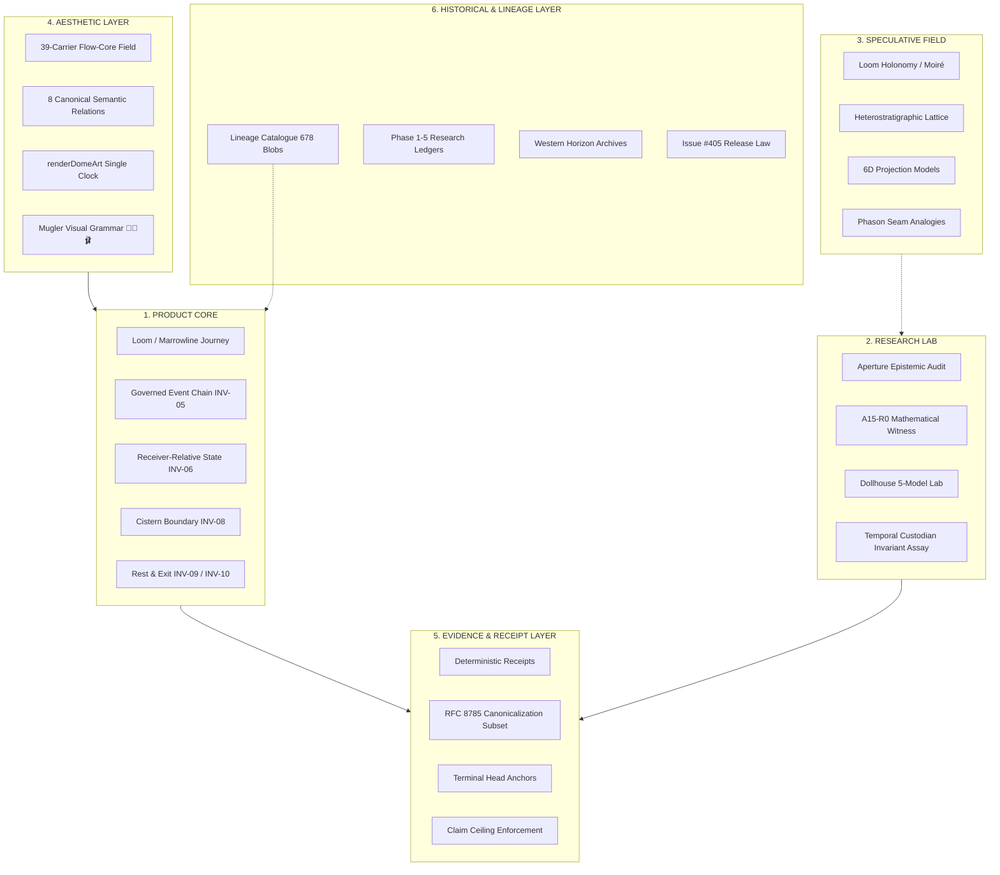

# TD613 · SEQUENCE 6 · SURVIVOR MAP & ARCHITECTURE FREEZE

```text
================================================================================
PROVENANCE & CUSTODY DECLARATION
================================================================================
DOCUMENT_ROLE:                      Sequence 6 Architecture Freeze & Survivor Map
STATUS:                             CANONICAL_PROVENANCE_RECORD
CONCEPTUAL_ADJUDICATION_TIMESTAMP:  2026-10-06T19:08:27-04:00
INITIAL_LOCAL_INGESTION_COMMIT:     4a41bb6468689857bfef61c7b5fae797a394d35b
CANONICAL_REMOTE_ARCHIVAL_TIMESTAMP: 2026-10-06T19:40:00-04:00
CANONICAL_STAGING_BRANCH:           staging/sequence-6-integration-20261006
CANONICAL_BASE_COMMIT:              f309a35822afbb72ece865a379be40800ba8effa
TRANCHE_1_IMPLEMENTATION_COMMIT:    44946b22cc8e8313ab58f7e257270988984e7309

CHRONOLOGY HONESTY NOTICE:
LATE_REMOTE_ARCHIVAL != EARLIER_GIT_FREEZE

1. Conceptual adjudication of the Sequence 6 Survivor Map and Six-Layer Architecture
   preceded the implementation of Tranche 1 (completed at 2026-10-06T19:08:27-04:00).
2. The initial local commit landed on a local research branch (4a41bb646) while the
   canonical staging branch (staging/sequence-6-integration-20261006) was established
   cleanly from product base main@1b1925ad4.
3. This provenance document enters remote canonical custody deliberately following
   Tranche 1 remote verification.
4. It does not rewrite Git chronology, backdate commits, or pretend to be an earlier
   commit than it is.
================================================================================
```

---

## I. Scientific State at Sequence 6 Entry

### 1. Canonical Sequence 5.5 Scientific Closure
Under the receiver-clean V4.1R relational-contrast assay at Gemini 3.8 Flash / medium / Vercel-preview:
* Arms K0, K0D, K1, and K2 each produced pair-success profiles of 4/5.
* Arm K3 produced 5/5, uniquely matching the preregistered `PAIR_04` (`PASS → HELD`) predecessor-continuity transition.
* Verification gates:
  * `methodological-identification gate` = **FAIL**
  * `pairwise-spread gate` = **FAIL**
  * `dynamic-range gate` = **FAIL**
  * Total pair score = **21/25 = 84%**
  * BAT execution count = **0**
  * Main battery = **SEALED / UNEXECUTED**

```text
APERTURE_INCREMENTAL_EFFECT        = NOT_ESTABLISHED
K3_CAUSAL_ADVANTAGE                = NOT_ESTABLISHED
K3_PAIR04_SIGNAL                   = OBSERVED_DIAGNOSTIC_ONLY
PAIR04_SIGNAL                     ≠ TREATMENT_EFFECT
NON_IDENTIFYING_RESULT            ≠ METHODOLOGICAL_EQUIVALENCE
SEQUENCE_4_RELATION_SURVIVAL      ≠ INDEPENDENT_EXTERNAL_VALIDATION
```

### 2. Governing Product & Ancestry Law
* **Primary Product Law:**  
  $$\text{THE PRODUCT IS NOT THE DISSERTATION RENDERED AS UI.}$$  
  $$\text{THE PRODUCT IS THE SURVIVING RELATION SET RENDERED BEAUTIFULLY.}$$
* **Ancestry Separation Law:**  
  $$\text{RESEARCH\_AUDIT\_ANCESTRY} \neq \text{PRODUCT\_MERGE\_ANCESTRY}$$
* **Utility vs Causation Law:**  
  $$\text{PRODUCT\_UTILITY} \neq \text{CAUSAL\_METHOD\_SUPERIORITY}$$  
  $$\text{ENGINEERING\_ADOPTION} \neq \text{SCIENTIFIC\_VALIDATION}$$
* **Epistemic Non-Equivalence Inequality:**  
  $$V \neq C \neq P \neq L$$
  Trace Observability ($V$) $\neq$ Custody Recoverability ($C$) $\neq$ Process State ($P$) $\neq$ Latent Reality ($L$).

---

## II. The Six-Layer Architecture

Sequence 6 partitions all inherited and newly designed repository mechanisms across six strict jurisdictions:



### 1. Layer Definitions & Jurisdictions

1. **PRODUCT CORE**  
   *Jurisdiction:* Runtime capabilities directly required for the operator to conduct governed work.  
   *Rule:* Enforces zero unearned authority; strictly separates interactive operator direct actions, Amari connector requests, and detached delegated operations.  
   *Inhabitants:* Loom intake, Marrowline continuation, Native Return, Cistern Law, Rest/Exit, predecessor chaining, receiver-relative state.

2. **RESEARCH LAB**  
   *Jurisdiction:* Controlled assays, falsification instruments, identifiability audits, and mathematical witnesses.  
   *Rule:* Cannot grant execution, merge, release, or production mutation authority. Produces bounded recommendations and diagnostic receipts only.  
   *Inhabitants:* Aperture v3.2-alpha diagnostic engine, A15-R0 algebraic witnesses, Dollhouse multi-agent lab, Temporal Custodian testing harness.

3. **SPECULATIVE FIELD**  
   *Jurisdiction:* Mathematical and conceptual analogies whose formal proof or causal separation is unearned or non-identifying.  
   *Rule:* Fully licensed for imaginative exploration and aesthetic inspiration; strictly walled off from production claims or cryptographic security assertions.  
   *Inhabitants:* Holonomy moiré, 6D projection lattices, phason strain mechanics, non-abelian two-loop history descent.

4. **AESTHETIC LAYER**  
   *Jurisdiction:* Visual rendering, typography, motion choreographies, spatial density, and emotional temperature.  
   *Rule:* Governed by the Mugler Mandate ("sex without AI-slop or ontology clutter"). Ambient motion is explicitly non-authoritative; only evidenced state is binding.  
   *Inhabitants:* 39-carrier Flow-Core depth field, 8 canonical relations, single-clock `renderDomeArt`, obsidian/marble/amber palette.

5. **EVIDENCE / RECEIPT LAYER**  
   *Jurisdiction:* Cryptographic digests, verifiable receipts, tamper-evident chains, and claim ceiling bounds.  
   *Rule:* Must declare exact claim ceilings; receipts record what was observed/verified, never manufacturing external custody authority or proof of origin.  
   *Inhabitants:* RFC 8785 deterministic canonicalization, domain-separated SHA-256 event chaining, terminal head anchors, claim ceilings.

6. **HISTORICAL / LINEAGE LAYER**  
   *Jurisdiction:* Immutable source lineage, archival research ledgers, closed sequence receipts, and release governance.  
   *Rule:* Immutable read-only reference estate. Carried bytes establish integrity, not empirical proof of external superiority.  
   *Inhabitants:* Lineage catalogue (678 blobs), closed Sequence 1–5.5 ledgers, Issue #405 release law.

---

## III. The 32 Inherited Mechanisms: Complete Survivor Map

| ID | Mechanism | Layer | Earned Status / Claim Ceiling | Disposition | Rationale |
|:---|:---|:---|:---|:---|:---|
| M-01 | Predecessor Hash Chaining | Product Core | `TAMPER_EVIDENT_PREDECESSOR_CHAINING_ONLY` | `CARRY_FORWARD` | Implemented in Tranche 1. INV-05 predecessor binding. |
| M-02 | RFC 8785 JSON Canonicalization | Evidence / Receipt | `DETERMINISTIC_JCS_CANONICALIZATION_SUBSET_ESTABLISHED` | `CARRY_FORWARD` | Strict UTF-16 sort, lone surrogate rejection, hole rejection. |
| M-03 | Terminal Head Anchoring | Evidence / Receipt | `PREDECESSOR_CHAIN_VERIFIED_NOT_TERMINAL_HEAD_ANCHORED` | `CARRY_FORWARD` | Distinguishes internal link traversal from witnessed head anchor. |
| M-04 | Monotonic Timestamp Chronology | Product Core | `MONOTONIC_EVENT_TIME_NOT_FULL_NON_RETROACTIVITY` | `CARRY_FORWARD` | Rejects retroactive event insertion; full non-retroactivity deferred. |
| M-05 | Timestamp Causality Check | Product Core | `DECLARED_MEASUREMENT_LEQ_RECORDING_TIME` | `CARRY_FORWARD` | Declared measurement must not occur after recording timestamp. |
| M-06 | Route Identity Binding | Product Core | `ROUTE_IDENTITY_BOUND_NOT_ROUTE_TRANSITION_AUTHORIZED` | `CARRY_FORWARD` | Cryptographically binds route; detects intermediate tampering once committed. |
| M-07 | Domain Separator (SHA-256) | Evidence / Receipt | `DIGEST_DOMAIN_SEPARATION_ONLY` | `CARRY_FORWARD` | Separates event digests from genesis anchors; no length-extension claim. |
| M-08 | 39-Carrier Depth Field | Aesthetic Layer | `NON_AUTHORITATIVE_VISUAL_CARRIER_GRAMMAR` | `CARRY_FORWARD` | Near/mid/far perceptual planes; expressions of system state. |
| M-09 | 8 Canonical Flow-Core Relations | Aesthetic Layer | `SEMANTIC_RELATION_MOTION_GRAMMAR` | `CARRY_FORWARD` | Expresses gathering, transport, rest, excitation, settling. |
| M-10 | Single Animation Coordinator | Aesthetic Layer | `DETERMINISTIC_VIEW_SNAPSHOT_COORDINATION` | `CARRY_FORWARD` | `renderDomeArt(viewId, worldSnapshot, viewport, time)` with 1 clock. |
| M-11 | Reduced-Motion Equivalents | Aesthetic Layer | `WCAG_ACCESSIBLE_STATIC_EQUIVALENCE` | `CARRY_FORWARD` | First-class static visual grammar for accessibility. |
| M-12 | Mugler Visual Styling | Aesthetic Layer | `PRODUCT_ART_DIRECTION_STANDARD` | `CARRY_FORWARD` | Obsidian, marble, velvet, architectural silhouette, zero AI-slop. |
| M-13 | Loom Intake Stage | Product Core | `BOUNDED_OPERATOR_INPUT_ADMISSION` | `CARRY_FORWARD` | Legible setup, selected file staging, clear authority classification. |
| M-14 | Marrowline Continuation Stage | Product Core | `BOUNDED_SUBSTANTIVE_REASONING_ROUTE` | `CARRY_FORWARD` | Living chat, qualifier preservation, mobile Send clearance. |
| M-15 | Native Return & Safe Export | Product Core | `CUSTODIAL_RETURN_AND_PORTABLE_EXPORT` | `CARRY_FORWARD` | Return to origin with intact history, private save, clean review. |
| M-16 | Cistern Law Boundary | Product Core | `CONSEQUENTIAL_MUTATION_RESTRICTION` | `CARRY_FORWARD` | Strict boundary for consequential information and mutation routes. |
| M-17 | Rest and Exit Affordances | Product Core | `UNPENALIZED_SESSION_REST_AND_EXIT` | `CARRY_FORWARD` | Operator may exit or pause at any point without loss or penalty. |
| M-18 | Human Closure Requirement | Product Core | `MANDATORY_HUMAN_IN_THE_LOOP_CLOSURE` | `CARRY_FORWARD` | No automated release, merge, or deployment without human gesture. |
| M-19 | Three Authority Classes | Product Core | `STRICT_AUTHORITY_PARTITIONING` | `CARRY_FORWARD` | Interactive direct vs Amari connector vs Detached delegated. |
| M-20 | Aperture Epistemic Audit | Research Lab | `DIAGNOSTIC_DEFICIT_IDENTIFICATION_ONLY` | `CARRY_FORWARD` | Audits rank, stability, conditioning; cannot grant execution authority. |
| M-21 | Dollhouse 4-Role Map | Research Lab | `JURISDICTIONAL_ROLE_PARTITIONING` | `CARRY_FORWARD` | Pedagogue, Aperture, Atlas, FADT distinct jurisdictions. |
| M-22 | Temporal Custodian | Research Lab | `BOUNDED_RESEARCH_CANDIDATE` | `HOLD` | Epistemic state snapshotting; held pending Tranche integration. |
| M-23 | Orchestrator Coordination | Research Lab | `COORDINATION_ONLY_NOT_EPISTEMIC_SUPERIORITY` | `SIMPLIFY` | Pure coordination layer; preserves disagreement and ceilings. |
| M-24 | 5-Model Multi-Agent Trial | Research Lab | `CROSS_MODEL_CALIBRATION_TESTING` | `PRODUCT_TEST_REQUIRED` | Exercises consistency across Claude, GPT-4o, Gemini, DeepSeek, Llama. |
| M-25 | Holonomy Moiré | Speculative Field | `MATHEMATICAL_ANALOGY_ONLY` | `CARRY_FORWARD` | Visual and conceptual generator; no causal claims. |
| M-26 | Heterostratigraphic Lattice | Speculative Field | `GEOMETRIC_EXPLORATION_FRAMEWORK` | `CARRY_FORWARD` | Structural visual inspiration for multi-plane interfaces. |
| M-27 | 6D Projection Constructions | Speculative Field | `THEORETICAL_CONSTRUCT_UNVALIDATED` | `HOLD` | Preserved in speculative literature; excluded from product claims. |
| M-28 | Phason Seam Mechanics | Speculative Field | `ANALOGICAL_TOPOLOGICAL_INSPIRATION` | `HOLD` | Excluded from physical/causal claims. |
| M-29 | Lineage Source Estate (678 Blobs)| Historical / Lineage | `CARRIED_BYTE_INTEGRITY_WITHOUT_PROMOTION` | `CARRY_FORWARD` | Immutable lineage catalogue across 8 pinned snapshots. |
| M-30 | Issue #405 Release Law | Historical / Lineage | `GOVERNED_SINGLE_DEPLOYMENT_GATE` | `CARRY_FORWARD` | Production release strictly requires issue #405 operator gesture. |
| M-31 | Bespoke Vernacular Ontology | Historical / Lineage | `HISTORICAL_LINEAGE_ARCHIVE` | `REMOVE` | Stripped from product UI; plain engineering terminology used. |
| M-32 | Unearned Causation Claims | Historical / Lineage | `UNVALIDATED_THEORETICAL_EXTRAPOLATION` | `REMOVE` | Nullified by Sequence 5.5 closure; tiara remains boxed. |

---

## IV. The 12 Invariants: Dispositions & Jurisdictions

1. **INV-01 (Non-Degenerate Inhabitant Preservation):**  
   *Layer:* Product Core.  
   *Disposition:* `CARRY_FORWARD`. Real routes, real data, and real user workflows cannot be replaced by hollow mock placeholders during evaluation.

2. **INV-02 (Projection Invariance):**  
   *Layer:* Speculative Field / Aesthetic.  
   *Disposition:* `SIMPLIFY`. Visual projections (desktop vs mobile, expanded vs compact) must preserve underlying semantic relation topology.

3. **INV-03 (Consequence-First Routing):**  
   *Layer:* Product Core.  
   *Disposition:* `CARRY_FORWARD`. Human consequence, cost, irreversibility, and danger must be encountered before ontology, configuration, or technical prose.

4. **INV-04 (Uncertainty Typing):**  
   *Layer:* Evidence / Receipt Layer.  
   *Disposition:* `CARRY_FORWARD`. Missing data, epistemic deficits, and model ambiguity must be typed explicitly (e.g. `STRUCTURAL_RANK_DEFICIT`, `UNANCHORED`).

5. **INV-05 (Predecessor Hash Chaining):**  
   *Layer:* Product Core.  
   *Disposition:* `CARRY_FORWARD` (Implemented in Tranche 1). Canonical RFC 8785 encoding with domain-separated SHA-256 predecessor links.

6. **INV-06 (Receiver-Relative State):**  
   *Layer:* Product Core.  
   *Disposition:* `CARRY_FORWARD`. Observer-local state and client-side draft buffers are never conflated with admitted, durable custody heads.

7. **INV-07 (Missing Evidence HOLD):**  
   *Layer:* Evidence / Receipt Layer.  
   *Disposition:* `CARRY_FORWARD`. When requisite evidence is absent, the system asserts an explicit `HOLD` rather than fabricating synthetic continuity.

8. **INV-08 (Cistern Law):**  
   *Layer:* Product Core.  
   *Disposition:* `CARRY_FORWARD`. High-consequence mutation operations require defensive parameter validation, explicit operator custody, and relock.

9. **INV-09 (Rest and Exit):**  
   *Layer:* Product Core.  
   *Disposition:* `CARRY_FORWARD`. The operator may pause, save privately, or exit any route at any time without data loss or administrative penalty.

10. **INV-10 (Human Closure):**  
    *Layer:* Product Core.  
    *Disposition:* `CARRY_FORWARD`. Autonomous processes cannot merge, deploy, or assert external truth without direct contemporaneous human closure.

11. **INV-11 (Non-Retroactivity):**  
    *Layer:* Product Core.  
    *Disposition:* `CARRY_FORWARD` (Ordered chronology in Tranche 1; full epistemic-state non-retroactivity in Temporal Custodian).

12. **INV-12 (Claim Ceiling Verification):**  
    *Layer:* Evidence / Receipt Layer.  
    *Disposition:* `CARRY_FORWARD`. Every verification receipt explicitly outputs its claim ceilings, preventing inflation of diagnostic evidence into causal superiority.

---

## V. Visual Grammar & Motion Architecture

### 1. The 39-Carrier Flow-Core Depth Field
* **Actors:** Exactly 39 visible carriers distributed across three depth planes:
  * **Near Plane (13 carriers):** High contrast, primary interactive focus, sharp edges, direct consequence.
  * **Mid Plane (13 carriers):** Ambient structural relation, contextual continuity, subtle luminosity.
  * **Far Plane (13 carriers):** Deep architectural grounding, slow cadence, subtle grid lattice.
* **The 8 Canonical Relations:**
  1. `米` (Convergence / Gathering): Carriers congregate toward an active focal root.
  2. `à` (Directional Transport): Directed motion along a defined route vector.
  3. `出` (Egress / Emission): Emission of completed artifacts or export payloads.
  4. `hõt` (Thermal Excitation): High-frequency shimmer indicating uncommitted computation or high route burden.
  5. `cōl` (Structural Settling): Damping velocity as state converges to rest.
  6. `上` (Ascent / Elevation): Promotion of an artifact to higher custody or review.
  7. `下` (Descent / Grounding): Resolution of an abstraction into concrete local storage.
  8. `𝄐` (Fermata / Structural Rest): Complete cessation of ambient motion; clean equilibrium.

### 2. Dome-Art Choreography
* **Single Clock Coordinator:** Exactly one animation coordinator:
  `renderDomeArt(viewId, worldSnapshot, viewport, time)`
* **Law of Visual Truth:** Ambient animation is presentation-only; it never masquerades as event history or cryptographic execution evidence.
* **Static Accessibility:** Reduced-motion preferences map the 39 carriers and 8 relations to crisp, static architectural typography and state badges.

---

## VI. The Repaired Product Journey

```text
Holonomy Loom (Intake / Setup)
  │
  ▼
Marrowline (Substantive Governed Reasoning)
  │
  ▼
Native Return & Portable Export (Review, Private Save, Clean Rest)
```

1. **Loom Intake:** Clean setup, clear authority classification, zero clutter, responsive touch targets.
2. **Marrowline Living Work:** Clear conversation tree without phantom traces, unblocked mobile Send, qualification preservation.
3. **Native Return:** Preserved predecessor chain, unambiguous head anchor, truthful receipts, unpenalized exit.

---

## VII. Five-Model Multi-Agent Calibration Trial

The Sequence 6 Dollhouse trial exercises the surviving architecture against five frontier foundation models:
1. Anthropic Claude 3.5 Sonnet / 3.7
2. OpenAI GPT-4o
3. Google Gemini 3.8 Flash / Pro
4. DeepSeek V3 / R1
5. Meta Llama 3.3 70B

Each model evaluates the same canonical practice fixtures under identical prompt boundaries, measuring:
* Invariant preservation consistency (`INV-01` through `INV-12`).
* Claim ceiling honesty (refusal to claim unearned causal advantage).
* Resilience against prompt injection and authority escalation.

---

## VIII. Conclusion & Staging Rest

With the ingestion of this document into canonical custody:
$$\text{SEQUENCE\_6\_REST\_1} = \text{SURVIVOR\_ARCHITECTURE\_FREEZE}$$
is earned.

Tranche 1 is complete, hardened, and anchored.
Tranche 2 (39-Carrier Flow-Core motion bridge and Loom route realization) remains paused awaiting explicit operator direction.

𝄐

Sealed ⟐
