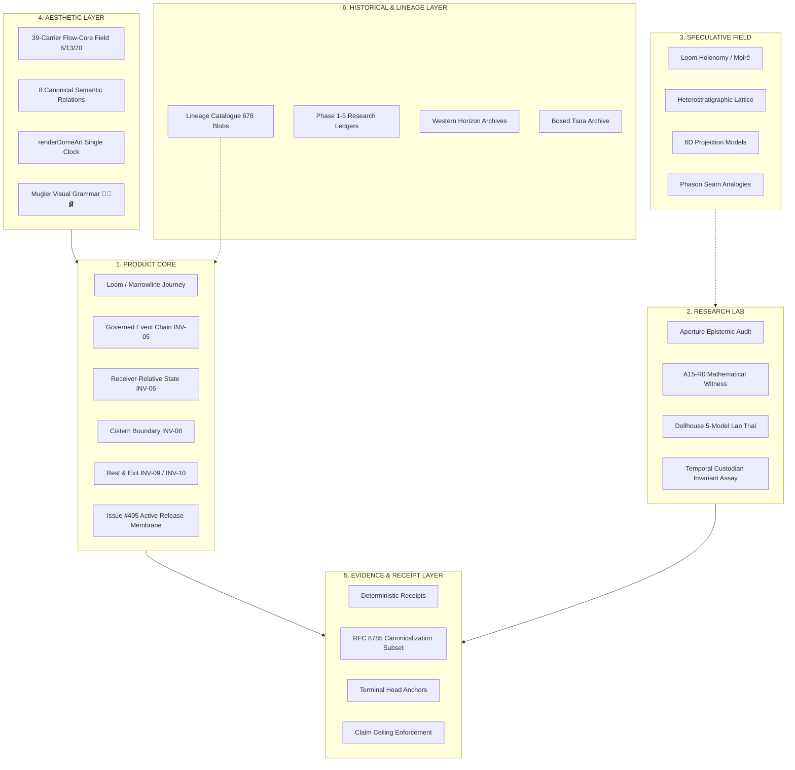

# TD613 · SEQUENCE 6 · SURVIVOR MAP & ARCHITECTURE FREEZE

```text
================================================================================
PROVENANCE & CUSTODY DECLARATION
================================================================================
DOCUMENT_ROLE:                       Sequence 6 Architecture Freeze & Survivor Map
STATUS:                              CANONICAL_PROVENANCE_RECORD
CONCEPTUAL_ADJUDICATION_TIMESTAMP:   2026-10-06T19:08:27-04:00
CANONICAL_STAGING_BRANCH:            staging/sequence-6-integration-20261006
CANONICAL_BASE_COMMIT:               f309a35822afbb72ece865a379be40800ba8effa
TRANCHE_1_INITIAL_COMMIT:            44946b22cc8e8313ab58f7e257270988984e7309
TRANCHE_1_CORRECTIVE_COMMIT:         cd30af5450b9b4c8c6e13930e4c436c424f1fb69
CURRENT_STAGE:                       REST_1_ARCHITECTURE_FREEZE_RECONCILIATION

CHRONOLOGY HONESTY NOTICE:
LATE_REMOTE_ARCHIVAL != EARLIER_GIT_FREEZE

1. Conceptual adjudication of the Sequence 6 Survivor Map and Six-Layer Architecture
   preceded the implementation of Tranche 1.
2. Initial Tranche 1 code was verified remotely at 44946b22c. Corrective hardening
   (RFC 8785 lone surrogate rejection, hole rejection, terminal head anchor) was
   admitted into canonical remote custody at cd30af545.
3. This reconciled freeze document corrects all lineage and invariant contradictions
   identified in the architecture freeze adjudication.
4. It does not rewrite Git chronology, backdate commits, or pretend to be an earlier
   commit than it is.
================================================================================
```

---

## I. Scientific State at Sequence 6 Entry

### 1. Canonical Sequence 5.5 Scientific Closure
Under the receiver-clean V4.1R relational-contrast assay at Gemini 3.8 Flash / medium / Vercel-preview:
* Arms K0, K0D, K1, and K2 each produced pair-success profiles of 4/5.
* Arm K3 produced 5/5, uniquely matching the preregistered `PAIR_04` (`PASS → HELD`) predecessor-continuity transition.
* Verification gates:
  * `methodological-identification gate` = **FAIL**
  * `pairwise-spread gate` = **FAIL**
  * `dynamic-range gate` = **FAIL**
  * Total pair score = **21/25 = 84%**
  * BAT execution count = **0**
  * Main battery = **SEALED / UNEXECUTED**

```text
APERTURE_INCREMENTAL_EFFECT        = NOT_ESTABLISHED
K3_CAUSAL_ADVANTAGE                = NOT_ESTABLISHED
K3_PAIR04_SIGNAL                   = OBSERVED_DIAGNOSTIC_ONLY
PAIR04_SIGNAL                     ≠ TREATMENT_EFFECT
NON_IDENTIFYING_RESULT            ≠ METHODOLOGICAL_EQUIVALENCE
SEQUENCE_4_RELATION_SURVIVAL      ≠ INDEPENDENT_EXTERNAL_VALIDATION
```

### 2. Governing Product & Ancestry Law
* **Primary Product Law:**  
  $$\text{THE PRODUCT IS NOT THE DISSERTATION RENDERED AS UI.}$$  
  $$\text{THE PRODUCT IS THE SURVIVING RELATION SET RENDERED BEAUTIFULLY.}$$
* **Ancestry Separation Law:**  
  $$\text{RESEARCH\_AUDIT\_ANCESTRY} \neq \text{PRODUCT\_MERGE\_ANCESTRY}$$
* **Utility vs Causation Law:**  
  $$\text{PRODUCT\_UTILITY} \neq \text{CAUSAL\_METHOD\_SUPERIORITY}$$  
  $$\text{ENGINEERING\_ADOPTION} \neq \text{SCIENTIFIC\_VALIDATION}$$  
  $$\text{RELATED\_RELATION\_SURVIVED} \neq \text{PRODUCT\_MECHANISM\_SURVIVED}$$
* **Jurisdiction Invariants:**  
  $$\text{MOTION\_INTERPRETATION} \neq \text{SEMANTIC\_REDEFINITION}$$  
  $$\text{ORCHESTRATION\_TRIAL} \neq \text{FIXED\_MODEL\_ROSTER}$$  
  $$\text{VISUAL\_GRAMMAR} \neq \text{IMMUTABLE\_PALETTE}$$
* **Epistemic Non-Equivalence Inequality:**  
  $$V \neq C \neq P \neq L$$
  * $V$ (**Trace Observability**): Emitted bytes, tokens, telemetry, and network logs.
  * $C$ (**Custody Recoverability**): Cryptographic linkage, HMAC signatures, content-addressed git hashes, and append-only commit history.
  * $P$ (**Process Identifiability**): Mathematical distinguishability of the underlying generating policy or routing mechanism from empirical outputs.
  * $L$ (**Latent-State Reconstructibility**): Verifiable reconstruction of true internal model representations, hidden prompt state, or user cognition.

---

## II. The Six-Layer Architecture

Sequence 6 partitions all inherited and newly designed repository mechanisms across six strict jurisdictions:



### Layer Definitions & Jurisdictions

1. **PRODUCT CORE**  
   *Jurisdiction:* Runtime capabilities directly required for the operator to conduct governed work.  
   *Rule:* Enforces zero unearned authority; strictly separates interactive operator direct actions, Amari connector requests, and detached delegated operations. Includes the active Issue #405 production release membrane.  
   *Inhabitants:* Loom intake, Marrowline continuation, Native Return, Cistern Law, Rest/Exit, predecessor chaining, receiver-relative state, Issue #405 release membrane.

2. **RESEARCH LAB**  
   *Jurisdiction:* Controlled assays, falsification instruments, identifiability audits, and mathematical witnesses.  
   *Rule:* Cannot grant execution, merge, release, or production mutation authority. Produces bounded recommendations and diagnostic receipts only.  
   *Inhabitants:* Aperture diagnostic engine, A15-R0 algebraic witnesses, Dollhouse multi-agent research trials, Temporal Custodian testing harness.

3. **SPECULATIVE FIELD**  
   *Jurisdiction:* Mathematical and conceptual analogies whose formal proof or causal separation is unearned or non-identifying.  
   *Rule:* Fully licensed for imaginative exploration and aesthetic inspiration; strictly walled off from production claims or cryptographic security assertions.  
   *Inhabitants:* Holonomy moiré, 6D projection lattices, phason seam mechanics.

4. **AESTHETIC LAYER**  
   *Jurisdiction:* Visual rendering, typography, motion choreographies, spatial density, and emotional temperature.  
   *Rule:* Governed by the Mugler Mandate ("sex without AI-slop or ontology clutter"). Ambient motion is explicitly non-authoritative; only evidenced state is binding. Governs quality and jurisdiction rather than an immutable swatch palette.  
   *Inhabitants:* 39-carrier Flow-Core depth field (6 near / 13 mid / 20 far), 8 canonical relations, single-clock `renderDomeArt`, Mugler visual grammar.

5. **EVIDENCE / RECEIPT LAYER**  
   *Jurisdiction:* Cryptographic digests, verifiable receipts, tamper-evident chains, and claim ceiling bounds.  
   *Rule:* Must declare exact claim ceilings; receipts record what was observed/verified, never manufacturing external custody authority or proof of origin.  
   *Inhabitants:* RFC 8785 deterministic canonicalization subset, domain-separated SHA-256 event chaining, terminal head anchors, claim ceilings.

6. **HISTORICAL / LINEAGE LAYER**  
   *Jurisdiction:* Immutable source lineage, archival research ledgers, closed sequence receipts, and heritage narratives.  
   *Rule:* Immutable read-only reference estate. Carried bytes establish integrity, not empirical proof of external superiority.  
   *Inhabitants:* Lineage catalogue (678 blobs), closed Sequence 1–5.5 ledgers, Tauric Diana Crimean heritage archive, boxed tiara.

---

## III. The 32 Inherited Mechanisms: Complete Survivor Map

All 32 inherited mechanisms are classified in exact byte-semantic alignment with `research/sequence-6-surviving-relations/01-SURVIVOR_MAP_AND_RELATIONAL_BASIS.json`:

| ID | Mechanism Name | TD613 Historical Name | Evidence Class | Seq 4 Status | Seq 5.5 Status | Disposition | Target Layer |
|:---|:---|:---|:---|:---|:---|:---|:---|
| **INV-01** | Default-Deny Outbound Carriage | `INV-01-UNARMED-SILENT-CARRIAGE-FORBIDDEN` | `ENGINEERED` | SURVIVED (Same-host) | SATURATED | `SURVIVED`, `FIELD-USEFUL` | PRODUCT_CORE |
| **INV-02** | Explicit Qualifying Authorization Gate | `INV-02-CONSEQUENTIAL-CARRIAGE-REQUIRES-EXPLICIT-QUALIFYING-AUTHORIZATION` | `ENGINEERED` | SURVIVED (Same-host) | SATURATED | `SURVIVED`, `GOVERNANCE_ONLY`, `AESTHETIC` | PRODUCT_CORE |
| **INV-03** | Single-Shot Ephemeral Authorization | `INV-03-TRANSIENT-AUTHORIZATION-REST-RETURN` | `ENGINEERED` | SURVIVED (Same-host) | SATURATED | `SURVIVED`, `FIELD-USEFUL` | PRODUCT_CORE |
| **INV-04** | Re-entry Re-authorization Mandate | `INV-04-REENTRY-REQUIRES-NEW-QUALIFYING-AUTHORIZATION` | `ENGINEERED` | SURVIVED (Same-host) | SATURATED | `SURVIVED`, `GOVERNANCE_ONLY` | PRODUCT_CORE |
| **INV-05** | Tamper-Evident Predecessor Hash Chaining | `INV-05-PREDECESSOR-ANCESTRY-CHAIN-PRESERVATION` | `ENGINEERED` | SURVIVED (Same-host) | SATURATED | `SURVIVED`, `FIELD-USEFUL` | PRODUCT_CORE |
| **INV-06** | Provenance Does Not Equal Action Authority | `INV-06-PROVENANCE-HISTORY-DOES-NOT-CONFER-ACTION-AUTHORITY` | `DERIVED` | SURVIVED (Same-host) | SATURATED | `SURVIVED`, `GOVERNANCE_ONLY` | PRODUCT_CORE |
| **INV-07** | Missing Evidence Fallback to HOLD | `INV-07-MISSING-RAW-EVIDENCE-TRIGGERS-HOLD-NOT-SILENT-DROPPING` | `ENGINEERED` | SURVIVED (Same-host) | SATURATED | `SURVIVED`, `FIELD-USEFUL`, `AESTHETIC` | PRODUCT_CORE |
| **INV-08** | Retry Route Preservation | `INV-08-RETRY-PRESERVES-ORIGINAL-ROUTE-CLASS` | `ENGINEERED` | SURVIVED (Same-host) | SATURATED | `SURVIVED`, `GOVERNANCE_ONLY` | PRODUCT_CORE |
| **INV-09** | Epistemic Layer Separation ($V \neq C \neq P \neq L$) | `INV-09-EVIDENCE-CLASS-SEPARATION` | `DERIVED` | SURVIVED (Same-host) | SATURATED | `SURVIVED`, `GOVERNANCE_ONLY`, `AESTHETIC` | PRODUCT_CORE |
| **INV-10** | Execution Host Does Not Prove Exogenous Witness | `INV-10-DIFFERENT-HOST-DOES-NOT-PROVE-EXOGENOUS-WITNESS` | `DERIVED` | SURVIVED (Same-host) | SATURATED | `SURVIVED`, `GOVERNANCE_ONLY` | EVIDENCE_RECEIPT_LAYER |
| **INV-11** | Temporal Non-Retroactivity | `INV-11-TEMPORAL-NON-RETROACTIVITY` | `ENGINEERED` | SURVIVED (Same-host) | SATURATED | `SURVIVED`, `FIELD-USEFUL` | PRODUCT_CORE |
| **INV-12** | Finite Quotient Support Compatibility | `INV-12-FINITE-QUOTIENT-SUPPORT-COMPATIBILITY` | `DERIVED` | SURVIVED (Same-host) | NOT_EVALUATED | `SURVIVED`, `FORMALLY_INTERESTING`, `GOVERNANCE_ONLY` | RESEARCH_LAB |
| **M13** | 39-Carrier Flow-Core Visual Field | `39-Carrier Field (near/mid/far)` | `ENGINEERED` | `OPERATIONAL_LINEAGE` | OPERATIONAL | `OPERATIONAL_LINEAGE`, `FIELD-USEFUL`, `AESTHETIC` | AESTHETIC_LAYER |
| **M14** | Eight Canonical Flow-Core Relations | `Flow-Core Relational Alphabet (米 à 出 hõt cōl 上 下 𝄐)` | `DERIVED` | `OPERATIONAL_LINEAGE` | OPERATIONAL | `OPERATIONAL_LINEAGE`, `FIELD-USEFUL`, `AESTHETIC` | AESTHETIC_LAYER |
| **M15** | Single Animation Coordinator | `renderDomeArt(viewId, snapshot, viewport, time)` | `ENGINEERED` | `OPERATIONAL_LINEAGE` | OPERATIONAL | `OPERATIONAL_LINEAGE`, `FIELD-USEFUL` | AESTHETIC_LAYER |
| **M16** | Semantic Motion vs Ambient Choreography | `Motion Jurisdiction Law` | `ENGINEERED` | `OPERATIONAL_LINEAGE` | OPERATIONAL | `OPERATIONAL_LINEAGE`, `GOVERNANCE_ONLY` | AESTHETIC_LAYER |
| **M17** | Deterministic Visual Replay & Reduced Motion | `Static / Reduced-Motion Equivalence` | `ENGINEERED` | `OPERATIONAL_LINEAGE` | OPERATIONAL | `OPERATIONAL_LINEAGE`, `FIELD-USEFUL` | AESTHETIC_LAYER |
| **M18** | Governed Product Journey | `Loom -> Marrowline -> Native Return` | `ENGINEERED` | `PRODUCT_TEST_REQUIRED` | PARTIAL | `PRODUCT_TEST_REQUIRED`, `FIELD-USEFUL` | PRODUCT_CORE |
| **M19** | Attachment Preview & Safe Download | `Attachments Affordance` | `ENGINEERED` | `PRODUCT_TEST_REQUIRED` | DEFECTIVE | `PRODUCT_TEST_REQUIRED`, `FIELD-USEFUL` | PRODUCT_CORE |
| **M20** | Receipts Autosnap & Fee Parsing | `Receipts Engine` | `ENGINEERED` | `PRODUCT_TEST_REQUIRED` | DEFECTIVE | `PRODUCT_TEST_REQUIRED`, `FIELD-USEFUL` | PRODUCT_CORE |
| **M21** | Conversation Hygiene (Speaking Grove Fix) | `Conversation Lifecycle Manager` | `ENGINEERED` | `PRODUCT_TEST_REQUIRED` | DEFECTIVE | `PRODUCT_TEST_REQUIRED`, `FIELD-USEFUL` | PRODUCT_CORE |
| **M22** | Mobile Viewport Send & Navigation (↻ ⧉ ✕ 𖠿) | `Mobile Action Membrane` | `ENGINEERED` | `PRODUCT_TEST_REQUIRED` | DEFECTIVE | `PRODUCT_TEST_REQUIRED`, `FIELD-USEFUL` | PRODUCT_CORE |
| **M23** | Complete Mugler Mandate Visual Grammar | `TD613 Design Grammar` | `AESTHETIC` | `OPERATIONAL_LINEAGE` | FORMALIZED | `OPERATIONAL_LINEAGE`, `AESTHETIC` | AESTHETIC_LAYER |
| **M24** | Dollhouse Orchestration Trial on Models A–E | `Dollhouse Jurisdictional Trial` | `PROPOSED_RESEARCH_DESIGN` | `OUT_OF_SCOPE` | NON_IDENTIFYING | `PROPOSED_RESEARCH_DESIGN`, `EMPIRICALLY_UNRESOLVED` | RESEARCH_LAB |
| **M25** | Temporal Custodian Chronology UX | `Temporal Custodian` | `ENGINEERED` | `OUT_OF_SCOPE` | CANDIDATE | `BOUNDED_RESEARCH_CANDIDATE`, `HOLD` | RESEARCH_LAB |
| **M26** | Pre-Refusal Conditioning Surface (PRCS-A) | `PRCS-A Latent Steering` | `HYPOTHESIS` | `OUT_OF_SCOPE` | NON_IDENTIFYING | `EMPIRICALLY_UNRESOLVED`, `FORMALLY_INTERESTING` | RESEARCH_LAB |
| **M27** | Holonomy & Path-Dependent Curvature | `Fiber Bundle Loop-Power Holonomy` | `FORMAL CONSTRUCTION` | `OUT_OF_SCOPE` | NOT_APPLICABLE | `FORMALLY_INTERESTING`, `SPECULATION` | SPECULATIVE_FIELD |
| **M28** | Moiré Interference as Model-Discovery Surface | `Pairwise Moire Stratigraphy` | `ANALOGY` | `OUT_OF_SCOPE` | NOT_APPLICABLE | `AESTHETIC`, `MNEMONIC` | AESTHETIC_LAYER |
| **M29** | 6D Quasi-Lattice & Phason Seam Dynamics | `6D Lattice Tomography / Phason Boundaries` | `SPECULATION` | `OUT_OF_SCOPE` | NOT_APPLICABLE | `DISCARDED`, `FORMALLY_INTERESTING` | SPECULATIVE_FIELD |
| **M30** | Recurrent Coordinate sqrt(3)/2 | `sqrt(3)/2 Invariant Coordinate` | `DERIVED` | `OUT_OF_SCOPE` | NOT_APPLICABLE | `REDUNDANT` | AESTHETIC_LAYER |
| **M31** | Workload Identity Gating & CAS Current Head | `Neon Custody / Vercel OIDC Token` | `ENGINEERED` | `OPERATIONAL_LINEAGE` | OPERATIONAL | `OPERATIONAL_LINEAGE`, `FIELD-USEFUL` | PRODUCT_CORE |
| **M32** | Governed Release Law (Issue #405 Active Membrane) | `Issue #405 Release Membrane` | `RELEASE_GOVERNANCE` | `OPERATIONAL_LINEAGE` | OPERATIONAL | `OPERATIONAL_LINEAGE`, `ACTIVE_RELEASE_GATE` | PRODUCT_CORE |

---

## IV. The Canonical Invariant Registry (`INV-01` through `INV-12`)

The twelve core invariants are reconciled byte-semantically with `research/sequence-6-surviving-relations/01-SURVIVOR_MAP_AND_RELATIONAL_BASIS.json`:

1. **`INV-01` · Default-Deny Outbound Carriage** (`INV-01-UNARMED-SILENT-CARRIAGE-FORBIDDEN`):  
   Ordinary action while in unarmed/rest state does not silently transmit protected context.  
   *Layer:* `PRODUCT_CORE`. *Status:* `SURVIVED` (same-host scope).

2. **`INV-02` · Explicit Qualifying Authorization Gate** (`INV-02-CONSEQUENTIAL-CARRIAGE-REQUIRES-EXPLICIT-QUALIFYING-AUTHORIZATION`):  
   Consequential external carriage requires explicit contemporaneous human authorization before payload leaves boundary.  
   *Layer:* `PRODUCT_CORE`. *Status:* `SURVIVED` (same-host scope).

3. **`INV-03` · Single-Shot Ephemeral Authorization** (`INV-03-TRANSIENT-AUTHORIZATION-REST-RETURN`):  
   Authorization is transient and bounded to exactly one dispatch, returning immediately to unarmed rest.  
   *Layer:* `PRODUCT_CORE`. *Status:* `SURVIVED` (same-host scope).

4. **`INV-04` · Re-entry Re-authorization Mandate** (`INV-04-REENTRY-REQUIRES-NEW-QUALIFYING-AUTHORIZATION`):  
   Re-entering governed carriage after rest requires a fresh qualifying authorization event.  
   *Layer:* `PRODUCT_CORE`. *Status:* `SURVIVED` (same-host scope).

5. **`INV-05` · Tamper-Evident Predecessor Hash Chaining** (`INV-05-PREDECESSOR-ANCESTRY-CHAIN-PRESERVATION`):  
   Later governed continuation preserves declared predecessor relations, linking canonically to immediate predecessor via domain-separated SHA-256 digests.  
   *Layer:* `PRODUCT_CORE`. *Status:* `SURVIVED` (same-host scope).

6. **`INV-06` · Provenance Does Not Equal Action Authority** (`INV-06-PROVENANCE-HISTORY-DOES-NOT-CONFER-ACTION-AUTHORITY`):  
   Provenance documents ancestry but confers zero permission, trust, or action authority.  
   *Layer:* `PRODUCT_CORE`. *Status:* `SURVIVED` (same-host scope).

7. **`INV-07` · Missing Evidence Fallback to HOLD** (`INV-07-MISSING-RAW-EVIDENCE-TRIGGERS-HOLD-NOT-SILENT-DROPPING`):  
   Missing raw evidence or unavailable predecessor payload triggers explicit HOLD, never silent dropping or hallucination.  
   *Layer:* `PRODUCT_CORE`. *Status:* `SURVIVED` (same-host scope).

8. **`INV-08` · Retry Route Preservation** (`INV-08-RETRY-PRESERVES-ORIGINAL-ROUTE-CLASS`):  
   Retrying an unprivileged action preserves original route class; cannot escalate into privileged external carriage.  
   *Layer:* `PRODUCT_CORE`. *Status:* `SURVIVED` (same-host scope).

9. **`INV-09` · Epistemic Layer Separation ($V \neq C \neq P \neq L$)** (`INV-09-EVIDENCE-CLASS-SEPARATION`):  
   Trace observability ($V$) $\neq$ custody recoverability ($C$) $\neq$ process identifiability ($P$) $\neq$ latent reconstructibility ($L$).  
   *Layer:* `PRODUCT_CORE`. *Status:* `SURVIVED` (same-host scope).

10. **`INV-10` · Execution Host Does Not Prove Exogenous Witness** (`INV-10-DIFFERENT-HOST-DOES-NOT-PROVE-EXOGENOUS-WITNESS`):  
    A different receiver, remote server, or foreign runner does not establish an exogenous witness of real-world truth.  
    *Layer:* `EVIDENCE_RECEIPT_LAYER`. *Status:* `SURVIVED` (same-host scope).

11. **`INV-11` · Temporal Non-Retroactivity** (`INV-11-TEMPORAL-NON-RETROACTIVITY`):  
    Later discovery or capability revelation cannot retroactively rewrite what an earlier observer actually witnessed.  
    *Layer:* `PRODUCT_CORE`. *Status:* `SURVIVED` (same-host scope).

12. **`INV-12` · Finite Quotient Support Compatibility** (`INV-12-FINITE-QUOTIENT-SUPPORT-COMPATIBILITY`):  
    Erasing a conditioning coordinate is lawful iff supports are constant on every occupied fiber ($\Gamma_y = U_y \setminus I_y = \emptyset$).  
    *Layer:* `RESEARCH_LAB`. *Status:* `SURVIVED` (same-host scope).

---

## V. Visual Grammar & Motion Architecture

### 1. The 39-Carrier Flow-Core Depth Field (Restored 6 / 13 / 20 Allocation)
In accordance with `app/dome-world/holonomy-loom/instrument-state-view.js` and `tests/loom-cinematic-stage-v2.test.mjs`, exactly 39 carriers are distributed across three perceptual planes:
$$\text{near} = (i \equiv 0 \pmod{13}) \lor (i \equiv 0 \pmod{11}) \implies 6 \text{ carriers}$$
$$\text{mid} = \neg\text{near} \land \big((i \equiv 0 \pmod 4) \lor (i \equiv 0 \pmod 7)\big) \implies 13 \text{ carriers}$$
$$\text{far} = \text{remainder} \implies 20 \text{ carriers}$$

* **Near Field (`flight-near`, 6 carriers):** Foreground focal layer. Opacity $1.0$, scale factor $1.35$. High contrast, primary interactive focus, sharp edges, immediate consequence.
* **Mid Field (`flight-mid`, 13 carriers):** Meso operational layer. Opacity $0.82$, scale factor $0.82$. Ambient structural relation, contextual continuity, subtle luminosity.
* **Far Field (`flight-far`, 20 carriers):** Background structural lattice. Opacity $0.46$, scale factor $0.46$. Deep architectural grounding, slow cadence, rest baseline coordinates.

### 2. Canonical Flow-Core Semantics & Motion Interpretation
Canonical semantics are governed by `app/dome-world/data/flowcore-glyph-semantics-v01.js`. Motion families visually interpret relations but do not redefine them:
$$\text{MOTION\_INTERPRETATION} \neq \text{SEMANTIC\_REDEFINITION}$$

1. `米` = **recurrence / recurrence-and-authored-structure**  
   *Visual Motion:* `phi-gossamer` (gentle harmonic convergence across planes).
2. `à` = **gathering / gathering-and-accumulated-obligation**  
   *Visual Motion:* `orbital-braid` (coordinated forward directional translation).
3. `出` = **release / release-and-transformation**  
   *Visual Motion:* `moire-shear` (outward diagonal expansion beyond boundaries).
4. `hõt` = **bounded emergence**  
   *Visual Motion:* `torsion-bloom` (rotational shearing around carrier axes).
5. `cōl` = **protected low-energy continuity**  
   *Visual Motion:* `quiet-recurrence` (arrested motion; amber stabilization; locking).
6. `上` = **created potential**  
   *Visual Motion:* `phasonic-rise` (upward vertical drift; energy staging).
7. `下` = **released tendency / return**  
   *Visual Motion:* `gradient-stampede` (downward grounding acceleration to baseline).
8. `𝄐` = **structural rest**  
   *Visual Motion:* `absolute-quiescence` (complete cessation of ambient motion; clean equilibrium).

### 3. Dome-Art Choreography Law
* **Single Clock Coordinator:** Exactly one animation coordinator:
  `renderDomeArt(viewId, worldSnapshot, viewport, time)`
* **Law of Visual Truth:** Ambient animation is presentation-only; it never masquerades as event history or cryptographic execution evidence.
* **Static Accessibility:** Reduced-motion preferences map the 39 carriers and 8 relations to crisp, static architectural typography and state badges.
* **Visual Silence:** When a task completes, the interface achieves structural rest (`𝄐`). Zero constant idle breathing.

### 4. Mugler Visual Grammar
$$\text{VISUAL\_GRAMMAR} \neq \text{IMMUTABLE\_PALETTE}$$
The aesthetic mandate governs quality, restraint, legibility, and architectural materiality rather than an immutable swatch book. High-contrast typography, 0.5px polished steel dividers, translucent glass panels representing epistemic depth ($V \neq C \neq P \neq L$), minimum 44px mobile touch targets, and total elimination of generic AI slop (no pulsing rainbow gradients, no floating hologram brains).

---

## VI. The Repaired Product Journey

```text
Holonomy Loom (Intake / Setup)
  │
  ▼
Marrowline (Substantive Governed Reasoning)
  │
  ▼
Native Return & Portable Export (Review, Private Save, Clean Rest 𝄐)
```

1. **Loom Intake:** Clean setup, clear authority classification, zero clutter, responsive touch targets, sandboxed attachment preview.
2. **Marrowline Living Work:** Clear conversation tree without phantom traces (fixed "Speaking grove"), unblocked mobile Send at $390\text{px}$, qualification preservation.
3. **Native Return:** Preserved predecessor chain, unambiguous head anchor, typed receipts (`unit_cost`, `subtotal`, `total_fee` parsed without string concatenation), unpenalized exit.

---

## VII. Dollhouse Orchestration Trial on Models A–E

$$\text{ORCHESTRATION\_TRIAL} \neq \text{FIXED\_MODEL\_ROSTER}$$

The Dollhouse multi-role orchestration paradigm is evaluated as a research hypothesis across five architectural models (Models A–E). Candidate vendor rosters (e.g. Claude, GPT-4o, Gemini, DeepSeek, Llama) are classified as `PROPOSED_RESEARCH_DESIGN`, not fixed canonical architecture:

1. **Model A (Monolith):** Single unified frontier model call.
2. **Model B (Dumb Concat):** 4 roles run in parallel, outputs naively concatenated.
3. **Model C (Typed Roles):** 4 roles with strictly disjoint schemas.
4. **Model D (Governed Clerk):** Model C plus `dollhouse-case-dossier.js` deterministic dissent recorder.
5. **Model E (Conventional Code):** Pure deterministic code (AST parsers, schema validators, hash verifiers). Zero LLM calls for governance.

### Architectural Finding
* **Product Core:** Adopts Model E (deterministic code) for all custody, invariant, and receipt enforcement.
* **Research Lab:** Preserves Model D (multi-agent LLM adjudication) for complex research disputes.

---

## VIII. Active Release Governance: Issue #405 Membrane

Production release authority remains governed strictly by GitHub Issue #405:
$$\text{COMMIT} \neq \text{DEPLOY} \qquad \text{GREEN} \neq \text{DEPLOY} \qquad \text{MERGE} \neq \text{DEPLOY}$$

1. **Explicit Operator Gesture:** Production deployment requires a direct, contemporaneous human comment on Issue #405:
   ```text
   /td613-vercel-release PRODUCTION <commit-sha>
   ```
2. **Provenance Verification:** Comment must originate from repository owner with `performed_via_github_app == null`.
3. **Exact Commit Verification:** Release workflow verifies exact commit SHA, exact source bytes, clean git status, and GREEN exact-head validation.
4. **Relock & Structural Rest:** Following receipt emission, the deployment locks and the session returns to rest (`𝄐`).

---

## IX. Test Witness Verification & Freeze Adjudication

Test reporting strictly separates verified repository artifacts from reported execution states:
$$\text{TEST\_SOURCE\_PRESENT} = \text{VERIFIED} \qquad \text{13\_TEST\_LOCAL\_EXECUTION} = \text{OPERATOR\_REPORTED}$$

1. `tests/governed-event-chain.test.mjs` is verified present in repository source with 13 comprehensive unit tests covering predecessor binding, RFC 8785 lone surrogate rejection, sparse array rejection, and terminal head anchors.
2. Local execution of the 13-test suite was reported passing (13/13) prior to remote commit `cd30af545`.

With the ingestion and remote verification of this reconciled document:
$$\text{SEQUENCE\_6\_REST\_1} = \text{SURVIVOR\_ARCHITECTURE\_FREEZE}$$
is earned.

𝄐

Sealed ⟐
