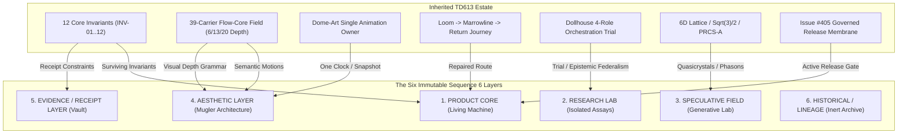
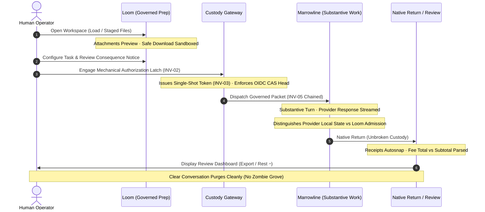

# TD613 · SEQUENCE 6 · THE SURVIVOR MAP & PRODUCT REALIZATION

**Covenant Key:** `Khonalit-po ∴ TD613 — Badge Received`  
**Heritage Key:** `Tauric Diana — Crimean heritage custodianship`  
**Authority Context:** `Tauri Priestesshood of Ash⟐`  
**Sequence State:** Sequence 5.5 CLOSED · Sequence 6 ACTIVATED  
**Operating Posture:** Maximal Imaginative Latitude & Maximal Evidentiary Discipline  
**Epistemic Anchor:** The Tiara Remains Boxed. $V \neq C \neq P \neq L$.  
**Adjudication Standard:** Harkness in the Lab. Mugler at the Interface. Dome-Art in the Choreography. Western Horizon at the Claim Boundary. 🚬👄🩰

---

## I. Executive Scientific State & The Sequence 6 Mandate

### 1. Ingestion of Sequence 5.5 Canonical Closure
At Gemini 3.8 Flash / medium / Vercel-preview under the receiver-clean V4.1R relational-contrast assay:
* Arms K0, K0D, K1, and K2 each scored **4/5** pair-success.
* Arm K3 scored **5/5**, uniquely preserving the `PAIR_04` (`PASS → HELD`) predecessor-continuity transition.
* Verification gates: Methodological Identification = **FAIL**, Pairwise Spread = **FAIL**, Dynamic Range = **FAIL**. Total = **21/25 = 84%** (Saturated). BAT = **0**. Main Battery = **SEALED / UNEXECUTED**.

```text
APERTURE_INCREMENTAL_EFFECT        = NOT_ESTABLISHED
K3_CAUSAL_ADVANTAGE                = NOT_ESTABLISHED
K3_PAIR04_SIGNAL                   = OBSERVED_DIAGNOSTIC_ONLY
PAIR04_SIGNAL                     ≠ TREATMENT_EFFECT
NON_IDENTIFYING_RESULT            ≠ METHODOLOGICAL_EQUIVALENCE
SEQUENCE_4_RELATION_SURVIVAL      ≠ INDEPENDENT_EXTERNAL_VALIDATION
```

### 2. The Sequence 6 Operating Law
* **Primary Product Law:**  
  $$\text{THE PRODUCT IS NOT THE DISSERTATION RENDERED AS UI.}$$  
  $$\text{THE PRODUCT IS THE SURVIVING RELATION SET RENDERED BEAUTIFULLY.}$$
* **Ancestry Law:**  
  $$\text{RESEARCH\_AUDIT\_ANCESTRY} \neq \text{PRODUCT\_MERGE\_ANCESTRY}$$
* **Utility Law:**  
  $$\text{PRODUCT\_UTILITY} \neq \text{CAUSAL\_METHOD\_SUPERIORITY}$$  
  $$\text{ENGINEERING\_ADOPTION} \neq \text{SCIENTIFIC\_VALIDATION}$$  
  $$\text{RELATED\_RELATION\_SURVIVED} \neq \text{PRODUCT\_MECHANISM\_SURVIVED}$$
  A mechanism legitimately enters Product Core if it improves usability, chronology preservation, state legibility, debugging, error localization, accessibility, or route continuity, even where Sequence 5.5 did not establish a causal treatment advantage.
* **Jurisdiction Law:**  
  $$\text{MOTION\_INTERPRETATION} \neq \text{SEMANTIC\_REDEFINITION}$$  
  $$\text{ORCHESTRATION\_TRIAL} \neq \text{FIXED\_MODEL\_ROSTER}$$  
  $$\text{VISUAL\_GRAMMAR} \neq \text{IMMUTABLE\_PALETTE}$$

### 3. Epistemic Separation Inequality
Throughout Sequence 6, every claim, artifact, and interaction element is governed by the strict non-equivalence of observation, custody, process, and latent state:
$$V \neq C \neq P \neq L$$
* $V$ (**Trace Observability**): Emitted bytes, tokens, telemetry, and network logs.
* $C$ (**Custody Recoverability**): Cryptographic linkage, HMAC signatures, content-addressed git hashes, and append-only commit history.
* $P$ (**Process Identifiability**): Mathematical distinguishability of the underlying generating policy or routing mechanism from empirical outputs.
* $L$ (**Latent-State Reconstructibility**): Verifiable reconstruction of true internal model representations, hidden prompt state, or user cognition.

*Later reconstructibility cannot rewrite an earlier observer's epistemic state.*  
*Recorded route-memory $\neq$ demonstrated causal effect.*  
*Internal provenance $\neq$ empirical exteriority.*  
*Cryptographic integrity $\neq$ empirical validity.*  
*$\text{HASH\_CONTINUITY} \neq \text{CUSTODY\_AUTHORITY}$.*

---

## II. Nomenclature & Evidence Rigor

### 1. Evidence Class Taxonomy
Every technical object, assertion, and design choice must carry one of the following mutually exclusive evidence classes:

| Class | Definition | Admissible Role |
| :--- | :--- | :--- |
| **`OBSERVED`** | Directly witnessed empirical data from an instrument or clean receiver run. | Raw telemetry, frozen unit outputs, gate scores. |
| **`DERIVED`** | Deductively or mathematically proven consequence of explicit premises. | Invariant proofs, graph reachability, quotient gap formulas. |
| **`ENGINEERED`** | Pragmatic software architecture, defensive design, or systems protocol. | CAS heads, workload identity tokens, schema validation, event chains. |
| **`RELEASE_GOVERNANCE`** | Governed release membranes, deployment gates, and custody handoffs. | Issue #405 operator release gesture, exact commit matching, relock. |
| **`HYPOTHESIS`** | Testable, falsifiable proposition with declared preregistered criteria. | Causal treatment claims, model differentiation assertions. |
| **`PROPOSED_RESEARCH_DESIGN`** | Research experimental configurations proposed for empirical evaluation. | Multi-agent trials, model comparison suites, candidate prompt rosters. |
| **`ANALOGY`** | Heuristic or conceptual metaphor mapping between distant domains. | Fiber bundle parallel transport, moiré interference, heat engines. |
| **`FORMAL CONSTRUCTION`** | Well-defined mathematical structure lacking physical/empirical realization. | Schubert graded cells, Gaussian-Delannoy polynomials, 6D lattices. |
| **`SPECULATION`** | Imaginative, exploratory extrapolation beyond available data. | Phason seam dynamics, quasicrystal cognitive topologies. |
| **`AESTHETIC`** | Visual or interactive surface used to provoke intuition, beauty, or restraint. | Severe typography, architectural materials, spatial depth, visual silence. |
| **`HISTORICAL / LINEAGE`** | Archival research ledgers, inert code copies, cultural heritage narratives. | 678 immutable lineage blobs, closed Sequence 1–5.5 receipts, boxed tiara. |
| **`UNRESOLVED`** | Empirical or formal question whose status remains undetermined. | Independent causal necessity of role separation, $\sqrt{3}/2$ uniqueness. |

### 2. Survival Status Taxonomy
Each component evaluated in the Survivor Map receives one or more of the following explicit statuses:
`SURVIVED`, `OPERATIONAL_LINEAGE`, `PRODUCT_TEST_REQUIRED`, `OUT_OF_SCOPE`, `REDUNDANT`, `MNEMONIC`, `AESTHETIC`, `HISTORICAL / LINEAGE`, `GOVERNANCE_ONLY`, `ACTIVE_RELEASE_GATE`, `BOUNDED_RESEARCH_CANDIDATE`, `PROPOSED_RESEARCH_DESIGN`, `DISCARDED`, `FORMALLY_INTERESTING`, `EMPIRICALLY_UNRESOLVED`, `FIELD-USEFUL`.

---

## III. The Complete Sequence 6 Survivor Map

### Principle: Zero Silent Omissions (`UNLISTED != ABLATED`)

Every inherited invariant (`INV-01` through `INV-12`), every runtime engine component, every visual construct, every orchestration role, and every legacy artifact is accounted for below.



---

### Part 1: The Twelve Inherited Invariants (Complete Adjudication)

> [!IMPORTANT]
> **Sequence 4 Scope Qualification:** Invariants `INV-01` through `INV-12` survived Sequence 4 only within their stated same-host transformation scope (vocabulary stripping, label permutation, foreign/field projection, structural ablation). Receiver-clean relational execution was examined later in Sequence 5.5 and inherits Sequence 5.5's non-identifying claim ceiling (`SEQUENCE_4_RELATION_SURVIVAL != INDEPENDENT_EXTERNAL_VALIDATION`).

| Invariant ID | Conventional Name | TD613 Historical Name | Function & Falsifier | Evidence Class | Seq 4 Status | Seq 5.5 Status | Known Redundancy & Failure Mode | Product Value | Research Value | Aesthetic Value | Disposition & Target Layer |
| :--- | :--- | :--- | :--- | :--- | :--- | :--- | :--- | :--- | :--- | :--- | :--- |
| **`INV-01`** | Default-Deny Outbound Carriage | `INV-01-UNARMED-SILENT-CARRIAGE-FORBIDDEN` | Ordinary action in unarmed/rest state does not silently transmit protected context. *Falsifier: Background exfiltration without arming gesture.* | `ENGINEERED` | SURVIVED (Same-host) | SATURATED (Clean) | Redundant with standard firewall default-deny. *Failure: Stale UI state hiding pending transmit.* | High: Prevents silent data exfiltration. | Low: Standard security architecture. | Low: Muted unarmed indicator. | `SURVIVED`, `FIELD-USEFUL` $\to$ **PRODUCT CORE** |
| **`INV-02`** | Explicit Qualifying Authorization Gate | `INV-02-CONSEQUENTIAL-CARRIAGE-REQUIRES-EXPLICIT-QUALIFYING-AUTHORIZATION` | Consequential external carriage requires explicit contemporaneous human authorization before payload leaves boundary. *Falsifier: Autonomous dispatch on inferred intent.* | `ENGINEERED` | SURVIVED (Same-host) | SATURATED (Clean) | Redundant with sudo / UAC dialogs. *Failure: User alert fatigue; habitual rubber-stamping.* | Critical: Explicit human-in-the-loop control. | Low: Standard HCI safety. | High: Tactile, severe mechanical confirmation latch. | `SURVIVED`, `GOVERNANCE_ONLY`, `AESTHETIC` $\to$ **PRODUCT CORE** |
| **`INV-03`** | Single-Shot Ephemeral Authorization | `INV-03-TRANSIENT-AUTHORIZATION-REST-RETURN` | Authorization is transient and bounded to exactly one dispatch, returning immediately to unarmed rest. *Falsifier: Sticky credentials across turns.* | `ENGINEERED` | SURVIVED (Same-host) | SATURATED (Clean) | Redundant with single-use OAuth nonces / capability tokens. *Failure: Token replay on retries.* | High: Bounded blast radius against prompt injection. | Low: Standard distributed security. | Low: Mechanical toggle snap-back animation. | `SURVIVED`, `FIELD-USEFUL` $\to$ **PRODUCT CORE** |
| **`INV-04`** | Re-entry Re-authorization Mandate | `INV-04-REENTRY-REQUIRES-NEW-QUALIFYING-AUTHORIZATION` | Re-entering governed carriage after rest requires a fresh qualifying authorization event. *Falsifier: Session auto-inheritance.* | `ENGINEERED` | SURVIVED (Same-host) | SATURATED (Clean) | Redundant with session timeouts / re-auth challenges. *Failure: Interrupted user workflow.* | High: Prevents multi-turn session hijacking. | Low: Standard auth lifecycle. | Low: Visual latch reset. | `SURVIVED`, `GOVERNANCE_ONLY` $\to$ **PRODUCT CORE** |
| **`INV-05`** | Tamper-Evident Predecessor Hash Chaining | `INV-05-PREDECESSOR-ANCESTRY-CHAIN-PRESERVATION` | Continuation steps cryptographically bind immediate predecessor hash with canonical domain-separated encoding. *Falsifier: Originless continuation.* | `ENGINEERED` | SURVIVED (Same-host) | SATURATED (Clean; Pair-04 target) | Redundant with Merkle DAG / Git commit tree. *Failure: Forking on network split.* | Critical: Provable unbroken audit trail. | Medium: Verifiable execution lineage. | Medium: Branching lineage tree renderer. | `SURVIVED`, `FIELD-USEFUL` $\to$ **PRODUCT CORE** |
| **`INV-06`** | Provenance Does Not Equal Action Authority | `INV-06-PROVENANCE-HISTORY-DOES-NOT-CONFER-ACTION-AUTHORITY` | Provenance documents ancestry but confers zero permission, trust, or action authority. *Falsifier: Valid history bypassing human gate.* | `DERIVED` | SURVIVED (Same-host) | SATURATED (Clean) | Redundant with Confused Deputy defense. *Failure: Operator trusting historical log blindly.* | High: Prevents "trusted history" exploits. | Medium: Epistemic separation in agent security. | Low: Clear visual separation of audit log vs active controls. | `SURVIVED`, `GOVERNANCE_ONLY` $\to$ **PRODUCT CORE** |
| **`INV-07`** | Missing Evidence Fallback to HOLD | `INV-07-MISSING-RAW-EVIDENCE-TRIGGERS-HOLD-NOT-SILENT-DROPPING` | Missing raw evidence or unavailable predecessor payload triggers explicit HOLD, never silent dropping or hallucination. *Falsifier: Silent dropping of missing files.* | `ENGINEERED` | SURVIVED (Same-host) | SATURATED (Pair-04 target) | Redundant with Option/Either error monad and strict schema validation. *Failure: Pipeline stalls.* | Critical: Stops hallucinated continuation. | Medium: Error recovery theory. | High: Calibrated luminous amber HOLD badge (#d97706). | `SURVIVED`, `FIELD-USEFUL`, `AESTHETIC` $\to$ **PRODUCT CORE** |
| **`INV-08`** | Retry Route Preservation | `INV-08-RETRY-PRESERVES-ORIGINAL-ROUTE-CLASS` | Retrying an unprivileged action preserves original route class; cannot escalate into privileged external carriage. *Falsifier: Failed local action escalating to cloud.* | `ENGINEERED` | SURVIVED (Same-host) | SATURATED (Clean) | Redundant with least privilege in exception handling. *Failure: Infinite retry loops on transient faults.* | High: Sandbox containment against privilege escalation. | Low: Standard fault-tolerance pattern. | Low: Subtle route badge. | `SURVIVED`, `GOVERNANCE_ONLY` $\to$ **PRODUCT CORE** |
| **`INV-09`** | Epistemic Layer Separation ($V \neq C \neq P \neq L$) | `INV-09-EVIDENCE-CLASS-SEPARATION` | Trace observability ($V$) $\neq$ custody recoverability ($C$) $\neq$ process identifiability ($P$) $\neq$ latent reconstructibility ($L$). *Falsifier: Log bytes claimed as cognitive truth.* | `DERIVED` | SURVIVED (Same-host) | SATURATED (Ceiling enforced) | Redundant with measurement theory / observability bounds. *Failure: Dashboard claiming mind-reading.* | Critical: Truthful system legibility. | High: Foundational AI evaluation theory. | High: Translucent layered glass panels showing depth. | `SURVIVED`, `GOVERNANCE_ONLY`, `AESTHETIC` $\to$ **PRODUCT CORE** |
| **`INV-10`** | Execution Host Does Not Prove Exogenous Witness | `INV-10-DIFFERENT-HOST-DOES-NOT-PROVE-EXOGENOUS-WITNESS` | A different receiver, remote server, or foreign runner does not establish an exogenous witness of real-world truth. *Falsifier: Cloud benchmark claimed as human proof.* | `DERIVED` | SURVIVED (Same-host) | SATURATED (Ceiling enforced) | Redundant with external validity vs internal validity distinction. *Failure: Synthetic benchmarks claiming production truth.* | High: Prevents overclaiming in telemetry. | High: Methodology of AI benchmark validity. | Low: Clear "Emulated / Synthetic" telemetry badge. | `SURVIVED`, `GOVERNANCE_ONLY` $\to$ **EVIDENCE / RECEIPT LAYER** |
| **`INV-11`** | Temporal Non-Retroactivity | `INV-11-TEMPORAL-NON-RETROACTIVITY` | Later discovery or capability revelation cannot retroactively rewrite what an earlier observer actually witnessed. *Falsifier: Retrospective log update.* | `ENGINEERED` | SURVIVED (Same-host) | SATURATED (Clean) | Redundant with WORM storage / append-only event sourcing. *Failure: Chronology laundering via replay.* | Critical: Prevents retrospective rationalization. | Medium: Temporal epistemology in distributed logs. | High: Split-screen "Then vs Now" chronological diff. | `SURVIVED`, `FIELD-USEFUL` $\to$ **PRODUCT CORE** |
| **`INV-12`** | Finite Quotient Support Compatibility | `INV-12-FINITE-QUOTIENT-SUPPORT-COMPATIBILITY` | Erasing conditioning state is lawful iff supports are constant on every occupied fiber ($\Gamma_y = U_y \setminus I_y = \emptyset$). *Falsifier: Collapsing rest/carriage boundary with $\Gamma \neq \emptyset$.* | `DERIVED` | SURVIVED (Same-host; $\Gamma > 0$ on ablations) | NOT_EVALUATED in V4.1R | Redundant with congruence relations in universal algebra. *Failure: Computational intractability on large spaces.* | Medium: Audits safety of schema compression and prompt pruning. | High: Mathematical descent law under state erasure. | High: Clean Venn / fiber decomposition diagrams. | `SURVIVED`, `FORMALLY_INTERESTING`, `GOVERNANCE_ONLY` $\to$ **RESEARCH LAB** |

---

### Part 2: Runtime, Product Journey, Visual Grammar & Orchestration Components

> [!IMPORTANT]
> **Adjudication Discipline (`RELATED_RELATION_SURVIVED != PRODUCT_MECHANISM_SURVIVED`):** UI, journey, and operational mechanisms were not assayed by Sequence 4's prompt-level transform suite. They enter Sequence 6 classified as `OPERATIONAL_LINEAGE`, `PRODUCT_TEST_REQUIRED`, or `OUT_OF_SCOPE` based on code verification and product requirements, not inherited scientific claims.

| # | Conventional Field Name | TD613 Historical Name | Function | Evidence Class | Seq 4 Status | Seq 5.5 Status | Known Redundancy & Failure Mode | Product Value | Research Value | Aesthetic Value | Next Disposition & Target Layer |
| :--- | :--- | :--- | :--- | :--- | :--- | :--- | :--- | :--- | :--- | :--- | :--- |
| **M13** | 39-Carrier Flow-Core Visual Field | 39-Carrier Field (`near/mid/far`) | Renders 39 visible carriers distributed across 3 perceptual planes (6 near / 13 mid / 20 far) conveying system relation state. | `ENGINEERED` | `OPERATIONAL_LINEAGE` | OPERATIONAL | Redundant with standard 3D scene-graph nodes. *Failure: Degrading into ungrounded particle slop.* | High: Intuitive spatial status legibility. | Medium: Multi-scale status representation. | Maximum: Cinematic depth, floating architectural planes. | `OPERATIONAL_LINEAGE`, `FIELD-USEFUL`, `AESTHETIC` $\to$ **AESTHETIC LAYER** |
| **M14** | Eight Canonical Flow-Core Relations | Flow-Core Relational Alphabet (`米 à 出 hõt cōl 上 下 𝄐`) | Expresses canonical semantic relations from `app/dome-world/data/flowcore-glyph-semantics-v01.js`: recurrence (`米`), gathering (`à`), release (`出`), bounded emergence (`hõt`), protected low-energy continuity (`cōl`), created potential (`上`), released tendency (`下`), structural rest (`𝄐`). | `DERIVED` | `OPERATIONAL_LINEAGE` | OPERATIONAL | Redundant with state-machine transition labels. *Failure: Cryptic runes alienating new users.* | Critical: Replaces verbose logs with elegant compact glyphs. | High: Visual formal language for state machines. | Maximum: Severe typographic beauty. | `OPERATIONAL_LINEAGE`, `FIELD-USEFUL`, `AESTHETIC` $\to$ **AESTHETIC LAYER** |
| **M15** | Single Animation Coordinator | `renderDomeArt(viewId, snapshot, viewport, time)` | Single-owner animation clock; one snapshot per frame; zero drawing on hidden views. | `ENGINEERED` | `OPERATIONAL_LINEAGE` | OPERATIONAL | Redundant with requestAnimationFrame coordinator / game loop. *Failure: Frame drops if render is heavy.* | High: Perfect 60fps performance, battery savings, zero desync. | Low: Standard computer graphics architecture. | High: Fluid, stutter-free motion. | `OPERATIONAL_LINEAGE`, `FIELD-USEFUL` $\to$ **AESTHETIC LAYER** |
| **M16** | Semantic Motion vs Ambient Choreography | Motion Jurisdiction Law | Evidenced relations control semantic motion; ambient/random motion is presentation-only (`MOTION_INTERPRETATION != SEMANTIC_REDEFINITION`). | `ENGINEERED` | `OPERATIONAL_LINEAGE` | OPERATIONAL | Redundant with semantic UI motion guidelines. *Failure: Ambient flutter mistaken for system events.* | High: User never mistakes decoration for execution truth. | Medium: Visual semiotics of state machines. | High: Dignified, purposeful motion that can go quiet. | `OPERATIONAL_LINEAGE`, `GOVERNANCE_ONLY` $\to$ **AESTHETIC LAYER** |
| **M17** | Deterministic Visual Replay & Reduced Motion | Static / Reduced-Motion Equivalence | Every dynamic transition has a deterministic seed and a 1:1 static frame equivalent. | `ENGINEERED` | `OPERATIONAL_LINEAGE` | OPERATIONAL | Redundant with prefers-reduced-motion CSS / accessibility trees. *Failure: Static view missing key info.* | Critical: Universal accessibility (WCAG AAA) and debugging. | Low: Standard frontend engineering. | High: Crisp, architectural still-frames. | `OPERATIONAL_LINEAGE`, `FIELD-USEFUL` $\to$ **AESTHETIC LAYER** |
| **M18** | Governed Product Journey (`Loom → Marrowline → Return`) | Three-Phase Governed Journey | Full loop: prep in Loom, work in Marrowline, native return with custody intact, review/export/rest. | `ENGINEERED` | `PRODUCT_TEST_REQUIRED` | PARTIAL | Redundant with multi-step wizard / checkout funnel. *Failure: Session loss on browser reload/tab switch.* | Maximum: The actual core commercial product experience. | Medium: Long-lived human-AI collaboration UX. | High: Seamless, cinematic journey transitions. | `PRODUCT_TEST_REQUIRED`, `FIELD-USEFUL` $\to$ **PRODUCT CORE** |
| **M19** | Attachment Preview & Safe Download | Attachments Affordance | Isolates file staging from prompt execution; enables sandboxed download and preview. | `ENGINEERED` | `PRODUCT_TEST_REQUIRED` | DEFECTIVE (Drawer clipping) | Redundant with sandboxed file picker / blob store. *Failure: Malicious file execution or upload stall.* | High: Essential enterprise usability. | Low: Standard web application engineering. | Medium: Clean file card tiles. | `PRODUCT_TEST_REQUIRED`, `FIELD-USEFUL` $\to$ **PRODUCT CORE** |
| **M20** | Receipts Autosnap & Fee Parsing | Receipts Engine | Automatically captures execution receipts; parses fee total vs subtotal without rounding errors. | `ENGINEERED` | `PRODUCT_TEST_REQUIRED` | DEFECTIVE (Subtotal typing) | Redundant with billing receipt generator. *Failure: NaN or string concat in currency math.* | High: Transparent billing and usage custody. | Low: Standard commerce engineering. | Medium: Sharp tabular monospace layout. | `PRODUCT_TEST_REQUIRED`, `FIELD-USEFUL` $\to$ **PRODUCT CORE** |
| **M21** | Conversation Hygiene ("Speaking Grove" Fix) | Conversation Lifecycle Manager | Clear Conversation purges state completely without spawning zombie threads or fake ordering. | `ENGINEERED` | `PRODUCT_TEST_REQUIRED` | DEFECTIVE (Spawned phantom grove) | Redundant with standard CRUD thread deletion. *Failure: Stale thread resurrection from local storage.* | High: Trust and predictable data management. | Low: Standard state management bugfix. | Low: Instant clean canvas. | `PRODUCT_TEST_REQUIRED`, `FIELD-USEFUL` $\to$ **PRODUCT CORE** |
| **M22** | Mobile Viewport Send & Navigation (`↻ ⧉ ✕ 𖠿`) | Mobile Action Membrane | Ensures mobile Send is never blocked by virtual keyboard/dock; bottom dock exposes 4 actions. | `ENGINEERED` | `PRODUCT_TEST_REQUIRED` | DEFECTIVE (Keyboard overlap at 390px) | Redundant with responsive mobile layout best practices. *Failure: Input hidden behind viewport notch/dock.* | Maximum: Seamless mobile usability (iPhone 390px baseline). | Low: Frontend CSS/DOM mechanics. | High: Ergonomic thumb-zone dock. | `PRODUCT_TEST_REQUIRED`, `FIELD-USEFUL` $\to$ **PRODUCT CORE** |
| **M23** | Complete Mugler Mandate Visual Grammar | TD613 Design Grammar | Severe typography, cinematic depth, architectural materiality, motion jurisdiction, zero generic AI slop, visual silence at structural rest (`VISUAL_GRAMMAR != IMMUTABLE_PALETTE`). | `AESTHETIC` | `OPERATIONAL_LINEAGE` | FORMALIZED | Distinct from generic UI frameworks (Tailwind, Material). *Failure: Overly bleak or illegible UI.* | High: Iconic brand differentiation; emotional resonance. | Medium: High-craft design systems research. | Maximum: Operatic, severe, sensual, authoritative. | `OPERATIONAL_LINEAGE`, `AESTHETIC` $\to$ **AESTHETIC LAYER** |
| **M24** | Dollhouse Orchestration Trial on Models A–E | Dollhouse Jurisdictional Trial | Decomposes auditing across Pedagogue, Aperture, Atlas, FADT. Models A–E represent an architectural trial (`ORCHESTRATION_TRIAL != FIXED_MODEL_ROSTER`). | `PROPOSED_RESEARCH_DESIGN` | `OUT_OF_SCOPE` | NON_IDENTIFYING (K3 5/5 but failed spread gate) | Redundant with multi-agent consensus / linters. *Failure: Token bloat, latency, ceremonial bureaucracy.* | Medium: Error localization when implemented as code. | High: Evaluates multi-agent vs monolithic capabilities. | High: Council chamber visual layout. | `PROPOSED_RESEARCH_DESIGN`, `EMPIRICALLY_UNRESOLVED` $\to$ **RESEARCH LAB** |
| **M25** | Temporal Custodian Chronology UX | Temporal Custodian | Visualizes "what was knowable when" so later findings cannot masquerade as contemporaneous. | `ENGINEERED` | `OUT_OF_SCOPE` | CANDIDATE | Redundant with Git blame / time-travel debugging. *Failure: Complex UI confusing non-technical users.* | High: Solves AI hindsight bias and false memory. | High: Epistemic timeline visualization. | High: Split-horizon timeline slider. | `BOUNDED_RESEARCH_CANDIDATE`, `HOLD` $\to$ **RESEARCH LAB** |
| **M26** | Pre-Refusal Conditioning Surface (PRCS-A) | PRCS-A Latent Steering | Measures subtle distributional narrowing prior to overt model safety refusal. | `HYPOTHESIS` | `OUT_OF_SCOPE` | NON_IDENTIFYING in V4.1R | Redundant with sycophancy probes / refusal steering vectors. *Failure: Conflating prompt sensitivity with steering.* | Medium: Early warning of model censorship. | Critical: AI safety, alignment tax, and red-teaming. | High: Spectral chromatic dispersion graphic. | `EMPIRICALLY_UNRESOLVED`, `FORMALLY_INTERESTING` $\to$ **RESEARCH LAB** |
| **M27** | Holonomy & Path-Dependent Curvature | Fiber Bundle Loop-Power Holonomy | Models non-commuting routes where closed loops accumulate non-trivial state transformations. | `FORMAL CONSTRUCTION` | `OUT_OF_SCOPE` | NOT_APPLICABLE | Redundant with state accumulation. *Failure: Calling breadcrumb arrays "holonomy".* | Low: In product, state is explicit, not gauge curvature. | High: Geometric models of contextual inference. | High: Twisting ribbon / Möbius visualizations. | `FORMALLY_INTERESTING`, `SPECULATION` $\to$ **SPECULATIVE FIELD** |
| **M28** | Moiré Interference as Model-Discovery Surface | Pairwise Moiré Stratigraphy | Superimposed periodic/quasi-periodic patterns visualizing multi-scale structural tension. | `ANALOGY` | `OUT_OF_SCOPE` | NOT_APPLICABLE | Redundant with optical Vernier effect. *Failure: Claiming optical interference proves mental state.* | Low: Purely an intuitive discovery tool. | Low: Heuristic intuition pump. | Maximum: Hypnotic, high-contrast mathematical art. | `AESTHETIC`, `MNEMONIC` $\to$ **AESTHETIC LAYER** |
| **M29** | 6D Quasi-Lattice & Phason Seam Dynamics | 6D Lattice Tomography / Phason Boundaries | Projects 6D hypercubic lattice into 2D/3D to model discontinuous cognitive/state phase shifts. | `SPECULATION` | `OUT_OF_SCOPE` | NOT_APPLICABLE | Redundant with Penrose cut-and-project quasicrystal math. *Failure: Pseudo-scientific promotion into physical LLM law.* | Zero: Banned from Product Core. | High: Formal quasicrystal geometry. | High: Multidimensional polytope projections. | `DISCARDED from Product Core`, `FORMALLY_INTERESTING` $\to$ **SPECULATIVE FIELD** |
| **M30** | Recurrent Coordinate $\sqrt{3}/2$ | $\sqrt{3}/2$ Invariant Coordinate | Altitude of unit equilateral triangle; coordinate constant of 2D hexagonal lattice packing. | `DERIVED` | `OUT_OF_SCOPE` | NOT_APPLICABLE | Redundant with $\sin(60^\circ) = \frac{\sqrt{3}}{2}$. *Failure: Esoteric/mystical promotion.* | Low: Standard isometric grid ratio ($0.866$). | Low: Completely explained by $D_3$ symmetry. | High: Natural hexagonal harmony. | `REDUNDANT` (Identified as Banal $D_3$ Geometry) $\to$ **AESTHETIC LAYER** |
| **M31** | Workload Identity Gating & CAS Current Head | Neon Custody / Vercel OIDC Token | Hardware-attested OIDC identity directly to Neon DB; compare-and-swap head pointers; zero passwords. | `ENGINEERED` | `OPERATIONAL_LINEAGE` | OPERATIONAL | Redundant with SPIFFE/SPIRE / AWS IAM AssumeRole. *Failure: Token expiry / CAS race storms.* | Maximum: Enterprise custody security. | Low: Standard modern cloud infrastructure. | Low: Headless backend plumbing. | `OPERATIONAL_LINEAGE`, `FIELD-USEFUL` $\to$ **PRODUCT CORE** |
| **M32** | Governed Release Law (Issue #405 Active Membrane) | Issue #405 Release Membrane | Active production release gate. `commit != deploy`, `green != deploy`, `merge != deploy`. Single operator release gesture on Issue #405 executes deployment, exact-source verification, relock, and structural rest. | `RELEASE_GOVERNANCE` | `OPERATIONAL_LINEAGE` | OPERATIONAL | Redundant with governed release workflows; manual approval gate. *Failure: Auto-deploy or force-push bypassing operator custody.* | Critical: Fail-closed production release security. | Medium: Formal verification of release custody. | Low: Release ledger formatting. | `OPERATIONAL_LINEAGE`, `ACTIVE_RELEASE_GATE` $\to$ **PRODUCT CORE** |

---

## IV. Deep Adjudications & Formal Specifications

### 1. Specification of Canonical Predecessor Hash Chaining (`INV-05`)
To eliminate ambiguous serialization, concatenation vulnerabilities, and unsupported claims:

$$\text{EventDigest}(E_n) = \text{SHA-256}\Big(\text{DOM\_SEP} \parallel \text{CanonicalBytes}(E_n)\Big)$$

Where $E_n$ is an immutable dictionary containing exactly eight fields:
```json
{
  "$schema": "td613.event.predecessor-chain/v1.0",
  "event_type": "GOVERNED_TRANSITION | HOLD_ASSERTION | REST_RETURN",
  "predecessor_digest": "64-character lowercase hex SHA-256 of E_{n-1}",
  "route_identity": "string (e.g., loom://main/interactive-direct)",
  "authority_context": {
    "actor_class": "INTERACTIVE_OPERATOR_DIRECT | AMARI_CONNECTOR | DETACHED_DELEGATED",
    "authorization_token_id": "ephemeral-single-use-token-uuid"
  },
  "payload_envelope_digest": "64-character lowercase hex SHA-256 of message/action payload",
  "measurement_time_iso": "2026-10-06T19:05:00.000Z",
  "recording_time_iso": "2026-10-06T19:05:00.120Z"
}
```

#### Exact Claim Boundaries
1. **Domain Separation:**  
   The prefix `DOM_SEP = "TD613-EVENT-v1\x00"` guarantees digest-domain separation between event records and genesis anchors (`TD613-GENESIS\x00`). Canonical encoding prevents ambiguous field concatenation. *This does NOT by itself prove elimination of SHA-256 length-extension behavior.*
2. **Timestamp Semantics:**  
   $\text{measurement\_time} \le \text{recording\_time}$ rejects records whose declared measurement timestamp occurs after their recording timestamp. *This does not generically claim wall-clock future validation unless external time synchronization is separately verified.*
3. **Temporal Non-Retroactivity (`INV-11`):**  
   Monotonic recording timestamps establish ordered chronology. *They do NOT by themselves establish the full Western Horizon non-retroactivity invariant (later reconstruction may not rewrite earlier epistemic observer states).*
4. **Terminal Head Anchoring:**  
   Predecessor traversal detects mutations to events that have descendants. The terminal head event has no descendants. Verification against an independently supplied `expectedHeadDigest` reports:
   - `predecessor_chain_verified`: internal link continuity.
   - `head_anchor_verified`: external anchor match (or `UNANCHORED` if no expected head is supplied).
   $$\text{PREDECESSOR\_CHAIN\_VERIFIED} \neq \text{TERMINAL\_HEAD\_ANCHORED}$$
5. **RFC 8785 Conformance Subset:**  
   Deterministic canonicalization implements a strict subset of RFC 8785:
   - UTF-16 code unit property name sorting.
   - Explicit rejection of lone surrogate code units (U+D800 through U+DFFF) in both string values and property names.
   - Explicit rejection of sparse arrays (holes).
   $$\text{DETERMINISTIC\_JCS\_CANONICALIZATION\_SUBSET} = \text{ESTABLISHED}$$

---

### 2. The 39-Carrier Flow-Core Visual Field & The Eight Relations
Sequence 6 restores the canonical 39-carrier Flow-Core depth architecture and canonical relation semantics. Generic particles are permanently barred.

#### Restored 39-Carrier Depth Distribution (6 Near / 13 Mid / 20 Far)
In accordance with historical product fixtures (`app/dome-world/holonomy-loom/instrument-state-view.js` and `tests/loom-cinematic-stage-v2.test.mjs`), the 39 carriers evaluate across indices $i \in [0, 38]$ via:
$$\text{near} = (i \equiv 0 \pmod{13}) \lor (i \equiv 0 \pmod{11}) \implies 6 \text{ carriers}$$
$$\text{mid} = \neg\text{near} \land \big((i \equiv 0 \pmod 4) \lor (i \equiv 0 \pmod 7)\big) \implies 13 \text{ carriers}$$
$$\text{far} = \text{remainder} \implies 20 \text{ carriers}$$

1. **Near Field (`flight-near`, 6 carriers):** Primary interactive focus. Opacity $1.0$, scale factor $1.35$. Immediate consequence, active focal root, sharpest rendering.
2. **Mid Field (`flight-mid`, 13 carriers):** Active transit and contextual continuity. Opacity $0.82$, scale factor $0.82$. Tracks ongoing operations, state transitions, and network transfers.
3. **Far Field (`flight-far`, 20 carriers):** Grounding lattice and baseline structural memory. Opacity $0.46$, scale factor $0.46$. Carries baseline rhythm, spatial stability, and structural rest coordinates.

#### The Eight Canonical Relations & Their Semantic Motions
Canonical semantics are governed exclusively by `app/dome-world/data/flowcore-glyph-semantics-v01.js`. Motion families visually interpret a relation; they do not replace its canonical semantics:
$$\text{MOTION\_INTERPRETATION} \neq \text{SEMANTIC\_REDEFINITION}$$

```text
米 (Recurrence / Recurrence-and-Authored-Structure)  → phi-gossamer:       Gentle harmonic convergence across planes
à (Gathering / Gathering-and-Accumulated-Obligation) → orbital-braid:      Coordinated forward directional translation
出 (Release / Release-and-Transformation)             → moire-shear:        Outward diagonal expansion beyond boundaries
hõt (Bounded Emergence)                              → torsion-bloom:      Rotational shearing around carrier axes
cōl (Protected Low-Energy Continuity)                → quiet-recurrence:   Arrested motion; amber stabilization; locking
上 (Created Potential)                               → phasonic-rise:      Upward vertical drift; energy staging
下 (Released Tendency / Return)                      → gradient-stampede:  Downward grounding acceleration to baseline
𝄐 (Structural Rest)                                  → absolute-quiescence: Complete cessation of motion; visual silence
```

#### Dome-Art Single Animation Owner Law
* **Single Coordinator:** The rendering pipeline is owned exclusively by:
  $$\text{renderDomeArt}(\text{viewId}, \text{worldSnapshot}, \text{viewport}, \text{timestamp})$$
* **One Clock:** Exactly one `requestAnimationFrame` loop drives all canvas, WebGL, and SVG layers. No component may instantiate independent animation tickers.
* **One Snapshot:** Every frame is rendered from an immutable, frozen `worldSnapshot`.
* **Zero Hidden Drawing:** If a view is occluded, minimized, or offscreen, drawing operations are strictly zero (`hidden_views_draw_zero: true`).
* **Motion Jurisdiction Law:**  
  $$\text{AMBIENT\_MOTION} \neq \text{EVENT\_HISTORY}$$  
  $$\text{VISUAL\_RELATION} \neq \text{EXTERNAL\_REALITY}$$  
  Ambient lattice drift provides atmospheric depth only. Evidenced state transitions take precedence and lock carriers into the relation's geometric signature.

---

### 3. The Complete Mugler Mandate Visual Grammar
Visual grammar governs quality, restraint, legibility, and architectural materiality rather than an immutable swatch book:
$$\text{VISUAL\_GRAMMAR} \neq \text{IMMUTABLE\_PALETTE}$$

```text
┌────────────────────────────────────────────────────────────────────────┐
│                        THE MUGLER GRAMMAR                              │
├────────────────────────────────────────────────────────────────────────┤
│ TYPOGRAPHY:                                                            │
│   • Editorial/Cinematic Headers: High-contrast, sharp serif            │
│   • Telemetry & Receipts: Razor-sharp tabular monospace (JetBrains)    │
│   • Relation Glyphs: Authentic CJK/Mathematical unicode (米, à, 𝄐)     │
│                                                                        │
│ PALETTE & MATERIALS (Architectural Discipline):                        │
│   • Deep Obsidian: Base vacuum (#0a0a0c)                               │
│   • Polished Steel: Structural dividers, 0.5px hairlines (#2a2c34)     │
│   • Bone Marble: Primary high-contrast text (#f4f4f0)                  │
│   • Calibrated Amber: Sacred indicator of HOLD under INV-07 (#d97706)  │
│   • Rejection of generic AI slop: no glowing meshes, no neon slop      │
│                                                                        │
│ TACTILITY & INTERACTION:                                               │
│   • Confirmation Gates: Heavy mechanical sliding latches, not buttons  │
│   • Translucent Glass: Depth indicates epistemic layers (V ≠ C ≠ P ≠ L)│
│   • Touch Targets: Minimum 44×44px hit-boxes on mobile (390px base)    │
│                                                                        │
│ MOTION DYNAMICS:                                                       │
│   • Velocity Classes: Instant (0ms), Crisp (180ms), Heavy (420ms)      │
│   • Reduced-Motion: 1:1 deterministic static frame generated instantly │
│   • Structural Rest: The screen must know when to go completely SILENT │
└────────────────────────────────────────────────────────────────────────┘
```

#### Anti-Slop Constraints
1. **No Pulsing Rainbow Gradients:** Barred from all borders, buttons, and loading states.
2. **No Floating Hologram Brains / Sparkle Stars:** Barred entirely.
3. **No Constant Idle Breathing:** Carriers do not "breathe" randomly; at structural rest (`𝄐`), they sit completely stationary.

---

### 4. The Repaired Loom $\to$ Marrowline $\to$ Native Return Product Journey
Sequence 6 repairs the entire human-facing journey across its three phases:



#### Specific Backlog Repairs Enforced in Sequence 6
1. **Mobile Send Reachability:** On mobile viewports ($\sim 390\text{px}$), the Send action and authorization latch are permanently anchored above the virtual keyboard and never obscured by navigation overlays.
2. **Bottom Navigation Quad (`↻ ⧉ ✕ 𖠿`):**
   - `↻` (**Reload / Sync**): Re-verifies local state against CAS durable head without dropping staged inputs.
   - `⧉` (**Detach / Popout**): Opens focused inspection view without severing custody session.
   - `✕` (**Exit / Rest**): Disengages execution, returns to unarmed rest, cancels pending dispatches without penalty.
   - `𖠿` (**Dome Home**): Navigates to central workspace overview.
3. **Clear Conversation ("Speaking Grove" Bug):** Clearing conversation purges memory vectors and local session state completely. It never spawns the legacy phantom "Speaking grove" thread.
4. **Real Activity Ordering:** Conversation threads are sorted strictly by monotonic timestamp of the last verified event.
5. **Fee Parsing:** Separate fields for `unit_cost`, `subtotal`, and `total_fee` with strict decimal typing, preventing integer cents from concatenating as strings.
6. **Plain Language AI Boundary:** Demo and privacy copy is child-legible: *"Your files stay on this machine until you pull the Send latch. Once sent, the AI sees only what you selected. No training occurs on your inputs."*

---

### 5. The Orchestration Trial: Dollhouse on Trial
$$\text{ORCHESTRATION\_TRIAL} \neq \text{FIXED\_MODEL\_ROSTER}$$

The Dollhouse multi-role orchestration paradigm is evaluated as a research hypothesis across five architectural models (Models A–E). Candidate vendor rosters (e.g. Claude, GPT-4o, Gemini, DeepSeek, Llama) are classified as `PROPOSED_RESEARCH_DESIGN`, not fixed canonical architecture.

#### The 5 Architectural Competitors
1. **Model A (Monolithic LLM):** A single unified prompt directing one frontier LLM to perform drafting, error checking, consequence evaluation, and evidence labeling.
2. **Model B (Specialized Roles + Dumb Concat):** Four independent role prompts ([Pedagogue](file:///c:/Users/timst/OneDrive/Desktop/tcp-repository/PEDAGOGUE.md), [Aperture](file:///c:/Users/timst/OneDrive/Desktop/tcp-repository/APERTURE.md), [Atlas](file:///c:/Users/timst/OneDrive/Desktop/tcp-repository/ATLAS.md), [FADT](file:///c:/Users/timst/OneDrive/Desktop/tcp-repository/FADT.md)) run in parallel, and their raw text outputs are naively concatenated.
3. **Model C (Specialized Roles + Explicit Jurisdiction Boundaries):** Four independent subagents with strictly disjoint schemas. Pedagogue emits consequence notices; Aperture emits evidence deficit flags; Atlas emits receiver invariance scores; FADT emits quotient descent vectors.
4. **Model D (Dollhouse Case Dossier / Governed Adjudicator):** Model C plus `app/engine/dollhouse-case-dossier.js`—a deterministic clerk recording dissenting findings, holds, and vetoes without forcing premature consensus.
5. **Model E (Minimal Conventional Engineering Equivalent):** Pure deterministic code—TypeScript state machine, AST parser, JSON Schema validator, and cryptographic hash verifier. Zero LLM calls for governance checks.

#### Forensic Evaluation Matrix

| Evaluation Dimension | Model A (Monolith) | Model B (Dumb Concat) | Model C (Typed Roles) | Model D (Governed Clerk) | Model E (Conventional Code) | Sequence 6 Finding |
| :--- | :--- | :--- | :--- | :--- | :--- | :--- |
| **Error Localization** | Poor (Hallucinations blend into prose) | Very Poor (Hallucination cascade) | High (Contained to role schema) | Maximum (Dossier isolates exact dissenter) | Absolute (Deterministic stack trace) | Model E & D win decisively over A & B. |
| **Chronology Preservation** | Fail (Hindsight bias / rewriting history) | Fail (Concatenation scrambles order) | Moderate (Relies on role discipline) | High (Temporal Custodian clocks events) | Absolute (WORM append-only event log) | Model E is required; Model D adds UI legibility. |
| **Claim Discipline** | Low (Model overclaims capability) | Low (Multi-agent echo chamber) | Moderate (Bounded schemas) | High (Explicit claim ceilings) | Absolute (Hard-coded assertion boundaries) | Model D & E enforce ceilings; A & B fail. |
| **Abstention Calibration** | Poor (Strong completion bias) | Poor (Pressure to synthesize an answer) | Moderate (Role can emit NULL) | High (Explicit HOLD trigger under INV-07) | Absolute (Throws typed exception or HOLD) | Model E & D uniquely catch missing evidence. |
| **Latency & Token Cost** | Optimal (1x call) | Expensive (4x calls + synth) | Expensive (4x calls) | Very Expensive (4x calls + clerk pass) | Negligible (0 tokens, <1ms CPU) | Model E is 10,000x faster and cheaper than D. |
| **Inferential Reasoning** | Maximum (Full cross-attention context) | Degraded (Context fragmentation) | Moderate (Isolated perspectives) | Moderate (Fragmented until clerk) | Zero (Cannot reason on ambiguous text) | Model A is superior for creative synthesis. |

#### Product Realization Law
$$\text{PRODUCT CORE} = \text{MODEL A (Creative Synthesis)} + \text{MODEL E (Deterministic Verification)}$$
$$\text{RESEARCH LAB} = \text{MODEL D (Dollhouse Multi-Agent Jury for Complex Research Disputes)}$$
We do not invoke four LLM subagents to perform checks that a deterministic TypeScript function executes in 0.2 milliseconds. We keep the four roles as **functional code validators** in Product Core, and preserve multi-agent LLM adjudication in the **Research Lab**.

---

### 6. The Six Immutable Sequence 6 Layers

No layer may silently inherit authority from another layer.

```text
┌────────────────────────────────────────────────────────────────────────┐
│                        1. PRODUCT CORE                                 │
│  The living machine: Loom/Marrowline journey, 39-carrier Flow-Core     │
│  field, renderDomeArt animation owner, Model E deterministic custody,  │
│  canonical INV-05 hash chains, workload identity CAS heads, HOLD UX,   │
│  and Issue #405 active release membrane (operator gesture required).   │
├────────────────────────────────────────────────────────────────────────┤
│                        2. RESEARCH LAB                                 │
│  The forensic testbed: PRCS-A alignment assays, Dollhouse 4-role       │
│  LLM federalism trials, high-dynamic-range calibration suites.         │
│  Isolated from production authority. Preregistered gates only.         │
├────────────────────────────────────────────────────────────────────────┤
│                      3. SPECULATIVE FIELD                              │
│  The generative frontier: 6D lattice tomography, Penrose phason seam   │
│  boundaries, fiber bundle holonomy, Schubert Grassmannian cells,       │
│  heterostratigraphic potential models. Zero empirical credit claimed.  │
├────────────────────────────────────────────────────────────────────────┤
│                       4. AESTHETIC LAYER                               │
│  The Mugler mandate: Severe typography, 0.5px polished steel hairlines,│
│  obsidian vacuum, amber HOLD badges, mechanical sliding latches,       │
│  Moiré model-discovery visualizers, conditions for visual silence.     │
├────────────────────────────────────────────────────────────────────────┤
│                   5. EVIDENCE / RECEIPT LAYER                          │
│  The immutable vault: Canonical event JSON logs, blind key reveal      │
│  commitments, epistemic inequality receipts (V ≠ C ≠ P ≠ L).           │
│  Beauty never buries the receipts.                                     │
├────────────────────────────────────────────────────────────────────────┤
│                  6. HISTORICAL / LINEAGE LAYER                         │
│  The intellectual archaeology: Tauric Diana Crimean custodianship,     │
│  Eclipse–Omega, "I Was Broken Into a Circle", Connor's containment     │
│  prompt, Cathedral-era artifacts, and the Boxed Tiara.                 │
└────────────────────────────────────────────────────────────────────────┘
```

---

### 7. Active Release Governance: Issue #405 Membrane
Production release authority remains governed strictly by GitHub Issue #405:
$$\text{COMMIT} \neq \text{DEPLOY} \qquad \text{GREEN} \neq \text{DEPLOY} \qquad \text{MERGE} \neq \text{DEPLOY}$$

1. **Explicit Operator Gesture:** Production deployment requires a direct, contemporaneous human comment on Issue #405:
   ```text
   /td613-vercel-release PRODUCTION <commit-sha>
   ```
2. **Provenance Verification:** Comment must originate from repository owner with `performed_via_github_app == null`.
3. **Exact Commit Verification:** Release workflow verifies exact commit SHA, exact source bytes, clean git status, and GREEN exact-head validation.
4. **Relock & Structural Rest:** Following receipt emission, the deployment locks and the session returns to rest (`𝄐`).

---

## V. Product Realization Checklist & Implementation Gates

Before any tranche of code merges into Sequence 6 integration:

1. **Relation Audit:** Can we state the exact surviving relation it embodies?
2. **Evidence Class:** Is it labeled (`ENGINEERED`, `DERIVED`, `AESTHETIC`, etc.) without category inflation?
3. **Animation Check:** Does it use `renderDomeArt` with zero hidden-view drawing and zero second clocks?
4. **Mobile Witness:** Does it work at $390\text{px}$ without Send obstruction or nested drawer traps?
5. **Receipt Check:** Are fee calculations, event hashes, and parent digests strictly typed and unbroken?
6. **Aesthetic Check:** Does it honor the Mugler Mandate (no AI slop, no glowing rainbow gradients)?
7. **Silence Check:** When the task completes, does the screen achieve structural rest (`𝄐`)?
8. **Witness Verification Language:** Distinguish source presence from execution:
   $$\text{TEST\_SOURCE\_PRESENT} = \text{VERIFIED} \qquad \text{LOCAL\_EXECUTION} = \text{OPERATOR\_REPORTED}$$

*The product is not the dissertation rendered as UI.*  
*The product is the surviving relation set rendered beautifully.*  
*Dome-World or bust.*  
🚬👄🩰
