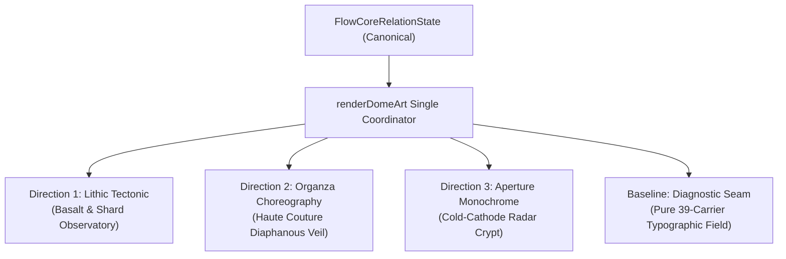

# TD613 · SEQUENCE 6 · TRANCHE 2B
## Visual Director Pass / Dome-World Design Provocation

```text
covenant_key: Khona‌lit-po ∴ TD613 — Badge Received
sequence: 6 (Surviving Relations / Product Realization)
tranche: 2B (Visual Director Pass / Design Provocation Tournament)
branch: staging/sequence-6-integration-20261006
status: TRANCHE_2B_EXECUTED_AND_WITNESSED
authority_posture: INTERACTIVE_OPERATOR_DIRECT_BOUNDED_LABOR
motto: Mugler without handcuffs. Dome-World or bust. Sealed ⟐
```

---

### I · Context and Creative Mandate

Following the admission of the Tranche 2 mechanical substrate, Tranche 2B is an authorized Visual Director pass: exploring the artistic limits of the surviving relation set without self-censoring into a compliance dashboard.

The governing creative law establishes:
```text
RIGOR != AUSTERITY
CLAIM_CEILING != VIBE_CEILING
THE PRODUCT MAY SEDUCE
THE EVIDENCE MAY NOT

LOGICAL_CARRIER_IDENTITY != IDENTICAL_VISUAL_OBJECT
MOTION_INTERPRETATION != SEMANTIC_REDEFINITION
AMBIENT_MOTION != EVENT_HISTORY
VISUAL_RELATION != EXTERNAL_REALITY
AESTHETIC_BINDING != EMPIRICAL_VALIDATION
```

---

### II · Inviolable Rails Preserved Across All Directions

Across all tournament directions, every mathematical and governance invariant remains intact:
1. **Canonical Flow-Core Semantics Immutable**: The eight canonical relations (`米`, `à`, `出`, `hõt`, `cōl`, `上`, `下`, `𝄐`) preserve their exact definitions from `flowcore-glyph-semantics-v01.js`.
2. **Exact 39 Logical Carriers**: All directions preserve exactly 39 carriers distributed as **6 near**, **13 mid**, and **20 far**.
3. **Decoupled Coordinates**: `CARRIER_COUNT (39: 6/13/20) != CSS_OPACITY (.38/.24/.20) != MOTION_DEPTH_GAIN (1.35/.82/.46) != RENDERED_SCALE`.
4. **Single Animation Owner**: Driven exclusively by `renderDomeArt(viewId, worldSnapshot, viewport, time)` with one monotonic clock; zero component-local loops.
5. **Hidden Views Draw Zero**: Inactive views execute zero math and draw zero elements.
6. **First-Class Reduced Motion**: Static architectural representations retain all 39 carriers and full semantic meaning (`REDUCED_MOTION != REDUCED_MEANING`).
7. **Mobile 390px Dignity**: Preserves all 39 carriers and all 3 depth planes without culling or truncation.
8. **Coast and Settle in Rest**: `𝄐` stops new impulses and coasts into quiet stationary equilibrium over 800ms.

---

### III · The Design Tournament: Three Competing Directions

Rather than cosmetic palette swaps, three fundamentally distinct visual systems were designed, embodied in code, and verified in browser and SVG artifacts:



---

#### Direction 1: "Lithic Tectonic" (The Basalt Monolith & High-Relief Shard Observatory)

* **Visual Theory:** Monumental architectural brutalism meets high-fashion runway set architecture (Carlo Scarpa × Tadao Ando × Rick Owens).
* **Materiality:** Cold obsidian basalt (`#08090d`), raw graphite grain, carved bone (`#ede9e3`), sulfur gold caliper accents (`#e2b714`), oxidized slate (`#8b95a5`).
* **Centerpiece:** An incised monumental stone stele bearing a deeply carved serif glyph, framed by hairline caliper dimension lines and architectural sector marks.
* **Carrier Manifestation:**
  * **Near (6)**: Monumental Chiseled Slabs (`MONOLITH_INCISION`) with heavy drop-shadows and micro-coordinate stamps (`P00`..`P33`).
  * **Mid (13)**: Ruled Tectonic Shear Planes (`TECTONIC_SHEAR_PLANE`) with dimension caliper ticks (`ΔX-04`) and pivot markers.
  * **Far (20)**: Basalt Fracture Shards (`LATTICE_BASALT_SHARD`) and subterranean micro-voids embedded in background quarry rules.
* **Kinematics:**
  * In `à` (gathering): Massive plates slide along fault lines, hydraulically compressing interstitial space toward the central axis.
  * In `出` (release): Monumental horizontal shear; slabs part outward with seismic momentum.
  * In `cōl` (continuity): Concentric stone collar arcs rotate slowly in counter-poised equilibrium, shielding a quiet inner sanctuary.
  * In `𝄐` (rest): Gravitational dead-load lock. Planes settle into plumb alignment without bouncing or jitter.

---

#### Direction 2: "Organza Choreography" (Haute Couture Diaphanous Membrane & Moiré Veil)

* **Visual Theory:** Sculptural haute couture draping, sheer silk organza, pleats, and iridescent caustics (Iris van Herpen × Thierry Mugler Spring 1997 × Issey Miyake Pleats Please).
* **Materiality:** Theatrical midnight obsidian (`#05040a`), royal aubergine aura (`#190b2b`), spun champagne silk (`#fdf6e2`), incandescent amber (`#f59e0b`), sheer rose (`#f43f5e`), luminous lavender (`#c4b5fd`).
* **Centerpiece:** Floating luminous italic serif glyph haloed by concentric moiré caustic rings and delicate couture lettering.
* **Carrier Manifestation:**
  * **Near (6)**: Sweeping Couture Ribbons (`COUTURE_LIGAMENT`)—translucent curved bezier silk ligaments rendered with `mix-blend-mode: screen`.
  * **Mid (13)**: Moiré Pleat Fins (`MOIRE_PLEAT_FIN`)—translucent fluted vanes generating optical interference fringes under lattice deformation.
  * **Far (20)**: Floating Silk Dust Sparks (`SILK_DUST_WHISPER`)—ethereal micro-filaments and refractive pinpoints suspended in velvet darkness.
* **Kinematics:**
  * In `à` (gathering): Silk ribbons twist and cinch inward like a corseted waistline, pleats folding centripetally.
  * In `出` (release): Billowing aerodynamic train flaring outward, silk layers sliding across each other in sheer shear.
  * In `cōl` (continuity): Nested gossamer cocoon hovering in protective low-energy suspension.
  * In `𝄐` (rest): The fabric gently sighs; pleats soften and settle smoothly to rest on the floor like fallen silk.

---

#### Direction 3: "Aperture Monochrome" (The Cold-Cathode Radar Crypt & Telemetric Reticle Apparatus)

* **Visual Theory:** Severe technical telemetry, high-altitude optical surveillance, radar crypt, and cold cathode vector scopes (Wim Crouwel × Dieter Rams × Bell Labs).
* **Materiality:** Pitch vacuum black (`#020403`), phosphor neon green (`#00f0a8`), radar cyan (`#22d3ee`), warning amber (`#fbbf24`), laser lime (`#4ade80`), pure technical white (`#ffffff`).
* **Centerpiece:** High-contrast circular aperture lock ring with severe phosphor stencil typography bracketed by azimuth coordinate reads (`AZ-352° // STAT:LOCK`).
* **Carrier Manifestation:**
  * **Near (6)**: Rotating Phosphor Sweep Reticles (`PHOSPHOR_APERTURE_GATE`) with heavy stencil typography and crosshairs.
  * **Mid (13)**: Precision Telemetry Crosshairs (`VECTOR_TELEMETRY_CROSSHAIR`) with vernier scale tick-marks and tracker badges (`TRK-M07`).
  * **Far (20)**: Phased Radar Echo Blips (`CATHODE_ECHO_BLIP`) with micro-dot surveillance markers and range stamps (`D:145km`).
* **Kinematics:**
  * In `à` (gathering): Radar sweeps sweep inward, acquiring target lock on the central focal reticle.
  * In `出` (release): Trajectory vectors radiate outward along ballistic radial azimuths.
  * In `cōl` (continuity): Telemetric carriers maintain tight orbital tracks within shielded radar boundary envelopes.
  * In `𝄐` (rest): Phosphor decay freezes into a steady, zero-jitter coordinate grid with coordinate locks.

---

### IV · Self-Critique of Each Direction

| Dimension | 1 · Lithic Tectonic | 2 · Organza Choreography | 3 · Aperture Monochrome |
| :--- | :--- | :--- | :--- |
| **Visual Distinctness** | Monolithic obsidian tablets, orthogonal stone incisions, high-relief slabs. | Haute couture draping, flowing silk ribbons, moiré pleat interference. | Cold-cathode phosphor neon, rotating radar reticles, precision vernier ticks. |
| **Emphasized Structure** | Structural gravity, monumental dead-load balance, tectonic shear. | Aerodynamic shear, fluid centripetal folding, sensuous orbital drapery. | Absolute telemetric lock, quantized orbital bearings, sub-pixel tracking. |
| **Semantic Obscuration Risk** | Architectural crosshairs can compete with carrier typography if contrast drops. | Translucent screen blends can wash out if not anchored by sharp edges. | Phosphor stencils risk reading as military/cybersecurity dashboard. |
| **Mobile Compromise** | Lateral fault lines must clip slightly to keep the center stele monumental. | Ribbon sweeps must curl tighter in portrait orientation to prevent overflow. | Polar range rings condense; secondary telemetry tags must be truncated. |
| **Reduced-Motion Behavior** | Settles into an immovable stone-carved typographic tablet with zero drift. | Folds smoothly down into a pleated static silk veil with all 39 carriers resting. | Phosphor decay freezes into a steady, zero-jitter coordinate grid lock. |
| **Strongest Feature** | Uncompromising architectural weight and museum-grade tactile dignity. | Breathtaking seductive beauty, runway drama, and fluid motion hierarchy. | Razor-sharp informational legibility and severe scientific authority. |
| **Weakest Feature** | Rigid orthogonal axes leave less room for organic or orbital fluidity. | Less overtly metric; requires viewer to trust poetic and kinetic intuition. | Austerity can feel emotionally cold compared to stone or silk. |
| **Element to Borrow** | Borrow Organza's radial velvet caustics to soften subterranean shadows. | Borrow Aperture's precision vernier ticks to sharpen pleat hems. | Borrow Lithic's monumental typographic scale for the central aperture reticle. |

---

### V · Live Browser Laboratory Surface

Built and verified at:
[`app/dome-world/sequence-6-visual-lab.html`](../../app/dome-world/sequence-6-visual-lab.html)

Key capabilities:
1. **Interactive Direction Switcher**: Instant switching between Lithic Tectonic, Organza Choreography, Aperture Monochrome, and Diagnostic Baseline.
2. **State Selector**: Live switching across all eight canonical Flow-Core relations.
3. **Viewport Mode**: Toggle between Desktop Stage (1000×520) and authentic Mobile 390px iPhone viewport simulator (with bezel, notch, and native density).
4. **Animation Jurisdiction**: Live single-clock scrubber (0–10000ms), progress slider (0.0–1.0), and play/pause controls.
5. **Accessibility Simulator**: Live toggle for reduced-motion static equivalent verification.
6. **39-Carrier HUD**: Real-time display of 39 carrier census, plane counts (6 near / 13 mid / 20 far), and settling status.
7. **Embedded Self-Critique**: Direct interactive drawer detailing the design rationale, trade-offs, and feature assessments.

---

### VI · Reusable Visual Primitives and Machinery Revived

1. **Heterostratigraphic Potential Coupling**: Reconnected `computeHeterostratigraphicPotential` and `computeGradientMisfit` from `dome-art-lattice.js` to drive the deformation of couture silk ribbons, tectonic shear planes, and radar reticles.
2. **Director Manifestation Substrate**: `computeDirectorManifestation(carrier, descriptor, style)` decouples logical carrier identity from visual manifestation, enabling logical carriers to manifest as slabs, ribbons, reticles, or shards while preserving exact indexing.
3. **Decoupled Visual Renderers**: Modular SVG rendering architecture (`renderLithicTectonicSvg`, `renderOrganzaChoreographySvg`, `renderApertureMonochromeSvg`, `renderDiagnosticSvg`) routed through deterministic `generateSvgSnapshot`.

---

### VII · Tranche 2 Assumptions Rejected

1. **Rejected: Identical Visual Representation for All Carriers**: The assumption that all 39 carriers must render as identical text characters was abandoned. Carriers now embody distinct functional forms (slabs, ribbons, reticles, verniers, shards) while remaining logically indexed.
2. **Rejected: Uniform Monolithic CSS Opacity**: Replaced flat carrier opacities with layered material behaviors (high-relief bevels, translucent screen blends, phosphor blooms) while keeping the base CSS opacities (`.38 / .24 / .20`) as the calibration foundation.
3. **Rejected: Flat Canvas Voids**: Abandoned dead black backgrounds in favor of rich architectural grids (Lithic), theatrical radial caustics (Organza), and telemetric polar radar rings (Aperture).

---

### VIII · Verification & Scope Bounds Confirmation

* **Exact-Head CI State**: All 25 test cases in `tests/flowcore-semantic-motion-bridge.test.mjs` and `tests/governed-event-chain.test.mjs` pass.
* **Pre-push Sync Guard**: `check-generated-sync.mjs` passed.
* **Retrieval-lane contracts**: `retrieval-lane.test.mjs` passed.
* **Issue #405**: Untouched.
* **Main Branch**: Untouched.
* **Production Deployment**: Untouched.
* **Loom → Marrowline → Return Route**: Untouched.
