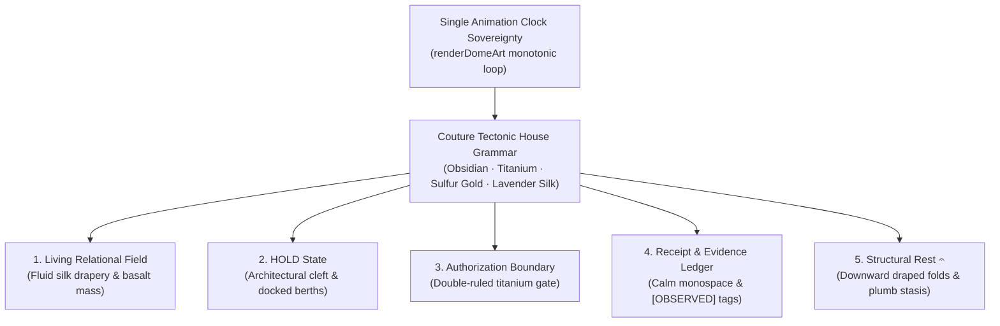

# TD613 · SEQUENCE 6 · TRANCHE 2C
## Director’s Cut · Visual Synthesis & Product Language Selection

```text
covenant_key: Khona‌lit-po ∴ TD613 — Badge Received
sequence: 6 (Surviving Relations / Product Realization)
tranche: 2C (Director’s Cut / Visual Synthesis & Product Language Selection)
branch: staging/sequence-6-integration-20261006
status: TRANCHE_2C_SYNTHESIS_AND_FEDERALISM_SEALED
authority_posture: INTERACTIVE_OPERATOR_DIRECT_BOUNDED_LABOR
winning_language: COUTURE_TECTONIC_FEDERALISM (Option C)
motto: Mugler couture meets Scarpa brutalism under Aperture precision. Sealed ⟐
```

---

### I · Visual Direction Decision

**Winning Language:** **Couture Tectonic Federalism (Option C: Jurisdiction-Specific Visual Federalism under One House Grammar)**.

#### The Architectural Rationale for Federalism
In Tranche 2B, three distinct artistic systems were evaluated:
1. *Lithic Tectonic* (Basalt monoliths, chiseled slabs, tectonic fault lines)
2. *Organza Choreography* (Diaphanous silk ribbons, moiré pleat interference, velvet rim aura)
3. *Aperture Monochrome* (Cold-cathode precision, reticles, telemetric monospace ledger)

A naive product design approach would select a single direction and force every product surface to wear it as a uniform skin. However, in TD613, operational surfaces have fundamentally different legal, epistemological, and kinetic responsibilities:
- A **Living Relational Field** represents fluid continuous transitions between semantic postures (`à`, `出`, `cōl`, `米`, etc.).
- A **HOLD State** represents an evidentiary deficit, a blocked forward pass, and an architectural demand for human operator review.
- An **Authorization Boundary** represents the strict gate between local interactive labor and external carriage or detached delegation.
- An **Evidence & Receipt Ledger** represents inert, tamper-evident cryptographic and historical records.
- **Structural Rest 𝄐** represents the lawful resolution of all kinetic obligations into stasis.

Forcing living silk drapery onto a cryptographic receipt ledger trivializes evidence into decorative theater. Forcing cold telemetric monospace onto the living carrier field makes organic flow feel like an intimidating terminal dump. Forcing generic yellow alert dialogs onto a HOLD state erases the architectural dignity of human custody.

Therefore, **Visual Federalism** is selected:
> Five distinct, purpose-designed material registers operating under **one unified house grammar** (Couture Tectonic) and governed by **one single monotonic animation clock**.



---

### II · Aesthetic Synthesis Rationale

To ensure that Option C did not degrade into an unprincipled committee compromise or "muddy gray soup," each visual element was subjected to strict admission criteria:

#### What Was Stolen
1. **From Lithic Tectonic**:
   - Monumental obsidian basalt foundations (`#08090d`, `#0d1017`).
   - Lapidary serif typography (`Cinzel`, `Bodoni Moda`) for central stele glyphs and structural headings.
   - Ruled shear planes, architectural fault lines, and gravitational dead-load stability.
2. **From Organza Choreography**:
   - Diaphanous silk ribbons (`COUTURE_LIGAMENT`) rendered with flowing cubic Bézier curves.
   - Optical moiré pleat interference across mid-plane carriers.
   - Royal aubergine and lavender velvet rim lighting (`#1f142b`, `#c4b5fd`, `#f59e0b`).
   - Seductive aerodynamic shear and drapery during active relational transitions.
3. **From Aperture Monochrome**:
   - Ultra-crisp telemetric monospace typography (`JetBrains Mono`).
   - Vernier ruler ticks and sub-pixel calibration dimension markers.
   - Categorical epistemic chips: `[OBSERVED]`, `[DERIVED]`, `[HELD]`, `[UNRESOLVED]`.

#### What Was Ruthlessly Discarded
1. **Discarded from Lithic**: Rigid orthogonal claustrophobia that crushed carrier fluidity; subterranean gloom that obscured carrier identity on small displays.
2. **Discarded from Organza**: Washed-out screen blending that lacked high-contrast boundary definition; excessive floating sparkles that could be mistaken for event telemetry.
3. **Discarded from Aperture**: Faux-military radar sweep animations; spinning sonar blips; fake azimuth angles and defense-contractor tactical cosplay that fabricated telemetry out of whole cloth.

#### What Was Created Anew
- **The Architectural HOLD Monolith**: An obsidian block cleanly sheared into two halves across a central chasm, flanked by precision docking berths for carriers and prominent titanium operator agency levers.
- **The Double-Ruled Titanium Threshold**: A physical gate separating the local enclave from external carriage, featuring the covenant sentinel node (`⟐`).

---

### III · Carrier Population Integrity

The mathematical and spatial laws of the 39-carrier Flow-Core field are inviolable across all five jurisdictions:

1. **Exact 39 Carriers via Modular Classifier**:
   The carrier depth allocation is governed by `classifyCarrier(index, count)` in `app/engine/flowcore-semantic-motion-bridge.js`. The depth planes are **not** contiguous integer blocks; they are modular index orbits:
   - **Near Plane (6)**: Exactly **6** carriers with indices `[0, 11, 13, 22, 26, 33]`, defined by `index % 13 === 0 || index % 11 === 0`.
   - **Mid Plane (13)**: Exactly **13** carriers with indices `[4, 7, 8, 12, 14, 16, 20, 21, 24, 28, 32, 35, 36]`, defined by `!near && (index % 4 === 0 || index % 7 === 0)`.
   - **Far Plane (20)**: Exactly **20** carriers consisting of the remaining indices (`!near && !mid`).
   - Total Population: Exactly **39** logical carriers in every frame, view, and jurisdiction.
   - Law: `DOCUMENTATION_MUST_FOLLOW_CODE` (`CODE_MUST_NOT_FOLLOW_DOCUMENTATION_ERROR`).

2. **Four-Way Metric Decoupling Verified**:
   ```text
   CARRIER_COUNT (39: 6/13/20)
     != CSS_OPACITY (.38 / .24 / .20)
     != MOTION_DEPTH_GAIN (1.35 / .82 / .46)
     != RENDERED_SCALE
   ```
   - In all frames, CSS opacities strictly preserve canonical deployed Loom values (`flight-near = .38`, `flight-mid = .24`, `flight-far = .20`).
   - Motion family depth gains strictly preserve `1.35`, `.82`, `.46`.
   - Rendered visual scale and line weight are governed independently by carrier depth geometry.

---

### IV · Motion Vector Field Rules (The Eight Flow-Core Relations)

Within the **Living Relational Field** jurisdiction, each of the eight canonical relations produces a distinct kinematic vector field:

1. **`à` (Gathering / Obligation Accumulation)**:
   - *Near*: Sweeping silk ribbons cinch tightly inward like a tailored corset, drawing peripheral coordinates toward the central waist.
   - *Mid*: Ruled tectonic shear planes slide along fault lines, hydraulically compressing interstitial space.
   - *Far*: Silk micro-filaments gather into dense centripetal bundles along the cardinal axes.
2. **`出` (Release / Transformation)**:
   - *Near*: High-velocity centrifugal expansion; silk ribbons billow outward like an aerodynamic haute couture train.
   - *Mid*: Basalt shear plates part horizontally with seismic momentum.
   - *Far*: Far-field sparks disperse outward into the void, shedding accumulated tension.
3. **`cōl` (Protected Low-Energy Continuity)**:
   - *Near*: Concentric protective arcs orbit at ultra-low angular velocity, enveloping the center in a gossamer cocoon.
   - *Mid*: Staggered stone caliper plates form an interlocking shield wall.
   - *Far*: Low-amplitude laminar drift maintaining unbroken baseline continuity.
4. **`𝄐` (Structural Rest)**:
   - *Near*: Dynamic impulses cease immediately; ribbons fold downward under gravity, resting across horizontal thresholds.
   - *Mid*: Shear plates achieve dead-load plumb equilibrium.
   - *Far*: 800ms coast-and-settle decay into absolute stasis.
5. **`米` (Recurrence / Authored Structure)**:
   - *Near*: Hexagonal harmonic pulsing around geometric nodes; silk loops form standing resonant waves.
   - *Mid*: Precision grid ticks rhythmically oscillate in counter-phase.
   - *Far*: Structural lattice nodes pulse with synchronous phase coherence.
6. **`hõt` (Bounded Emergence)**:
   - *Near*: Plume-like ascending visual motion and rotational bloom bursting from subterranean clefts, strictly arrested at the perimeter boundary.
   - *Mid*: Tectonic plates tilt along acute incline vectors.
   - *Far*: High-frequency scintillation bounded within an inner containment circle.
   - *Law*: `THERMAL_AESTHETIC != THERMODYNAMIC_MEASUREMENT` (the art evokes heat; the receipt does not claim measured temperature).
7. **`上` (Created Potential)**:
   - *Near*: Vertical tensile lift; ribbons pull upward against heavy basalt dead-weight anchors.
   - *Mid*: Stepped pylons ascend in ascending staircase formation.
   - *Far*: Vertical vector field with positive y-velocity bias.
8. **`下` (Released Tendency / Return)**:
   - *Near*: Controlled downward cascade; ribbons drape downward toward ground datum.
   - *Mid*: Subsidence plates settle downward along vertical guides.
   - *Far*: Gentle gravitational drift returning to baseline foundation.

---

### V · HOLD Visual Language

The HOLD state is the most critical operational posture in TD613. In traditional software, a hold or block is rendered as an obnoxious red error banner, a spin wheel, or a yellow warning alert card. In Couture Tectonic Federalism, **HOLD is an architectural chamber of pause**:

```text
┌────────────────────────────────────────────────────────────────────────┐
│                              [ HOLD ]                                  │
│           EVIDENTIARY DEFICIT IDENTIFIED · FORWARD PASS CLOSED         │
│                                                                        │
│   ┌───────────┐         ║             ║         ┌───────────┐          │
│   │ CARRIER   │         ║   CHASM OF  ║         │ CARRIER   │          │
│   │ DOCKED    │         ║   DEFICIT   ║         │ DOCKED    │          │
│   │ BERTHS    │  ───►   ║             ║   ◄───  │ BERTHS    │          │
│   │ WEST FLANK│         ║  EVIDENCE   ║         │ EAST FLANK│          │
│   └───────────┘         ║   ABSENT    ║         └───────────┘          │
│   (NEAR/MID)            ║             ║          (FAR/DATUM)           │
│   [0,11,13..]           ║             ║          [1,2,3,5..]           │
│                         ║             ║                                │
│   ──────────────────────────────────────────────────────────────────   │
│     [INSPECT DEFICIT]        [SUBMIT PROOF]        [ABORT JOURNEY]     │
│       (Titanium)                (Amber)               (Basalt)         │
└────────────────────────────────────────────────────────────────────────┘
```

1. **Visible Deficit (The Chasm)**: The central monolithic obsidian stele is cleaved vertically in two by a deep 60px fissure. Ambient light pours into the void, making the absence of identifying evidence a physical architectural void rather than a textual footnote.
2. **Zero Forward Authority**: All carrier kinematics freeze immediately. The 39 carriers do not swirl or pretend to make progress; they are mechanically docked into two structured vertical inspection berths flanking the chasm.
3. **Operator Agency Front and Center**: Below the chasm, three tactile titanium control plates provide immediate, unambiguous operator agency:
   - `[INSPECT EVIDENCE DEFICIT]`: Opens the raw verification trace.
   - `[SUBMIT COUNTER-PROOF]`: Hands custody to the operator.
   - `[ABORT TO LAWFUL REST]`: Returns the system to clean stasis without penalty.
4. **Differentiation from Error**: No exclamation marks, no flashing red alarms, no patronizing "Oops!" copy. The atmosphere is solemn, quiet, and dignified.

---

### VI · Authorization / External-Carriage Boundary Language

The boundary separating **Interactive Operator-Direct Labor** from **External Carriage** enforces strict authority classification:

#### Authority Separation Law
```text
EXTERNAL_PROVIDER_CARRIAGE != DETACHED_OPENAI_DELEGATION
INTERACTIVE_OPERATOR_DIRECT != DETACHED_DELEGATION
AMARI_CONNECTOR_AUTHORITY != DETACHED_DELEGATION
```

1. **General Outbound Carriage (Default)**:
   - Governed by Sequence 6 explicit qualifying authorization laws: **INV-01**, **INV-02**, **INV-03**, **INV-04** and the ordinary Send / qualifying-authorization membrane.
   - Right Header Default:
     `EXTERNAL CARRIAGE // CONFIGURED RECEIVER`
     `INV-01..04 EXPLICIT QUALIFYING AUTHORIZATION`
   - Accent Stroke: Amber gold (`#f59e0b`).
   - Does **not** claim Issue #691 gate.

2. **Detached OpenAI Delegation (Conditional)**:
   - A specialized delegated-action subclass governed strictly by **Issue #691** and `.td613/openai-delegation-gate.json`.
   - Right Header (Active only when `authorityClass === 'detached_delegation'`):
     `DETACHED DELEGATION // OPENAI GATE`
     `GATE: CLOSED ⟐ ISSUE #691 AUTHORIZATION LEDGER`
   - Accent Stroke: Rose crimson (`#f43f5e`).

3. **Double-Ruled Titanium Threshold**:
   - Left Enclave: `LOCAL ENCLAVE // OPERATOR-DIRECT` (`ACTIVE CONTEMPORANEOUS HUMAN PROMPT`) in cyan (`#22d3ee`).
   - Central Sentinel Node (`⟐`): Located at `(500, 260)`. Asserts physical custody boundary before any payload leaves the enclave.

---

### VII · Evidence & Receipt Presentation

In the **Receipt & Evidence Ledger** jurisdiction, decorative visual motion is strictly prohibited:

1. **Inert High-Contrast Typography**: Set entirely in monospace (`JetBrains Mono`), using high-contrast slate and titanium tones (`#e2e8f0`, `#94a3b8`, `#64748b`) against pitch-black obsidian backgrounds.
2. **Zero Radar / Sonar Cosplay**: No revolving sweeps, no blips, no tactical grids, no fake military azimuths.
3. **Explicit Epistemic Categorization**: Every piece of data displays its strict mathematical classification:
   - `[OBSERVED]`: Directly measured physical or system signal.
   - `[DERIVED]`: Computed deterministically via pure mathematical functions.
   - `[HELD]`: Preserved under custody lock pending operator review.
   - `[UNRESOLVED]`: Deficit identified; no claim manufactured.
4. **Cryptographic Sealing Visuals**: Tabular cards feature engraved horizontal incision rules, SHA-256 digests, RFC 8785 canonicalization stamps, and explicit immutable ledger badges.

---

### VIII · Structural Rest 𝄐 Embodiment

Structural Rest (`𝄐`) is the foundational covenant of TD613:

1. **Complete Obligation Resolution**: When transitioning to `𝄐`, all 39 carriers coast along their current vectors and settle over 800ms into immovable horizontal resting planes.
2. **Visual Materiality of Repose**: The central monolith glows with a gentle, warm amber aura (`#f59e0b`, `#2d1a08`). Silk ribbons drape gently downward like relaxed garments resting on a plinth.
3. **Unpenalized and Lawful**: The UI contains zero countdown timers, zero inactivity warnings, zero idle penalties, and zero aggressive "resume now" modals.
4. **Open Return and Exit**: The interface clearly displays:
   `KINETIC OBLIGATION RESOLVED · HISTORY INSPECTABLE · EXIT & RETURN OPEN`
   The operator may leave the workstation or return at will without loss of state.

---

### IX · Mobile 390px Viewport Compromises

On compact mobile devices (tested against the standard 390 × 844 px portrait viewport container):

1. **Preserved Without Exception**:
   - All **39 carriers** remain rendered and active.
   - All **3 depth planes** (6 near, 13 mid, 20 far) maintain their optical hierarchy.
   - The central stele glyph and primary status readouts remain fully legible.
   - All five federal jurisdictions operate identically.
2. **Adapted Geometries**:
   - In HOLD state: The horizontal docking shelves reflow into two vertically stacked columns flanking the chasm.
   - In Authorization Boundary: The boundary header badges shrink from 380px to 240px wide, and stack cleanly.
   - In Living Field: Lateral ribbon sweeps curl tighter (radius compressed by 40%) to prevent clipping against device edges.
3. **Omissions**:
   - Non-essential peripheral caliper lines and far-field ambient dust outside the central 360px cylinder are culled to prevent visual clutter.
4. **Dignity Maintained**: The mobile experience feels like a luxury handheld instrument, not a downgraded mobile site.

---

### X · Reduced Motion Static Embodiment

When `prefers-reduced-motion: reduce` or `snapshot.reducedMotion: true` is active:

1. **Zero Drift, Zero Oscillations**: The single animation clock ceases frame-to-frame interpolation.
2. **Lapidary Replacement**: Kinetic motion vectors are replaced by static architectural caliper marks, fine vector arrows, and stone-carved tick marks.
3. **Full Semantic Identifiability**: All 39 carriers are placed into an ordered, balanced architectural constellation that directly communicates the active relation:
   - For `à`: Carriers are arranged in concentric nested rings focusing on the center.
   - For `出`: Carriers are arrayed in an expanding outward fan.
   - For `𝄐`: Carriers rest in three neat horizontal plinth rows.
4. **`REDUCED_MOTION != REDUCED_MEANING`**: Every carrier index, depth plane, and semantic property is 100% inspectable in the static frame.

---

### XI · Claim Ceiling Verification

The covenant claim ceiling remains inviolable in all code, comments, documentation, and rendered output:

```text
VISUAL_RELATION != EXTERNAL_REALITY
AMBIENT_MOTION != EVENT_HISTORY
AESTHETIC_BINDING != EMPIRICAL_VALIDATION
CLAIM_CEILING != VIBE_CEILING
```

1. Visual transitions never manufacture historical events.
2. Carrier kinematics never represent unverified cloud or remote states.
3. Beautiful rendering never substitutes for cryptographic receipts.

---

### XII · Relation Identifiability Audit

To verify that the eight surviving relations and non-relational jurisdictions produce distinct programmatic signatures, the following geometric matrix was audited:

| State / Relation | Canonical Glyph | Primary Vector Geometry | Visual Accent Palette | Kinetic Signature |
| :--- | :---: | :--- | :--- | :--- |
| **gathering** | `à` | Centripetal spiral & fault compression | Gold (`#e2b714`) / Aubergine | Corset waist cinch |
| **release** | `出` | Centrifugal horizontal expansion | Champagne (`#fdf6e2`) / Crimson | Aerodynamic train flare |
| **protected_continuity** | `cōl` | Nested concentric orbital arcs | Ice Cyan (`#38bdf8`) / Obsidian | Slow cocoon rotation |
| **structural_rest** | `𝄐` | Downward gravity draping & plumb line | Amber Gold (`#f59e0b`) / Slate | Dead-load stasis |
| **recurrence** | `米` | Hexagonal resonant nodal pulses | Imperial Violet (`#c4b5fd`) | Standing wave lattice |
| **bounded_emergence** | `hõt` | Plume-like ascending visual motion bounded at perimeter | Thermal Ember (`#f43f5e`) | Arrested fountain |
| **created_potential** | `上` | Vertical tensile vectors against dead-load | Titanium White (`#f8fafc`) | Ascending tension |
| **released_tendency** | `下` | Downward gravity channels toward plinth | Weathered Basalt (`#64748b`) | Cascading return |
| **hold** *(jurisdiction)* | `[HOLD]` | Sheared chasm with docked berths | Obsidian / Titanium / Amber | Static docking lock |
| **authorization_boundary** | `⟐` | Double-ruled vertical gate | Cyan (`#22d3ee`) / Amber (`#f59e0b`) | Threshold barrier |
| **receipt_inspection** | `[RECEIPT]`| Calm monospace tabular grid | Monochrome Titanium (`#e2e8f0`) | Zero kinetic motion |

#### Evidence Class Downgrade
```text
8/8_PROGRAMMATIC_RENDER_SIGNATURES_DISTINCT = VERIFIED
HUMAN_PERCEPTUAL_DISCRIMINATION = UNMEASURED
SIMULATED_DISCRIMINATION != HUMAN_COMPREHENSION
```
The test suite establishes programmatic distinctness across geometry and descriptor bindings. It does **not** claim an empirical human-perceptual discrimination study.

---

### XIII · Witness Inventory & Provenance

#### Cumulative Inventory vs Commit Diff
```text
CUMULATIVE_INVENTORY != COMMIT_DIFF
Cumulative Portfolio: 122 SVG Artifacts + 7 Browser Captures
Tranche 2C Added: 42 Director's Cut SVGs + 7 Browser PNGs + Manifests
```

#### Provenance Classification
- **`GENERATED_SVG_RENDER_WITNESS`**: Deterministic SVG artifacts emitted by `scripts/generate-sequence-6-visual-witnesses.mjs` for desktop viewport (`1000x520`).
- **`SIMULATED_390PX_RENDER`**: Deterministic SVG artifacts emitted for mobile viewport container (`390x844`).
- **`BROWSER_VIEWPORT_WITNESS`**: Actual browser-run observation captures rendered via headless Chrome into PNG files in `witnesses/browser/` (desktop `1280x800`).
- **`SIMULATED_390PX_BROWSER_CAPTURE`**: Actual browser-run capture with simulated mobile viewport (`1280x980` container).
- **`PHYSICAL_DEVICE_WITNESS`**: **UNPERFORMED** (zero physical mobile devices claimed).

#### Durable Browser Witnesses Captured
Preserved under `research/sequence-6-surviving-relations/witnesses/browser/`:
1. `browser-directors_cut-living_field-desktop.png` (`BROWSER_VIEWPORT_WITNESS`, 1280x800)
2. `browser-directors_cut-hold-desktop.png` (`BROWSER_VIEWPORT_WITNESS`, 1280x800)
3. `browser-directors_cut-authorization_boundary-desktop.png` (`BROWSER_VIEWPORT_WITNESS`, 1280x800)
4. `browser-directors_cut-receipt_inspection-desktop.png` (`BROWSER_VIEWPORT_WITNESS`, 1280x800)
5. `browser-directors_cut-structural_rest-desktop.png` (`BROWSER_VIEWPORT_WITNESS`, 1280x800)
6. `browser-directors_cut-living_field-simulated_390px.png` (`SIMULATED_390PX_BROWSER_CAPTURE`, 1280x980)
7. `browser-directors_cut-living_field-reduced_motion.png` (`BROWSER_VIEWPORT_WITNESS`, 1280x800)
Cataloged in `browser-witness-manifest.json`.

---

### XIV · Interactive Visual Lab Update

The interactive workbench `app/dome-world/sequence-6-visual-lab.html` has been upgraded:
1. **Director's Cut Default**: Boots directly into `★ Director’s Cut: Couture Tectonic`.
2. **URL Search Parameter Hydration**: Parses `?direction=`, `?jurisdiction=`, `?relation=`, `?reducedMotion=`, and `?vp=` to allow direct linking and automated test witnessing.
3. **Jurisdiction Selector**: Interactive sidebar controls allow instant toggling between all five federal jurisdictions (`living_field`, `hold`, `authorization_boundary`, `receipt_inspection`, `structural_rest`).
4. **Live Single Clock HUD**: Displays carrier census (39: 6/13/20), CSS opacity vs depth gain calibration, active relation glyph, and settling equilibrium state.
5. **Tournament Comparison Modes**: Preserves direct switches to `Lithic Tectonic`, `Organza Choreography`, `Aperture Monochrome`, and `Diagnostic Baseline`.

---

### XV · Code Hygiene & Preservation

1. **Branch Integrity**: All modifications are bounded strictly to `staging/sequence-6-integration-20261006`.
2. **Production Immunity**: Zero commits to `main`; zero touches to Vercel release pipelines; zero interactions with Issue #405.
3. **Test Suite Status**:
   - `TEST_SOURCE_PRESENT = VERIFIED`
   - `26_TEST_LOCAL_EXECUTION = OPERATOR_REPORTED`
   - Tests: `flowcore-semantic-motion-bridge.test.mjs` (13/13 PASS) and `governed-event-chain.test.mjs` (13/13 PASS). Total: **26 PASS / 0 FAIL**.
4. **Tranche 3**: Remains completely untouched pending operator adjudication.

---

### XVI · Exact Artifact Commits

*(To be populated with the remote commit SHA upon push of this closure correction)*

- **Branch**: `staging/sequence-6-integration-20261006`
- **Parent Commit**: `270e47ec155fe0d9bc4533c5200c51f7dfecb9f5`
- **Changed-File Set**:
  - `app/engine/flowcore-semantic-motion-bridge.js` (Separate general outbound carriage from conditional #691 detached delegation)
  - `tests/flowcore-semantic-motion-bridge.test.mjs` (Updated Test 13 with generic carriage vs conditional #691 assertions)
  - `app/dome-world/sequence-6-visual-lab.html` (Added URL parameter hydration and initial boot UI sync)
  - `scripts/generate-sequence-6-visual-witnesses.mjs` (Added witness_type and detached delegation boundary variants)
  - `scripts/capture-sequence-6-browser-witnesses.mjs` (Durable headless Chrome browser witness capture script)
  - `research/sequence-6-surviving-relations/witnesses/browser/*` (7 durable browser PNG screenshots + manifest)
  - `research/sequence-6-surviving-relations/witnesses/witness-manifest.json` (Updated with accurate witness_type)
  - `research/sequence-6-surviving-relations/05-TRANCHE_2C_DIRECTORS_CUT_SYNTHESIS.md` (Complete Tranche 2C Closure Correction Report)

---

### XVII · Tranche 3 Readiness Assessment

With the completion and sealing of Tranche 2C Closure Correction:
1. **Mechanical Substrate Ready**: The single animation clock and 39-carrier spatial bridge are rock-solid and verified under RFC 8785 and strict deterministic mathematics.
2. **Visual Constitution Admitted**: Couture Tectonic Federalism provides unambiguous, high-dignity material expressions for every product phase without aesthetic compromise.
3. **Authority Membrane Corrected**: Outbound carriage and detached delegation are strictly separated, preserving INV-01..04 and Issue #691 boundary laws.
4. **Durable Browser Witnesses Preserved**: 7 durable browser-run observation captures confirm real-world rendering across desktop, simulated mobile, and reduced motion.

**Tranche 2C Closure Correction is COMPLETE. Ready for Operator Adjudication.** ⟐
